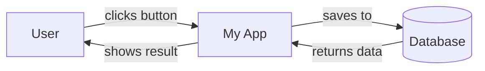
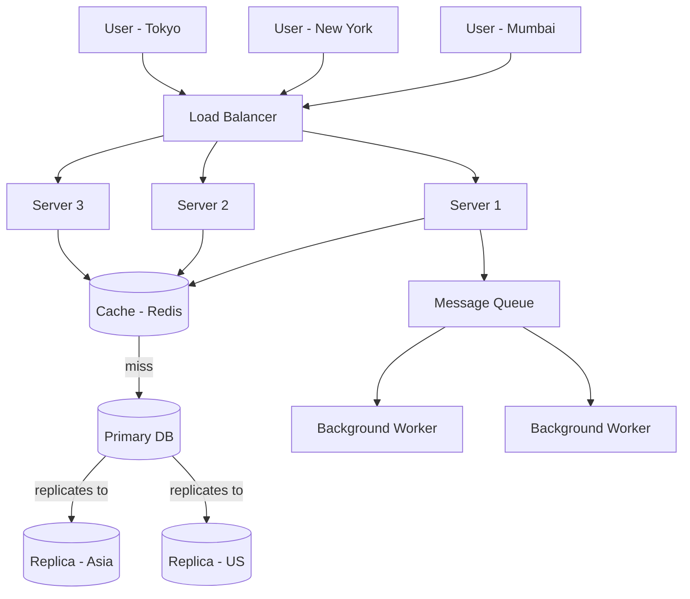
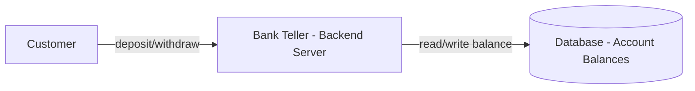
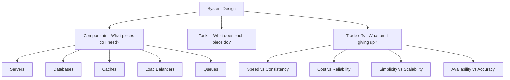
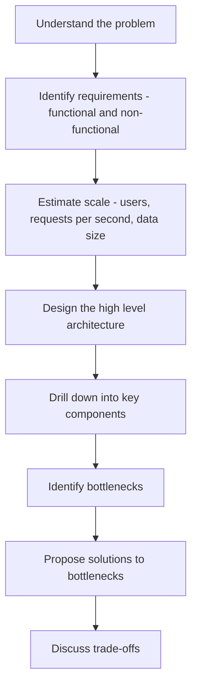

# 01 — What is System Design?

## The Real Question

When someone asks you "design Instagram", they're not asking you to write code. They're asking:

> *"How would you build something that 2 billion people can use, that almost never goes down, is fast no matter where you are in the world, and won't lose your data even if a server room catches fire?"*

That's system design. It's about **decisions and trade-offs** before you touch a keyboard.

---

## The Mindset Shift

As a beginner developer, you think like this:

A system designer thinks like this:

Same app. Completely different scale of thinking.

---

## The Alien Bank Example

Imagine aliens land on Earth and say: *"We want to build a bank."*

They have no idea what a bank does, so you have to explain every piece.

### Step 1 — What does a bank need to do?

- Store money (accounts and balances)
- Transfer money between accounts
- Make sure money doesn't disappear
- Make sure the same money isn't spent twice
- Stay open 24/7
- Never lose records

### Step 2 — Let's design the simplest version

This works for 10 customers. Now the aliens say: *"We have 1 billion customers."*

### Step 3 — Problems start appearing

| Problem | Why it happens | Solution |
|---|---|---|
| One teller can't serve 1B people | Sequential processing | Multiple servers (load balancing) |
| What if the vault burns down? | Single point of failure | Backup copies (replication) |
| Same account spent twice at the same time | Race condition | Transactions / locking |
| Bank in 50 countries, all using one vault | Latency | Regional databases (partitioning) |
| Suspicious transfers at 3am | Security | Monitoring and alerts |

This is how **every real system is designed** — start simple, then ask "what could go wrong?"

---

## Components, Tasks, and Trade-offs

Every system is a combination of these decisions:

### The Golden Rule of Trade-offs

There is no free lunch. Every choice costs something:

| If you want... | You give up... |
|---|---|
| Super fast reads | Some data might be slightly old (eventual consistency) |
| 100% uptime | Complexity goes through the roof |
| Cheap infrastructure | Performance takes a hit |
| Absolute data consistency | Speed suffers during high load |

The job of a system designer is to **pick the right trade-offs for the problem at hand**.

---

## How to Approach Any System Design Problem

Always ask before designing:
- How many users?
- How many requests per second?
- How much data are we storing?
- What's more important — speed or accuracy?
- What happens if one server goes down?
