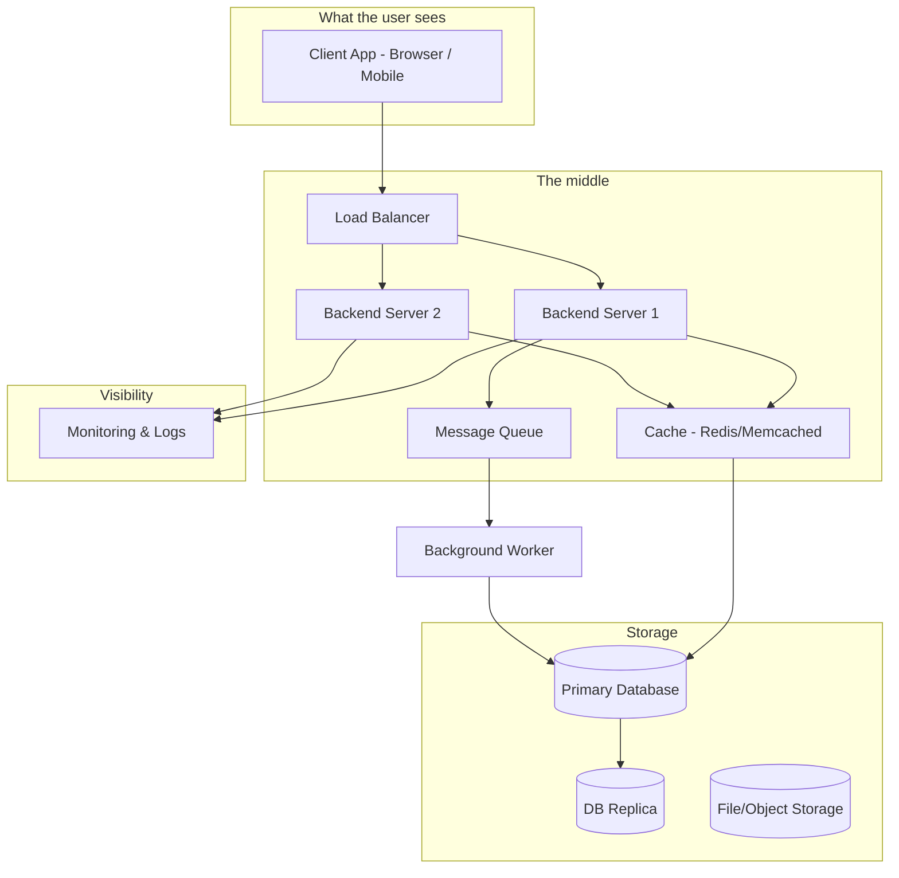
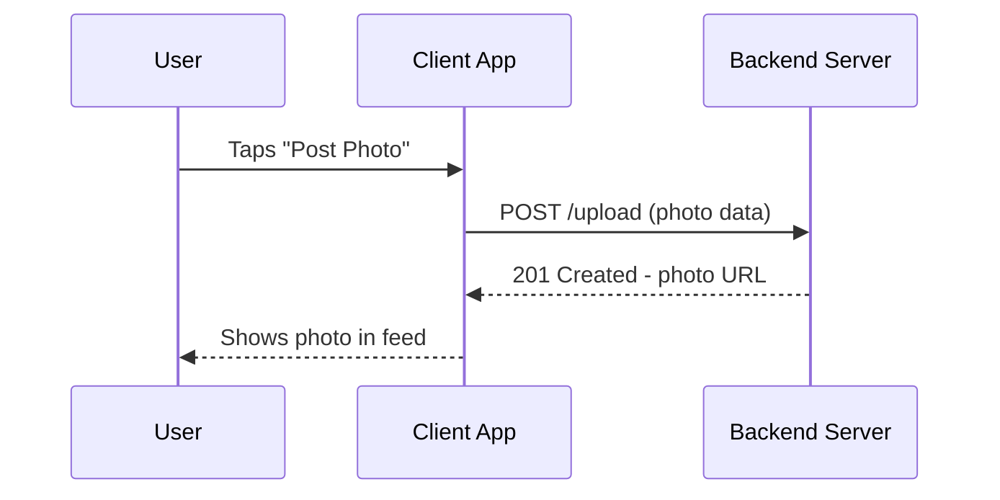
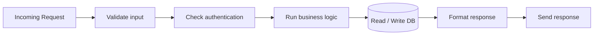
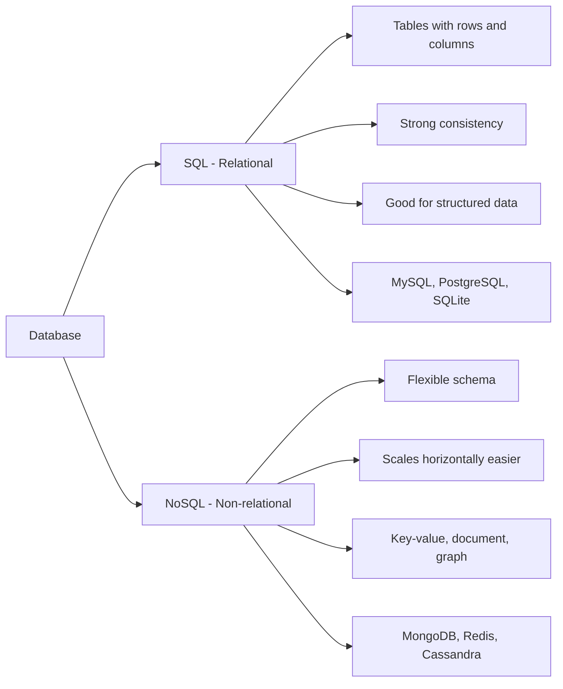
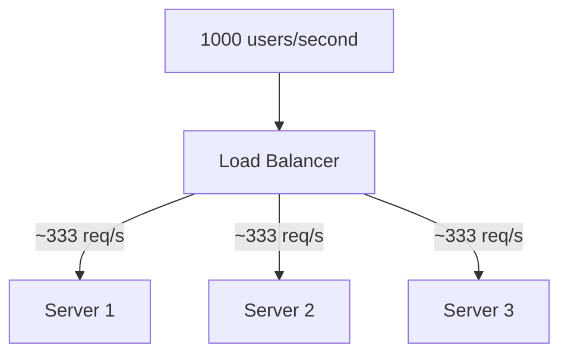
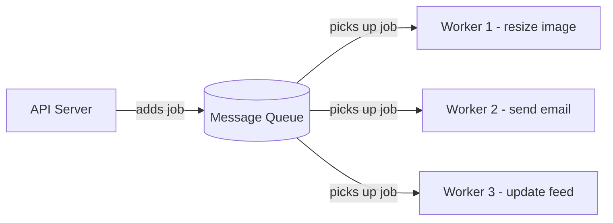
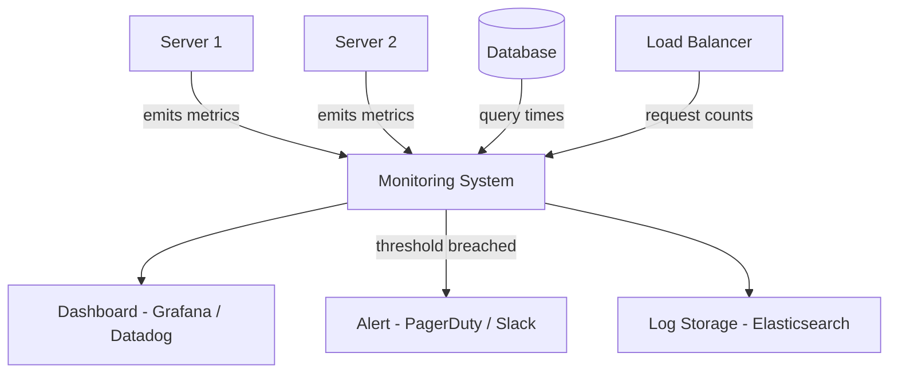
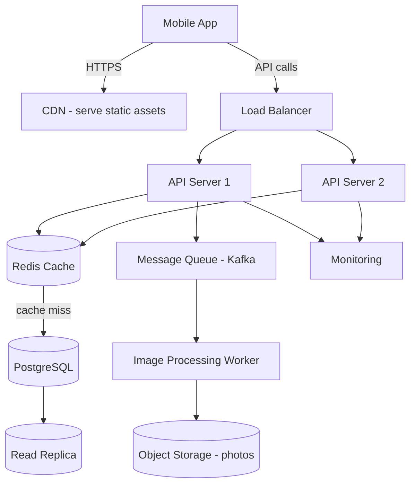

# 02 — Core Components of System Design

## The Lego Bricks of Every Big System

No matter what you're building — Instagram, Netflix, WhatsApp, a banking app — they're all made from the same basic building blocks. The art of system design is knowing which blocks to use and how to connect them.

---

## 1. Client Applications

The part the user actually touches.

| Type | Examples | Characteristics |
|---|---|---|
| Web browser | Chrome, Firefox | Downloads HTML/CSS/JS, runs in browser |
| Mobile app | iOS, Android | Native code, installed on device |
| Desktop app | Electron apps, native apps | Installed locally |
| IoT device | Smart thermostat, sensor | Minimal compute, sends data |

The client **sends requests** and **receives responses**. It does very little heavy lifting — all the real work happens on the server.

---

## 2. Backend Servers

The brain of the operation. This is where your **business logic** lives.

What a backend server does:
- Receives requests from clients
- Validates the input
- Runs the logic (e.g., "does this user have enough balance?")
- Reads from or writes to the database
- Returns a response

A single server has limits: CPU, memory, and network bandwidth. When too many requests arrive at once, the server slows down and eventually crashes. That's why we need multiple servers and a load balancer in front.

---

## 3. Databases

Where all the data lives — permanently (unlike RAM which disappears when the server restarts).

Two broad types:

Databases are often the **bottleneck** in systems. Everything waits on the database. That's why so much of system design is about reducing database load (caching), spreading the data (sharding), and keeping backups (replication).

---

## 4. Load Balancers

Imagine a restaurant with 3 chefs but 1 waiter who only ever hands orders to chef 1. Chef 1 is overwhelmed. Chef 2 and 3 are bored. That's what happens without a load balancer.

A **load balancer** sits in front of your servers and distributes incoming requests evenly.

Benefits:
- No single server gets crushed
- If one server dies, traffic is routed to healthy ones
- You can add more servers without the client knowing

---

## 5. Message Queues

Sometimes you don't need to do things immediately. If a user uploads a photo, you don't need to resize it, generate thumbnails, and send email notifications all in the same second they hit upload. You can do those things **later**, in the background.

A **message queue** is like a to-do list for your backend workers.

Benefits:
- The API responds instantly to the user
- Heavy work happens asynchronously
- If a worker crashes, the job stays in the queue and gets retried
- Workers can be scaled independently

---

## 6. Monitoring and Logs

You can't fix what you can't see. Monitoring is the system's pulse check — always running in the background, alerting you when something is wrong.

What you monitor:
- **Latency**: how long requests take
- **Throughput**: how many requests per second
- **Error rate**: % of requests that fail
- **CPU / Memory / Disk**: is the machine healthy?
- **Database query times**: is something slow?

---

## How They All Fit Together

Here's a simplified view of a photo-sharing app (like Instagram):

Every component in this diagram has one job. Each one can be scaled, upgraded, or replaced independently.
