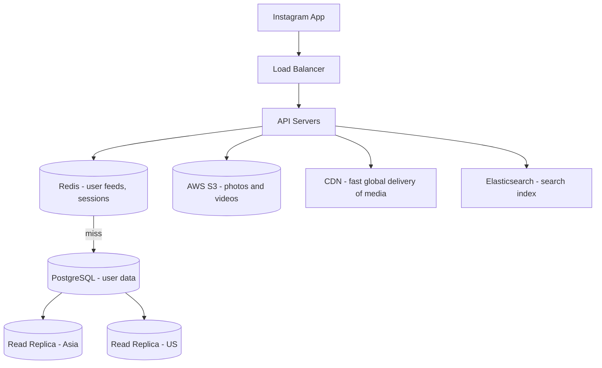
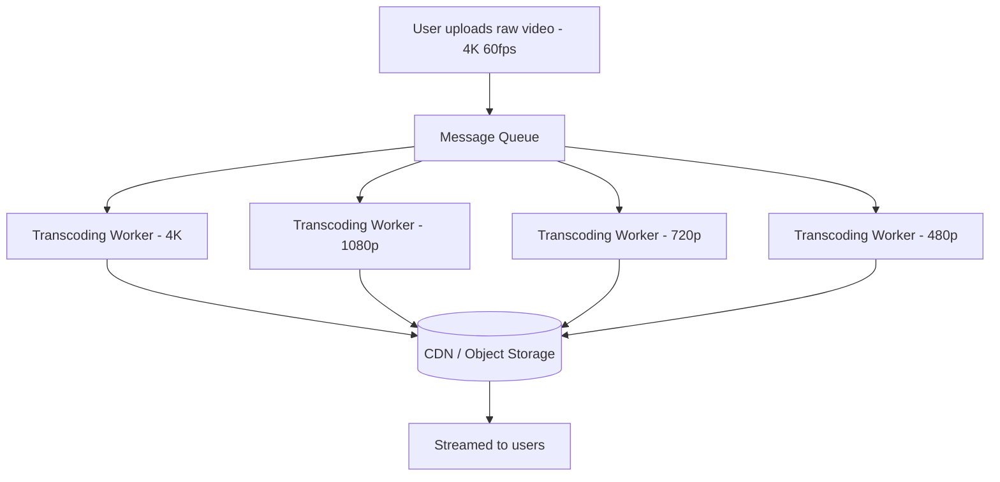
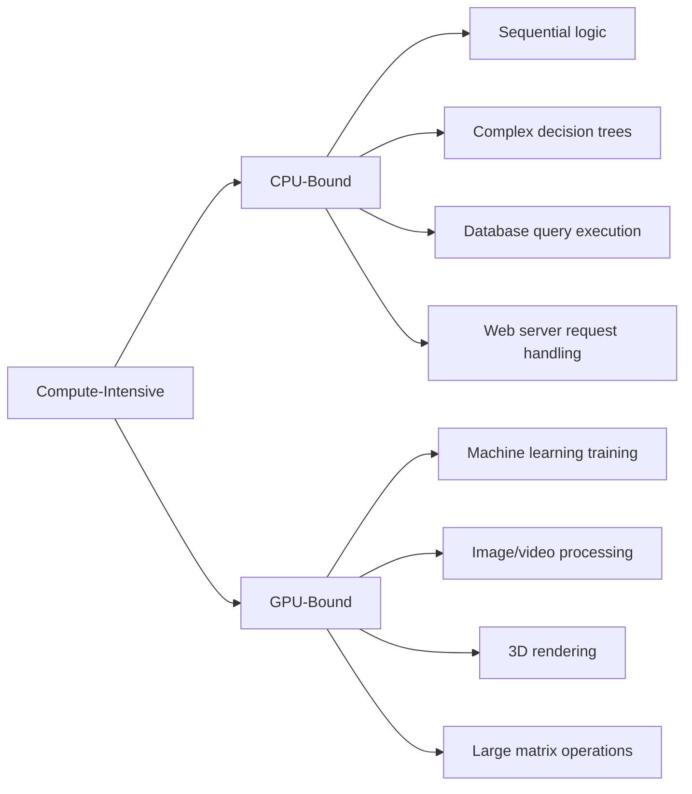
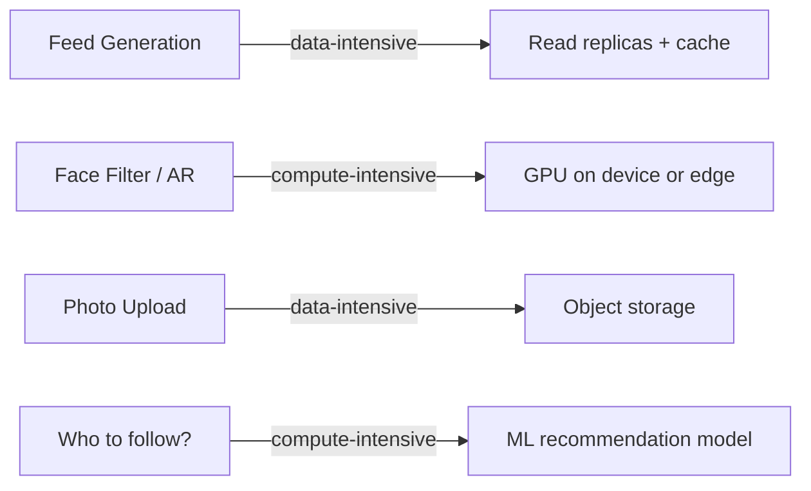
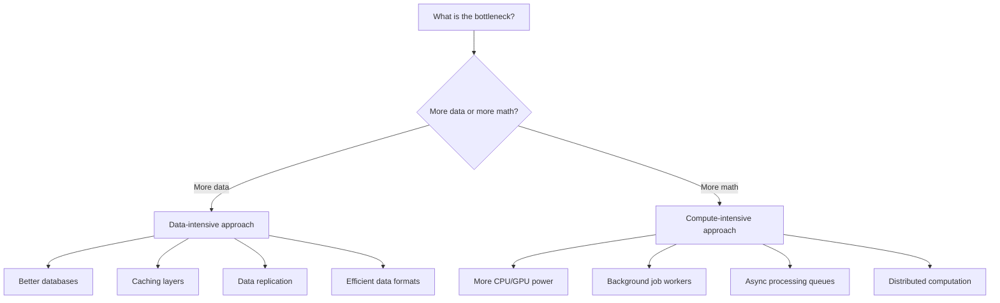

# 03 — Types of Applications: Data-Intensive vs Compute-Intensive

## The Key Question Before Designing Anything

Before you draw a single box in your architecture diagram, ask: **"Where is the bottleneck going to be?"**

- Is the problem about **moving and storing a lot of data**?
- Or is the problem about **doing a lot of computation on that data**?

The answer changes everything about how you design the system.

---

## Data-Intensive Applications

A **data-intensive** application's main challenge is:
- Storing huge amounts of data
- Reading and writing it fast
- Keeping it consistent and available
- Moving it efficiently between services

The bottleneck is **I/O** — disk reads, network transfers, database queries.

### Real-world examples

| Application | Why it's data-intensive |
|---|---|
| Instagram | 100M+ photos uploaded per day, billions stored |
| WhatsApp | Billions of messages per day |
| Twitter/X | 500M tweets/day, complex timeline generation |
| Uber | Real-time GPS data from millions of drivers |
| E-commerce | Huge product catalogs, order histories, search indexes |

### Instagram Architecture — a data-intensive system

The main challenge here isn't complex math — it's handling the **volume** of data and serving it fast to billions of people worldwide.

---

## Compute-Intensive Applications

A **compute-intensive** application's main challenge is:
- Doing heavy mathematical operations
- Processing data to produce results
- The CPU/GPU is the bottleneck, not storage

### Real-world examples

| Application | Why it's compute-intensive |
|---|---|
| Netflix video encoding | Converts raw video into 10+ formats and resolutions |
| YouTube video processing | Same — transcoding is CPU-heavy |
| ML model training | Billions of matrix multiplications |
| Real-time fraud detection | ML inference on every transaction |
| Scientific simulations | Weather modeling, protein folding |
| Rendering (games/VFX) | Billions of pixel calculations |

### Video encoding pipeline (YouTube-style)

The bottleneck here is **CPU time** — raw video transcoding is one of the most compute-heavy tasks in software.

---

## CPU-Bound vs GPU-Bound

A GPU has thousands of simpler cores designed to do the **same operation on many pieces of data simultaneously** (parallel processing). A CPU has a few powerful cores great for complex sequential logic.

---

## Why This Matters for System Design

| Aspect | Data-Intensive | Compute-Intensive |
|---|---|---|
| Main bottleneck | Disk I/O, network, database | CPU cycles, GPU memory |
| Scale strategy | More replicas, better caching, sharding | More powerful machines, GPU clusters |
| Cost driver | Storage, bandwidth | Compute time, specialized hardware |
| Latency concern | Database query time, cache miss | Processing time per job |
| Example fix | Add a read replica | Add more transcoding workers |

---

## Real-world Scalability Concerns

### Instagram — a mix of both

Most large systems are **hybrids** — the feed is data-intensive, but the ML recommendation engine is compute-intensive. You design each part of the system for its own bottleneck.

---

## The Simple Mental Check

Before designing any component, ask yourself:

