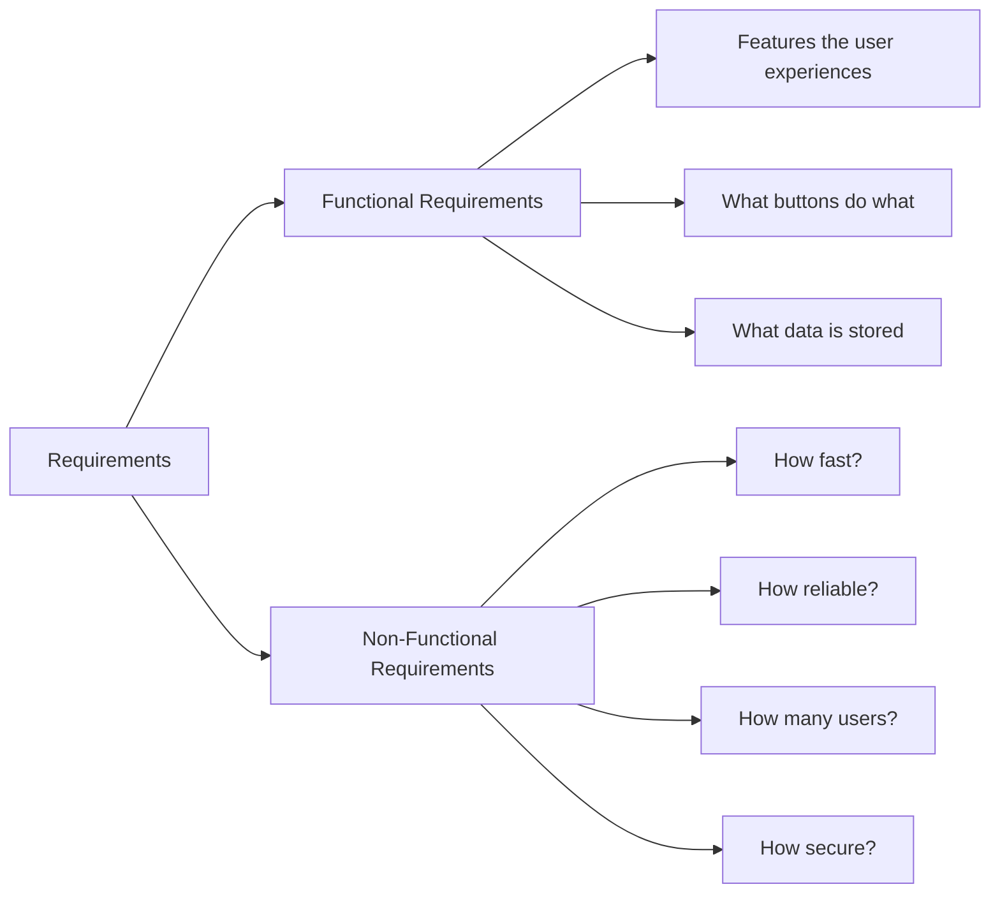
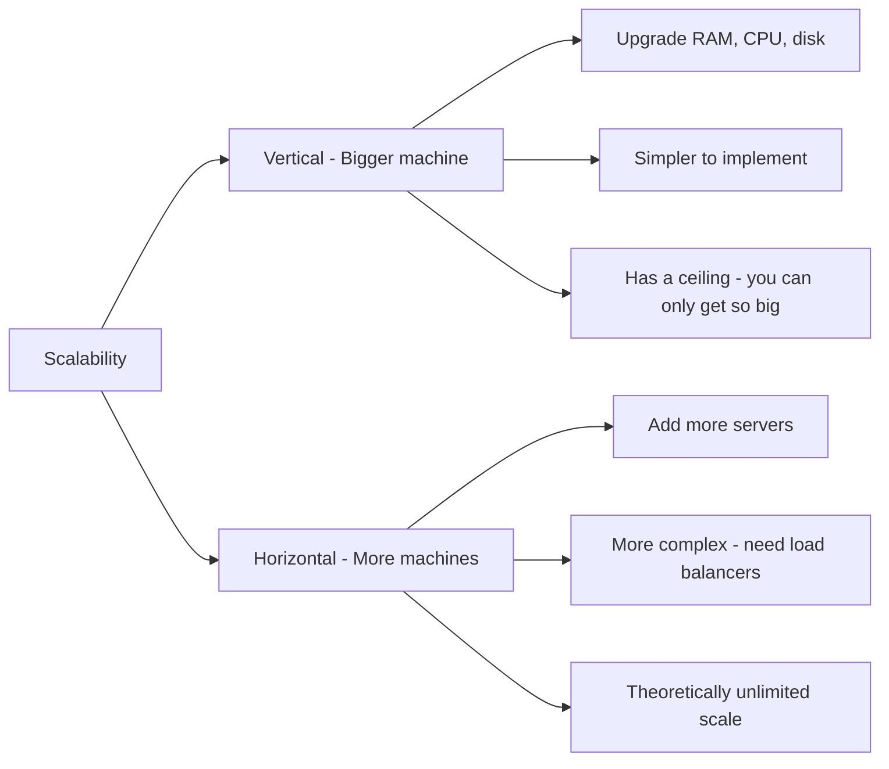
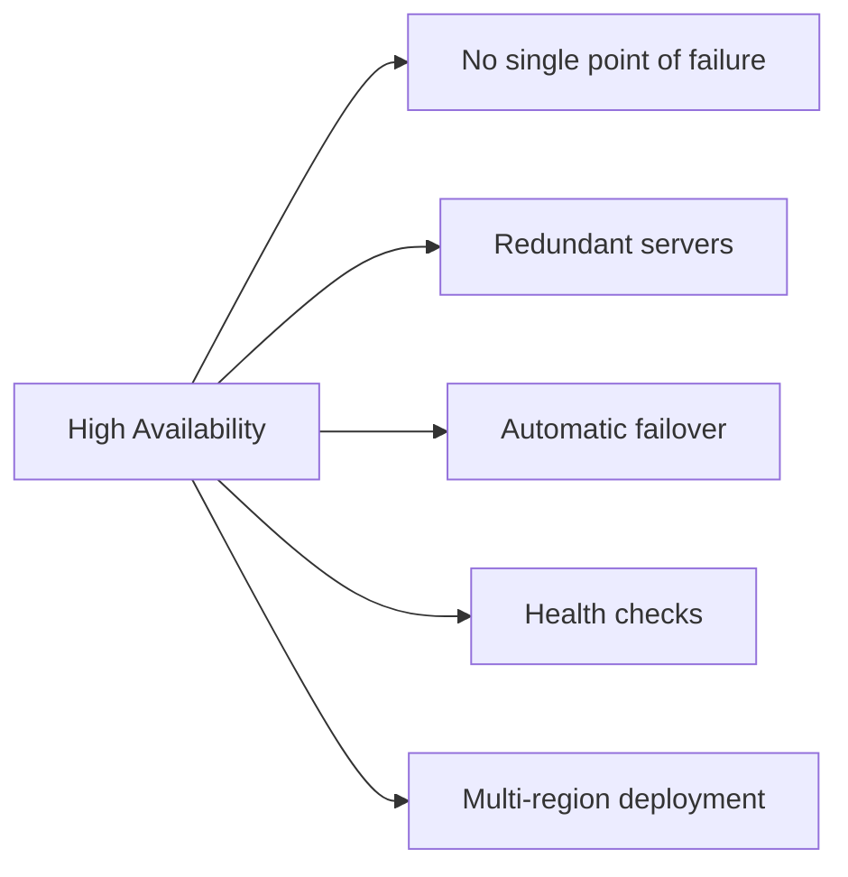
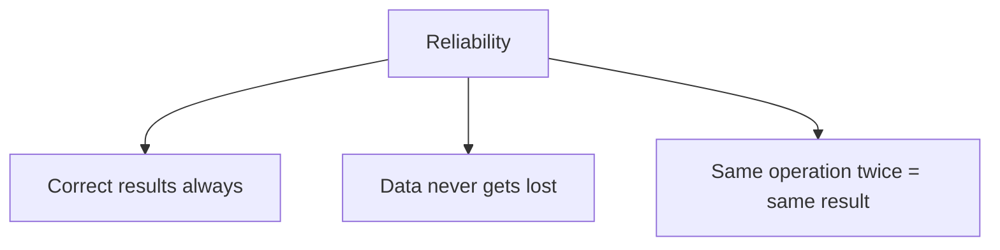
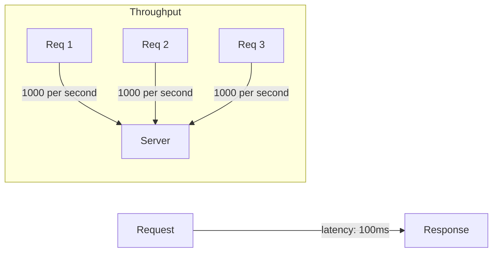
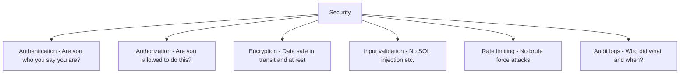
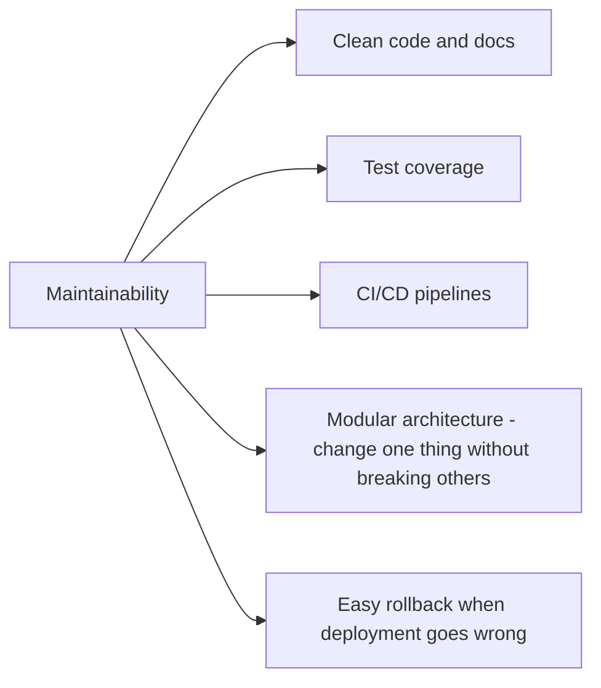
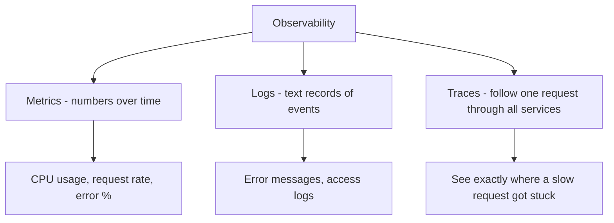
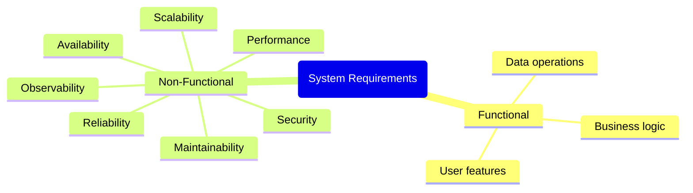

# 04 — Functional vs Non-Functional Requirements

## Why Requirements Come First

You can't design a system if you don't know what it's supposed to do. Before drawing a single box, you clarify **two types of requirements**:

1. **Functional** — what the system *does*
2. **Non-Functional** — how *well* it does it

---

## Functional Requirements

These are the features. The *what*.

**Example: Design a messaging app**

| Functional Requirement | Description |
|---|---|
| Users can register and log in | Auth system needed |
| Users can send text messages | Core feature |
| Users can see message history | Read past messages |
| Users can create group chats | Group functionality |
| Messages show delivery and read receipts | Status tracking |

Functional requirements are usually straightforward — they come from the product spec or user stories.

---

## Non-Functional Requirements

These are the quality attributes. The *how well*. This is where system design lives.

---

### 1. Scalability

Can the system handle growth without breaking?

*"If we get 10x the users tomorrow, does the system survive?"*

---

### 2. Availability

What % of the time is the system up and running?

| Availability | Downtime per year | Used for |
|---|---|---|
| 99% | 3.65 days | Internal tools |
| 99.9% | 8.7 hours | Most web apps |
| 99.99% | 52 minutes | E-commerce, payments |
| 99.999% ("five nines") | 5 minutes | Banking, hospitals |

*"If one server dies at 3am, do users even notice?"*

---

### 3. Reliability

Will the system produce the correct result every time?

Availability ≠ Reliability. A system can be:
- Available but unreliable (it's up, but gives wrong answers)
- Reliable but not highly available (it's correct when up, but goes down sometimes)

*"If we process a bank transfer, will it happen exactly once — not zero times, not twice?"*

---

### 4. Performance

How fast is the system?

Two key metrics:

| Metric | What it measures | Example |
|---|---|---|
| **Latency** | Time for one request to complete | Page loads in 200ms |
| **Throughput** | How many requests can be handled per second | 10,000 requests/second |

*"The Google Search home page loads in under 200 milliseconds. How?"*

---

### 5. Security

Can attackers steal data, crash the system, or impersonate users?

---

### 6. Maintainability

Can engineers add features, fix bugs, and deploy changes without everything breaking?

---

### 7. Observability

Can you tell what's happening inside the system at any moment?

The three pillars of observability:

---

## The Full Picture

## How to Gather Requirements in an Interview

1. **Clarify scope** — "Are we designing just the backend? Including auth? Mobile app too?"
2. **Estimate scale** — "How many daily active users? Requests per second?"
3. **Identify priorities** — "Is consistency more important than availability here?"
4. **Ask about constraints** — "What's the budget? Existing tech stack?"

Then write down your requirements clearly before you start designing.
