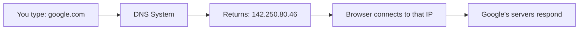
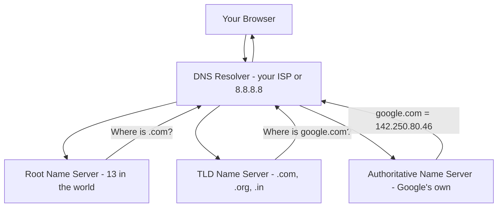
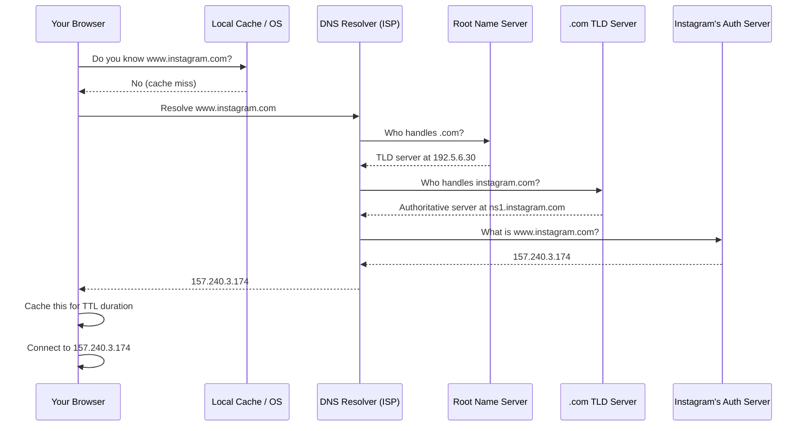
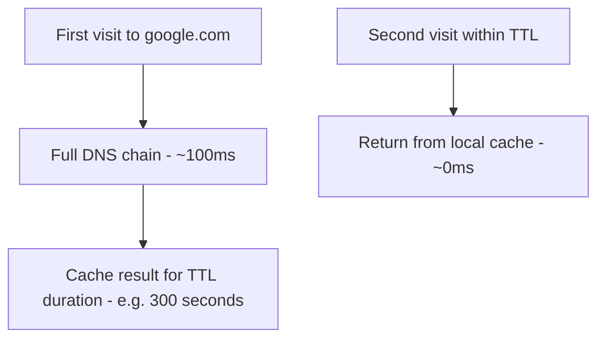
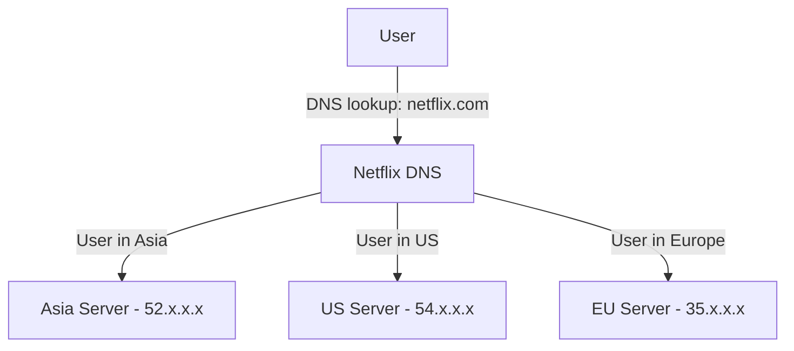
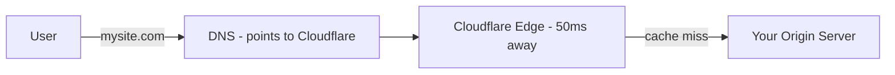

# 05 — DNS: How the Internet Finds Your Website

## The Problem DNS Solves

Computers talk to each other using **IP addresses** — numbers like `142.250.80.46`. That's Google's IP.

But nobody types `142.250.80.46` into their browser. They type `google.com`. 

Someone needs to translate `google.com` → `142.250.80.46`. That someone is **DNS — the Domain Name System**. It's basically the phone book of the internet.



---

## How a Domain Name is Structured

```
mail.google.com
│    │      │
│    │      └── Root (implicit dot at the end)
│    └────────── TLD (Top Level Domain): .com
└─────────────── Subdomain: mail
                 Domain: google
```

Full domain: `mail.google.com.` (there's always an invisible dot at the end — the root)

---

## The Four Players in DNS Resolution



| Player | Who they are | What they do |
|---|---|---|
| **DNS Resolver** | Your ISP or Google/Cloudflare (8.8.8.8) | Receives your query, fetches the answer |
| **Root Name Server** | 13 special servers worldwide | Knows where all TLD servers are |
| **TLD Name Server** | Managed by ICANN | Knows where authoritative servers are for `.com`, `.org`, `.in` etc. |
| **Authoritative Name Server** | Owned by the domain owner | Has the final, definitive answer |

---

## Step-by-Step DNS Resolution

Let's trace what happens when you type `www.instagram.com` for the first time (no cache):



This whole chain typically completes in **under 100 milliseconds**.

---

## DNS Caching and TTL

Every DNS record has a **TTL (Time To Live)** — how long the answer can be cached before asking again.



| TTL Value | Meaning | Use case |
|---|---|---|
| Low (60s) | Refresh often | When you're about to change IPs |
| Medium (300s) | Balance | Most websites |
| High (86400s = 1 day) | Cache aggressively | Stable, rarely-changing servers |

---

## DNS Record Types

| Record | What it does | Example |
|---|---|---|
| **A** | Maps domain to IPv4 | `google.com → 142.250.80.46` |
| **AAAA** | Maps domain to IPv6 | `google.com → 2607:f8b0::8b:200e` |
| **CNAME** | Alias — one domain points to another | `www.google.com → google.com` |
| **MX** | Mail server for the domain | `gmail.com → mail.google.com` |
| **TXT** | Arbitrary text (often for verification) | SPF records for email security |
| **NS** | Which name servers are authoritative | `google.com → ns1.google.com` |

---

## Why This Matters for System Design

### 1. DNS-based Load Balancing (Geo-routing)

You can have different IPs for different regions:



Netflix, Google, and Cloudflare use DNS to direct users to the nearest server.

### 2. DNS Failover

If your primary server goes down, update the DNS record to point to a backup server. (Subject to TTL — that's why low TTL before planned changes.)

### 3. CDN Integration

CDN providers like Cloudflare use DNS to intercept requests and serve content from edge servers:


