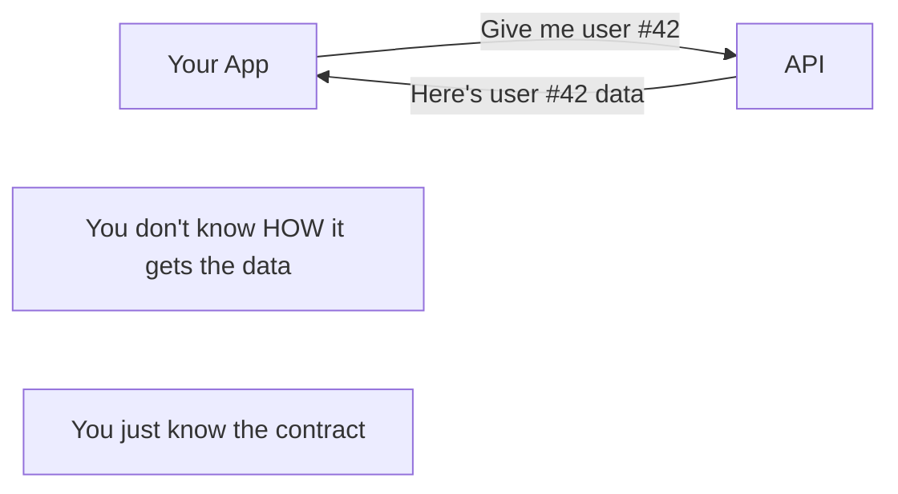
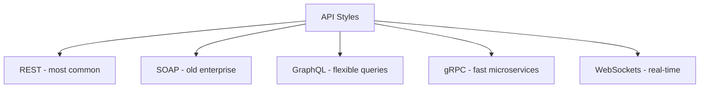
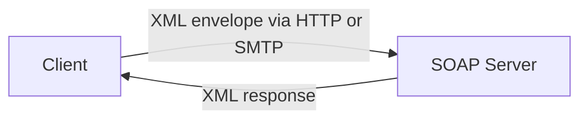
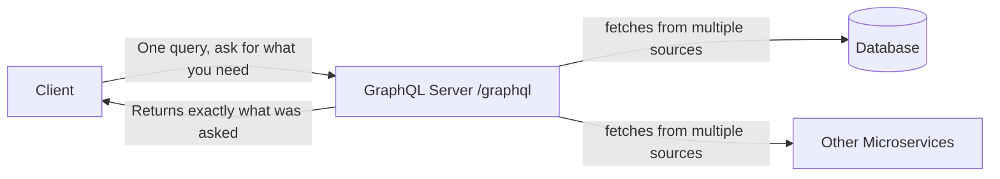
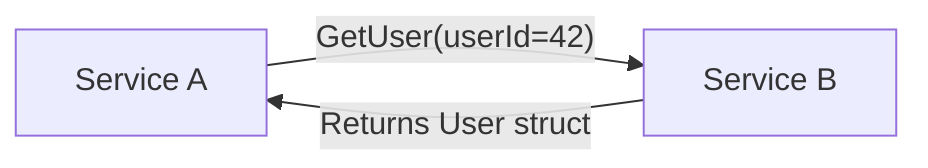
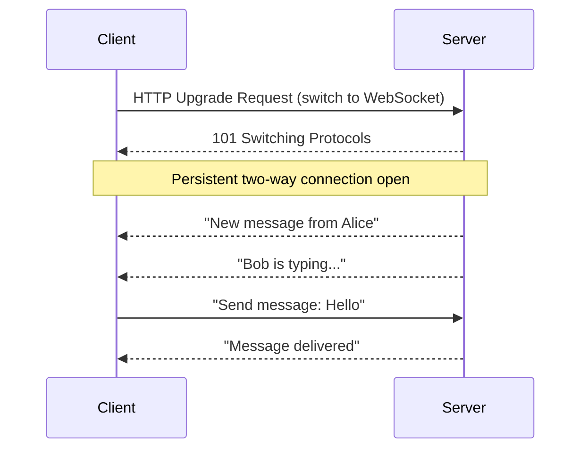
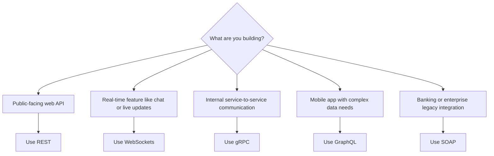

# 06 — APIs and Communication: How Systems Talk to Each Other

## What is an API?

An **API (Application Programming Interface)** is a contract. It says:

> "If you send me *this*, I'll give you *that*."

It's how two completely separate systems communicate without knowing each other's internal details.



Real-world analogy: A TV remote. You press "Volume Up" and the TV gets louder. You don't need to know what's inside the TV. The remote's buttons are the API.

---

## The 5 Major API Styles



---

## 1. REST (Representational State Transfer)

The most widely used style. Uses standard HTTP methods and URLs to represent resources.

**Mental model**: A file system in the cloud. Each URL is a "path" to a resource.

```mermaid
flowchart LR
    GET[GET /users/42] -->|Read user 42| Response[{"id": 42, "name": "Alice"}]
    POST[POST /users] -->|Create new user| Response2[{"id": 43, "name": "Bob"}]
    PUT[PUT /users/42] -->|Replace user 42| Response3[Updated user]
    DELETE[DELETE /users/42] -->|Delete user 42| Response4[204 No Content]
```

| Feature | REST |
|---|---|
| Protocol | HTTP/HTTPS |
| Data format | JSON (usually) |
| Learning curve | Low |
| Cacheability | Excellent (GET requests are cacheable) |
| Best for | Public APIs, web and mobile apps |

---

## 2. SOAP (Simple Object Access Protocol)

The old-school way. Still used in banking and enterprise software. Uses XML envelopes.



**Example SOAP request** (just to show how verbose it is):
```xml
<Envelope xmlns="http://schemas.xmlsoap.org/soap/envelope/">
  <Body>
    <GetUser>
      <UserId>42</UserId>
    </GetUser>
  </Body>
</Envelope>
```

| Feature | SOAP |
|---|---|
| Protocol | HTTP, SMTP, or others |
| Data format | XML (strict, verbose) |
| Learning curve | High |
| Best for | Enterprise, banking, systems requiring strict contracts |
| Still used? | Yes — in legacy systems and financial services |

---

## 3. GraphQL

Invented by Facebook (2015). Lets the client ask for **exactly the data it needs** — no more, no less.

**Problem with REST**: If you want a user's name and their last 3 posts, you might need 2 separate API calls:
- `GET /users/42` → returns 20 fields, you only wanted 2
- `GET /users/42/posts?limit=3`

**GraphQL solves this**:

```graphql
query {
  user(id: 42) {
    name
    posts(limit: 3) {
      title
      createdAt
    }
  }
}
```

One request. Exactly the data you asked for.



| Feature | GraphQL |
|---|---|
| Protocol | HTTP |
| Data format | JSON |
| Best for | Mobile apps, complex frontends, when different clients need different data |
| Downside | Caching is harder, more complex to set up |

---

## 4. gRPC (Google Remote Procedure Call)

Think of it as calling a function on another machine as if it were local.

Instead of "send me JSON and I'll parse it", gRPC says "call this exact method with these exact parameters".



Uses **Protocol Buffers** (protobuf) — a binary format. Much smaller and faster than JSON.

| Feature | gRPC |
|---|---|
| Protocol | HTTP/2 |
| Data format | Binary (Protocol Buffers) |
| Speed | Very fast — 5-10x faster than REST |
| Best for | Internal microservice communication |
| Downside | Binary format is not human-readable, harder to debug |

---

## 5. WebSockets

REST/gRPC are **request-response**: client asks, server answers, connection closes.

WebSockets keep the connection **permanently open** so the server can push data to the client at any time.



| Feature | WebSockets |
|---|---|
| Connection type | Persistent, bidirectional |
| Best for | Chat apps, live feeds, multiplayer games, collaborative editing |
| Examples | WhatsApp Web, Google Docs, stock price tickers |
| Downside | Harder to scale (connections stay open), not cacheable |

---

## Comparison Table

| | REST | SOAP | GraphQL | gRPC | WebSockets |
|---|---|---|---|---|---|
| Direction | Request-Response | Request-Response | Request-Response | Request-Response | Bidirectional |
| Protocol | HTTP | HTTP/SMTP/etc | HTTP | HTTP/2 | WS |
| Format | JSON | XML | JSON | Binary | Any |
| Speed | Medium | Slow | Medium | Fast | Real-time |
| Caching | Easy | Hard | Hard | Hard | N/A |
| Best for | Public APIs | Enterprise legacy | Flexible clients | Microservices | Real-time apps |

---

## When to Use What


