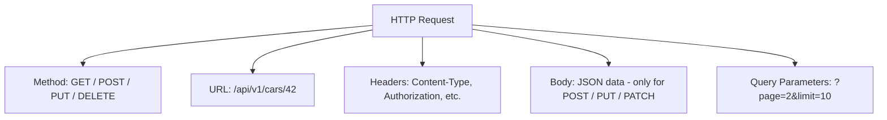
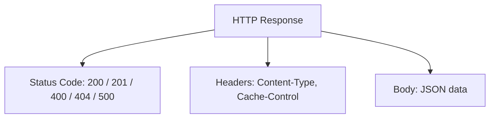
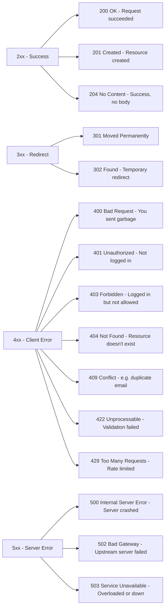
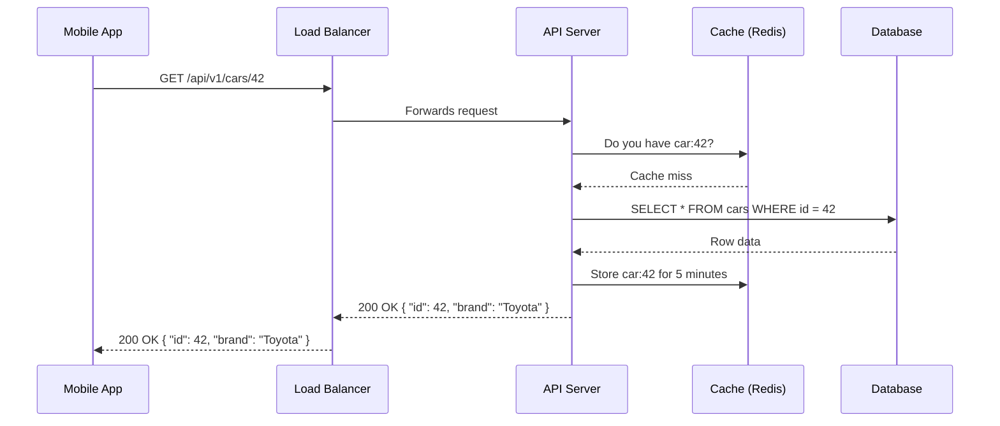
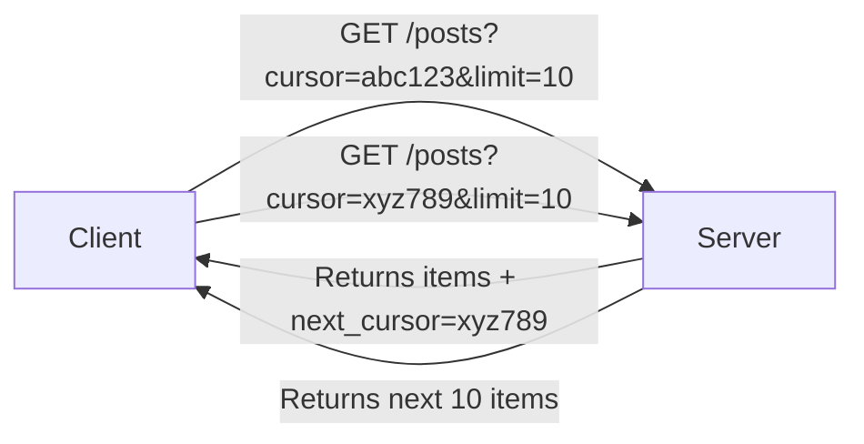

# 07 — REST API Deep Dive

## REST in Plain English

REST is just a set of rules for building APIs over HTTP. It's not a protocol or a framework — it's a style.

The key idea: **every URL represents a "resource"** (a thing), and HTTP methods tell you what to do with it.

```mermaid
flowchart LR
    URL[URL = the thing] --> users[/users - the users collection]
    URL --> user[/users/42 - a specific user]
    URL --> posts[/users/42/posts - that user's posts]
    
    Method[HTTP Method = the action] --> GET[GET - read it]
    Method --> POST[POST - create it]
    Method --> PUT[PUT - replace it]
    Method --> PATCH[PATCH - update part of it]
    Method --> DELETE[DELETE - delete it]
```

---

## HTTP Methods

### GET — Read data (never changes anything)

```
GET /cars           → get all cars
GET /cars/5         → get car with id 5
GET /cars?brand=Toyota&year=2020  → filtered list
```

Rules for GET:
- **Safe** — reading doesn't change server state
- **Idempotent** — calling it 10 times gives the same result as calling it once
- **Cacheable** — responses can be cached

### POST — Create something new

```
POST /cars
Body: { "brand": "Toyota", "model": "Camry", "price": 25000 }

Response: 201 Created
Body: { "id": 43, "brand": "Toyota", "model": "Camry", "price": 25000 }
```

- **Not idempotent** — calling POST twice creates two cars
- Response code is `201 Created` (not `200 OK`)

### PUT — Replace an entire resource

```
PUT /cars/43
Body: { "brand": "Toyota", "model": "Corolla", "price": 20000 }
```

Replaces the whole object. If a field is missing from the body, it gets cleared.

### PATCH — Update only specific fields

```
PATCH /cars/43
Body: { "price": 22000 }
```

Only the `price` changes. Other fields stay the same.

### DELETE — Remove a resource

```
DELETE /cars/43
Response: 204 No Content
```

- `204` means "success, but no body to return"

---

## Request Anatomy

Every HTTP request has these parts:



### Headers

Headers carry metadata about the request:

| Header | Purpose | Example |
|---|---|---|
| `Content-Type` | Format of the body | `application/json` |
| `Accept` | Format the client wants back | `application/json` |
| `Authorization` | Auth token | `Bearer eyJhbGciOiJIUzI1...` |
| `X-Request-ID` | Unique ID for tracing | `abc-123-xyz` |

### Query Parameters

Used for filtering, sorting, and paginating — never for identifying a specific resource.

```
GET /cars?brand=Toyota&year=2022&sort=price&order=asc&page=2&limit=20
```

| Param | Purpose |
|---|---|
| `brand=Toyota` | Filter by brand |
| `year=2022` | Filter by year |
| `sort=price` | Sort by field |
| `order=asc` | Sort direction |
| `page=2` | Page number |
| `limit=20` | Items per page |

### Request Body (JSON)

Used in POST / PUT / PATCH to send data to the server:

```json
{
    "brand": "Toyota",
    "model": "Camry",
    "year": 2022,
    "price": 28000,
    "features": ["sunroof", "backup camera"]
}
```

---

## Response Anatomy



### Status Codes



---

## RESTful URL Design Best Practices

### Use nouns, not verbs

```
❌  GET /getUser/42
❌  POST /createCar
❌  DELETE /deletePost/5

✅  GET /users/42
✅  POST /cars
✅  DELETE /posts/5
```

The verb comes from the HTTP method. The URL is just the resource.

### Use plural nouns for collections

```
✅  /users       (collection)
✅  /users/42    (specific item)
✅  /cars
✅  /cars/42/reviews   (nested - reviews of car 42)
```

### Use lowercase and hyphens

```
❌  /GetAllUsers
❌  /user_posts
✅  /users
✅  /user-posts
```

### Version your API

```
✅  /api/v1/users
✅  /api/v2/users
```

This lets you change the API without breaking existing clients.

---

## Full Request-Response Flow



---

## Pagination Patterns

When a collection is huge, you don't return everything at once.

### Offset pagination (simplest)

```
GET /cars?page=3&limit=20
```

Returns items 41–60 (skip first 40, take 20).

### Cursor pagination (better for large datasets)

```
GET /cars?cursor=eyJpZCI6NDJ9&limit=20
```

The cursor is an encoded pointer to the last item seen. Better for infinite scroll.


