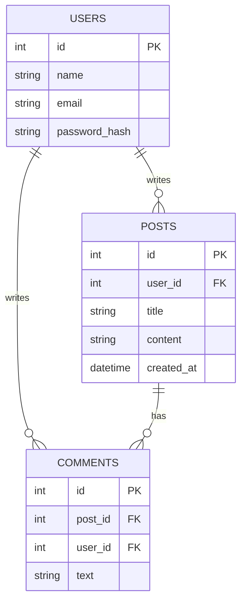
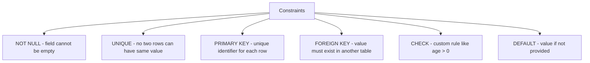
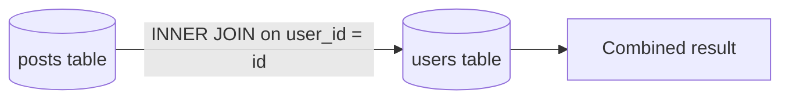
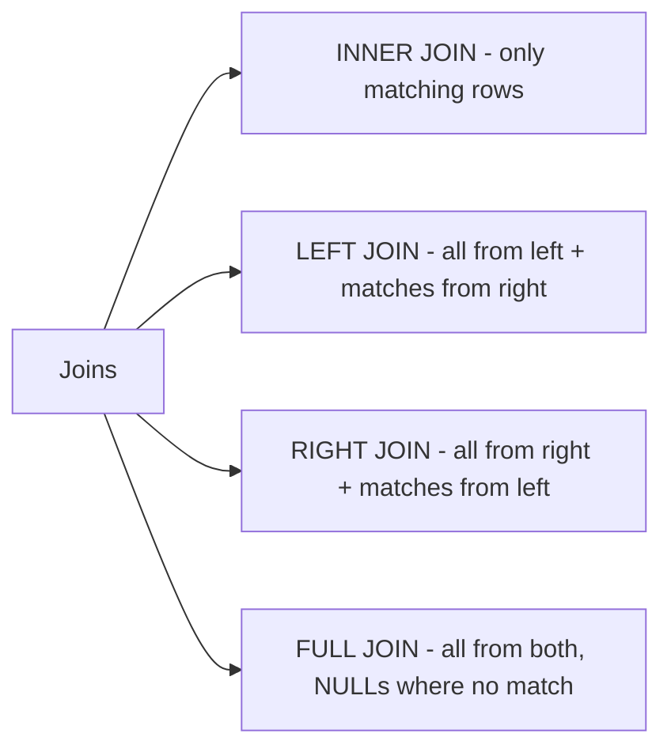
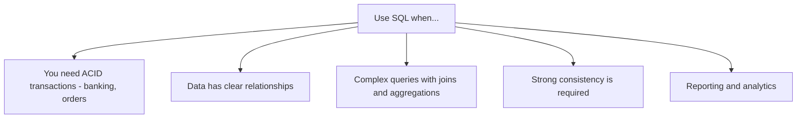

# 08 — SQL Databases: Relational Data Done Right

## What is a Relational Database?

A relational database organizes data into **tables** (like spreadsheets) with rows and columns. The "relational" part means tables can be **related to each other** through keys.



---

## Tables, Rows, and Columns

| Term | What it is | Analogy |
|---|---|---|
| **Table** | A collection of related data | A spreadsheet tab |
| **Row** | One record / entry | One row in the spreadsheet |
| **Column** | A field / attribute | One column header |
| **Schema** | The structure definition | The column headers + their types |

**Example: users table**

| id | name | email | age |
|---|---|---|---|
| 1 | Alice | alice@example.com | 28 |
| 2 | Bob | bob@example.com | 35 |
| 3 | Carol | carol@example.com | 22 |

---

## Constraints

Constraints are rules that the database enforces on your data. They prevent bad data from ever entering the system.



```sql
CREATE TABLE users (
    id       INT PRIMARY KEY AUTO_INCREMENT,
    email    VARCHAR(255) NOT NULL UNIQUE,
    name     VARCHAR(100) NOT NULL,
    age      INT CHECK (age >= 0),
    role     VARCHAR(20) DEFAULT 'user'
);
```

---

## Primary Key and Foreign Key

### Primary Key (PK)
The unique identifier for a row. No two rows can have the same PK.

```
users table:
id (PK) | name  | email
1       | Alice | alice@example.com
2       | Bob   | bob@example.com
```

### Foreign Key (FK)
References the primary key of another table. Creates the "relation" in relational database.

```
posts table:
id (PK) | user_id (FK → users.id) | title
1       | 1                        | Alice's first post
2       | 1                        | Alice's second post
3       | 2                        | Bob's post
```


If you try to insert a post with `user_id = 99` and there's no user with id 99, the database **rejects it**. That's referential integrity.

---

## Relationships

### One-to-One

One row in table A links to exactly one row in table B.

```mermaid
erDiagram
    USER ||--|| PROFILE : "has"
    USER { int id }
    PROFILE { int id, int user_id, string bio, string avatar_url }
```

Example: A user has one profile. A profile belongs to one user.

### One-to-Many

One row in table A links to many rows in table B.

```mermaid
erDiagram
    USER ||--o{ POST : "writes"
    USER { int id }
    POST { int id, int user_id, string content }
```

Example: One user can write many posts. Each post belongs to one user.

### Many-to-Many

Many rows in A link to many rows in B. Requires a **junction table**.

```mermaid
erDiagram
    STUDENT }o--o{ COURSE : "enrolls in"
    STUDENT { int id, string name }
    ENROLLMENT { int student_id FK, int course_id FK, date enrolled_at }
    COURSE { int id, string name }
```

Example: A student can take many courses. A course can have many students.

---

## Joins

Joins let you combine data from multiple tables into one result.

### INNER JOIN — only rows that match in BOTH tables

```sql
SELECT users.name, posts.title
FROM posts
INNER JOIN users ON posts.user_id = users.id;
```



| users.name | posts.title |
|---|---|
| Alice | Alice's first post |
| Alice | Alice's second post |
| Bob | Bob's post |

### LEFT JOIN — all rows from left table, matching from right (or NULL)

```sql
SELECT users.name, posts.title
FROM users
LEFT JOIN posts ON users.id = posts.user_id;
```

Returns all users, even if they have no posts (post fields will be NULL).

### Types of Joins at a Glance



---

## When to Use SQL



**Popular SQL databases:**

| Database | Best for |
|---|---|
| **PostgreSQL** | Most use cases — powerful, open-source |
| **MySQL / MariaDB** | Web apps, widely supported |
| **SQLite** | Embedded, small apps, testing |
| **SQL Server** | Enterprise Microsoft stack |
| **Oracle** | Enterprise, banking |
