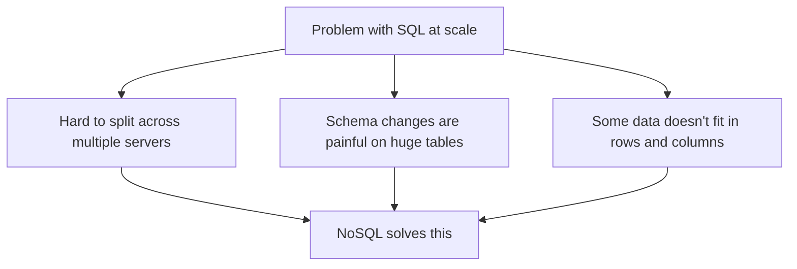
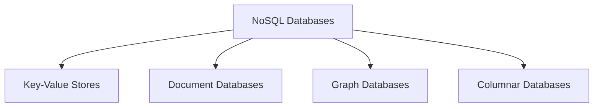
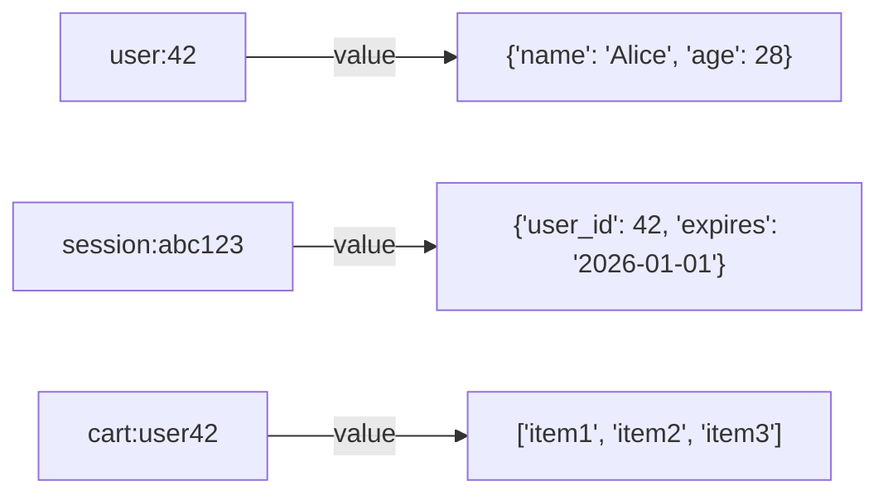
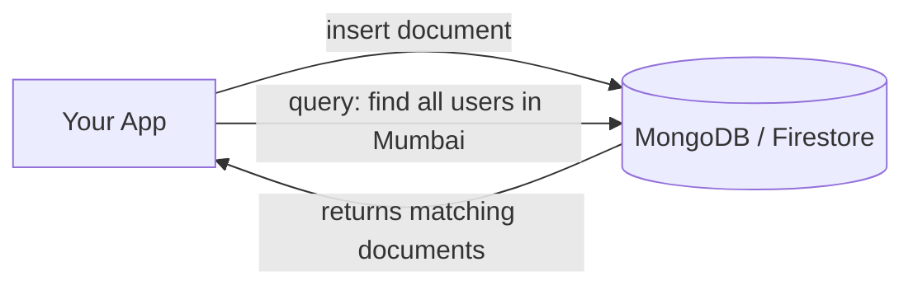
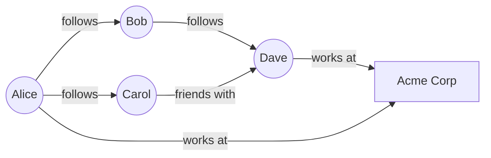
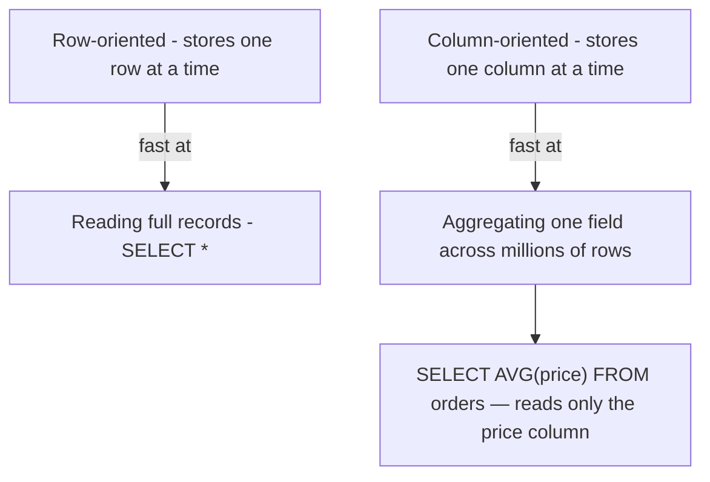
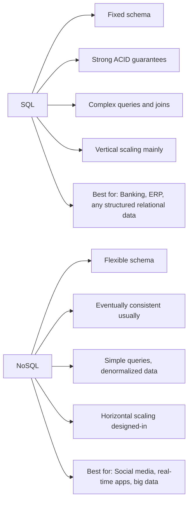
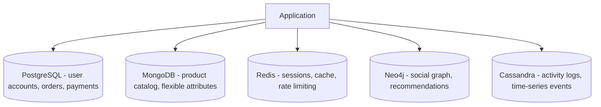

# 09 — NoSQL Databases: When SQL Isn't Enough

## Why NoSQL Exists

SQL databases are great. But they have weaknesses at scale:

1. **Scaling is hard**: SQL databases scale vertically (bigger machine) better than horizontally (more machines). Adding more servers to a SQL cluster is complex.
2. **Fixed schema**: Every row must match the table structure. Changing the schema on a huge live table is painful.
3. **Not all data is relational**: A JSON document, a social graph, or a time-series log doesn't fit nicely in tables.

NoSQL databases were built to solve these problems.



> **NoSQL ≠ "No SQL syntax"** — it means "Not Only SQL". Some NoSQL databases even support SQL-like queries.

---

## The 4 Types of NoSQL Databases



---

## 1. Key-Value Stores

The simplest kind. Just like a Python dictionary: `key → value`.



**Used for:**
- Session storage
- Caching (most common use)
- Rate limiting counters
- Shopping carts

**Examples:** Redis, Memcached, DynamoDB (also supports other modes)

**Strengths:** Extremely fast (microsecond reads), simple to use
**Weaknesses:** Can't query by value — you must know the exact key

---

## 2. Document Databases

Stores data as **JSON-like documents**. Each document can have its own structure — no fixed schema.

```json
{
    "_id": "user_42",
    "name": "Alice",
    "email": "alice@example.com",
    "address": {
        "city": "Mumbai",
        "country": "India"
    },
    "tags": ["premium", "verified"],
    "last_login": "2026-06-01T10:00:00Z"
}
```

A different user document could have completely different fields. That's flexible schema.



**Used for:**
- User profiles
- Product catalogs
- Blog posts, comments
- Any data with variable structure

**Examples:** MongoDB, Firestore, CouchDB

**Strengths:** Flexible schema, easy to scale horizontally
**Weaknesses:** Joins are hard (you denormalize data instead)

---

## 3. Graph Databases

Designed specifically for data that's all about **relationships** — where the connections between things matter as much as the things themselves.



Finding "friends of friends" in SQL requires expensive recursive joins. In a graph database, it's just traversing edges — fast and natural.

**Used for:**
- Social networks (who follows whom)
- Recommendation engines (users who bought X also bought Y)
- Fraud detection (identify suspicious transaction patterns)
- Knowledge graphs

**Examples:** Neo4j, Amazon Neptune

---

## 4. Columnar Databases (Wide-Column Stores)

Instead of organizing data by row, they organize it **by column**. Great for analytical queries on huge datasets.



Also includes systems like **Cassandra** which use a wide-column model optimized for write-heavy distributed systems.

**Used for:**
- Analytics and data warehouses
- Time-series data (IoT sensor readings)
- High-write, distributed systems

**Examples:** Apache Cassandra, HBase, Google Bigtable, Amazon Redshift (analytics)

---

## SQL vs NoSQL



| | SQL | NoSQL |
|---|---|---|
| Schema | Fixed | Flexible |
| Consistency | Strong (ACID) | Usually eventual |
| Scaling | Vertical (harder horizontal) | Horizontal (designed for it) |
| Joins | Excellent | Difficult (avoid them) |
| Query power | Very high (full SQL) | Limited to simpler queries |
| Best for | Structured, relational data | Unstructured, high-volume data |

---

## The Real-World Answer: Use Both

Large systems typically use multiple databases for different needs:



This is called **polyglot persistence** — using the right database for each job.
