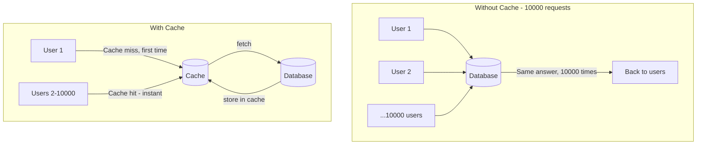
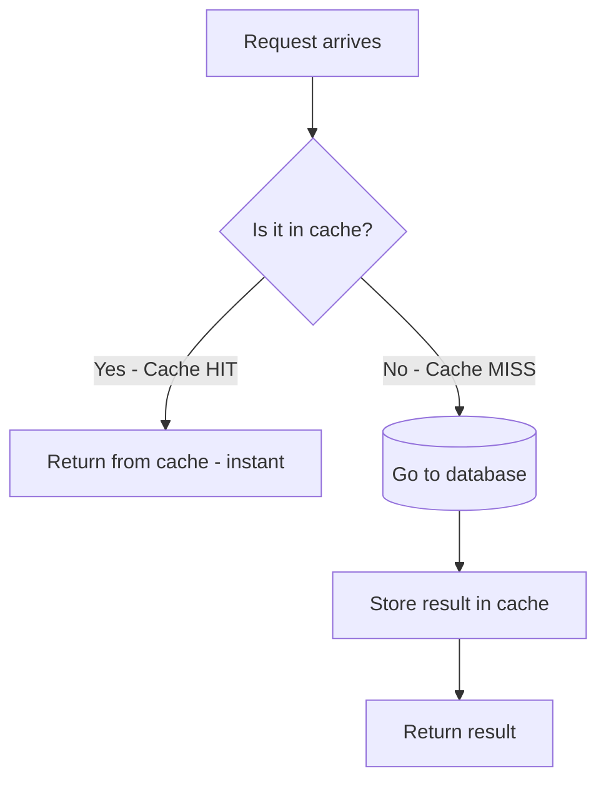
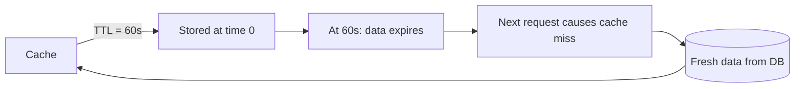
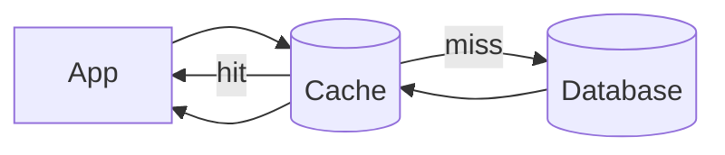
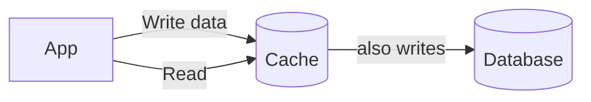
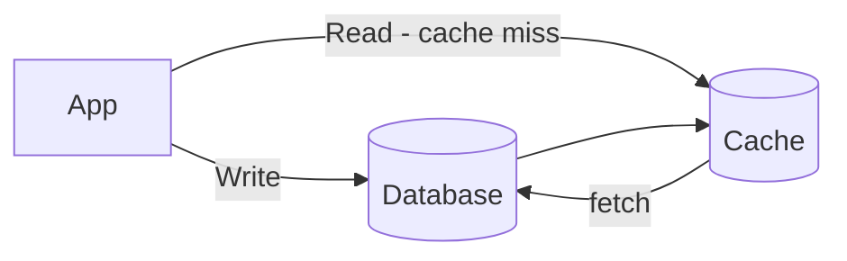
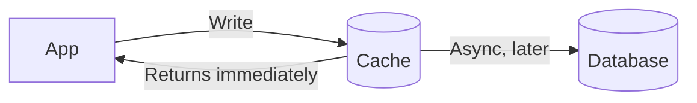
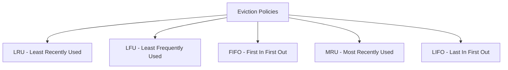
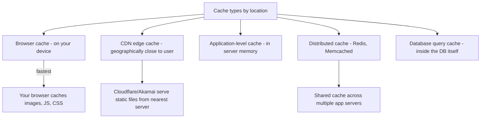
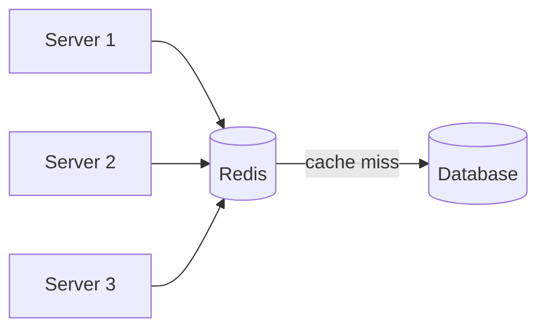

# 10 — Caching: Stop Asking the Same Question Twice

## The Problem

Every time a user visits a popular product page, your server goes to the database, runs the same query, gets the same result, and sends it back. If 10,000 users visit the same page, you run the same database query 10,000 times.

That's wasteful. The data hasn't changed. A cache solves this.



---

## Cache Hit and Cache Miss



| Term | Meaning | Speed |
|---|---|---|
| **Cache Hit** | Data found in cache | Microseconds |
| **Cache Miss** | Data not in cache, must fetch from DB | Milliseconds |

**Hit rate** = number of hits / total requests. A good cache has 80–99% hit rate.

---

## TTL (Time To Live)

Cached data gets stale. TTL tells the cache how long to keep data before discarding it.



**Choosing TTL:**

| Data type | TTL | Reason |
|---|---|---|
| Static pages, CSS, JS | 1 day – 1 week | Rarely changes |
| Product catalog | 5–30 minutes | Occasionally updated |
| User profile | 5 minutes | Changes sometimes |
| Live stock prices | 1–5 seconds | Changes constantly |
| Real-time data | No caching | Must always be fresh |

---

## Cache Write Strategies

When you write data, what happens to the cache? There are 4 strategies.

### 1. Read-Through Cache

Cache sits in front of the database. On a miss, the **cache itself** fetches from the DB.



- Simple for the app — just talk to the cache
- First request is always slow (miss)

---

### 2. Write-Through Cache

Every write goes to cache **and** database simultaneously.



- Cache is always up to date
- Writes are slower (two writes every time)
- Data is never stale

---

### 3. Write-Around Cache

Writes go **directly to the database**, skipping the cache entirely. Cache is only populated on reads.



- Good when you write data that's rarely read again immediately
- Avoids polluting the cache with write-heavy, rarely-read data
- Cache may be stale until TTL expires

---

### 4. Write-Back (Write-Behind) Cache

Writes go to the cache. The cache **asynchronously** flushes to the database later.



- Very fast writes (no waiting for DB)
- **Risk**: if cache crashes before flushing, data is lost
- Used when write speed is critical and some data loss is acceptable

---

## Cache Eviction Policies

The cache has limited memory. When it's full, something must go. The eviction policy decides what.



### LRU — Least Recently Used *(most common)*

Throw out the item that hasn't been accessed in the longest time.

```
Timeline → oldest access ... newest access
Cache: [Item D (oldest), Item B, Item A, Item C (newest)]
Cache is full, new item arrives
→ Evict Item D (least recently used)
```

**Assumption**: if you haven't needed it recently, you probably won't need it soon.

### LFU — Least Frequently Used

Throw out the item that has been accessed the fewest total times.

```
Item A: accessed 50 times
Item B: accessed 3 times  ← evict this
Item C: accessed 28 times
```

**Assumption**: popular items stay popular.

### FIFO — First In, First Out

Throw out the oldest item regardless of how often it was used.

Like a queue — what came in first goes out first.

### MRU — Most Recently Used

Throw out the **most** recently used item. (Sounds backwards, but useful in specific cases like when you're scanning data sequentially and won't re-read it.)

### LIFO — Last In, First Out

Like a stack — the most recently added item gets evicted first.

---

## Comparison at a Glance

| Policy | Evicts | Good for |
|---|---|---|
| **LRU** | Least recently accessed | General purpose — most systems use this |
| **LFU** | Accessed fewest times | When access frequency is a strong signal |
| **FIFO** | Oldest item | Simple, predictable expiry |
| **MRU** | Most recently accessed | Sequential scans, media streaming |
| **LIFO** | Most recently added | Stack-based access patterns |

---

## Where Caches Live



---

## Redis in Practice

Redis is the most popular distributed cache. It's an in-memory key-value store.



All servers share the same Redis instance, so a cache hit on one server is also available to others.

Common Redis patterns:
- Cache database query results
- Store user sessions
- Rate limiting counters (`INCR` + TTL)
- Pub/Sub messaging
- Distributed locks
