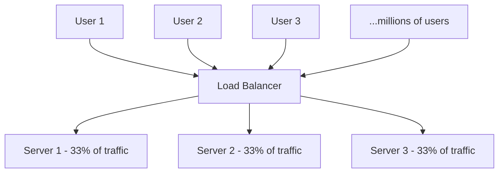
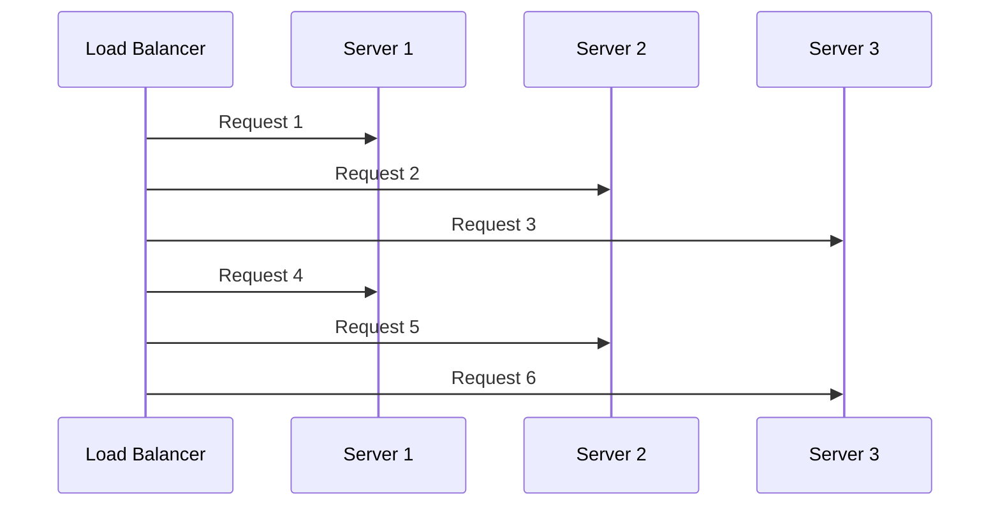
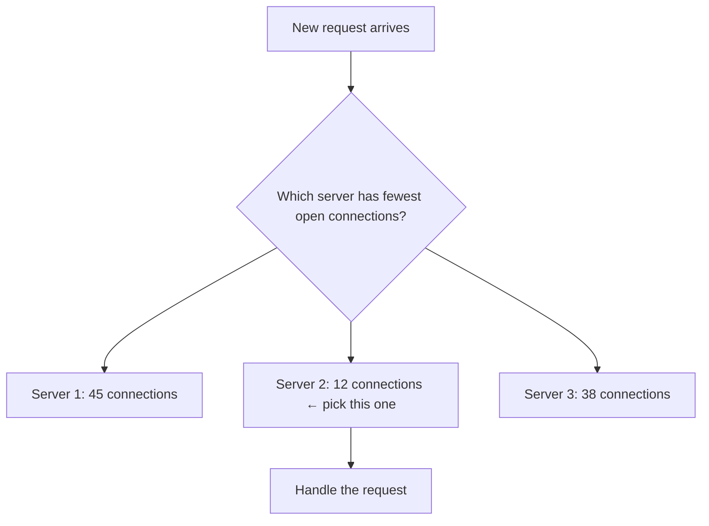
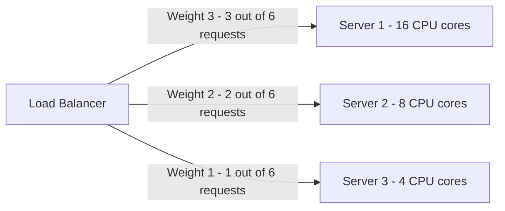
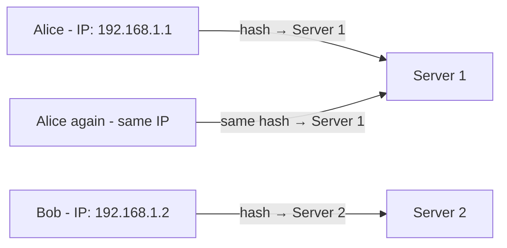
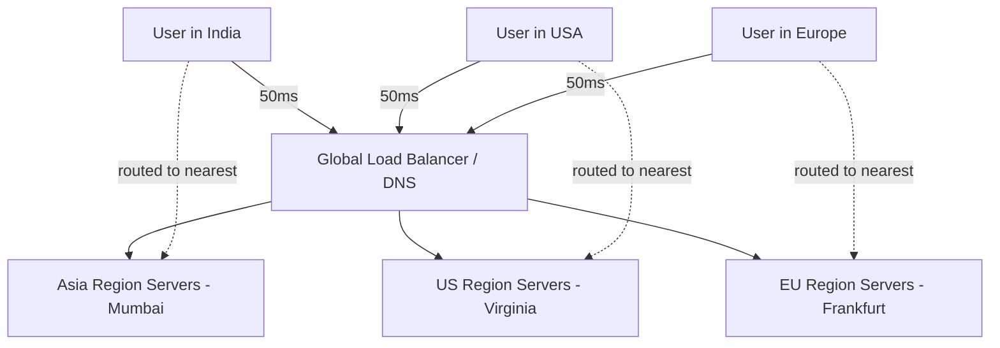
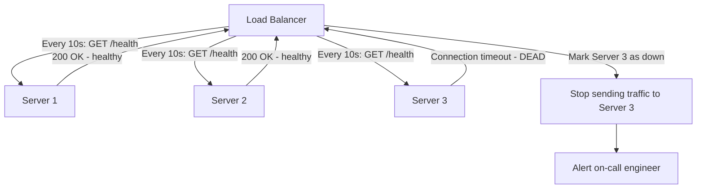
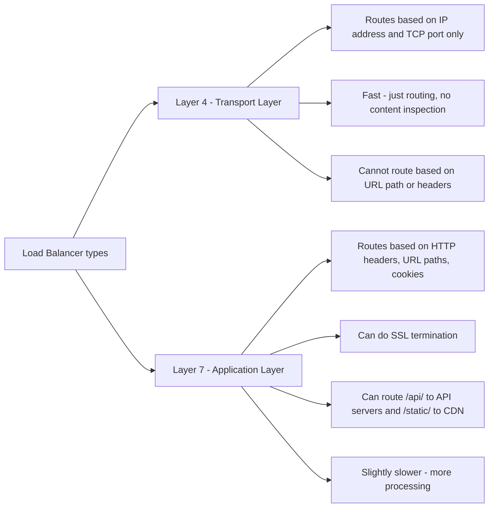
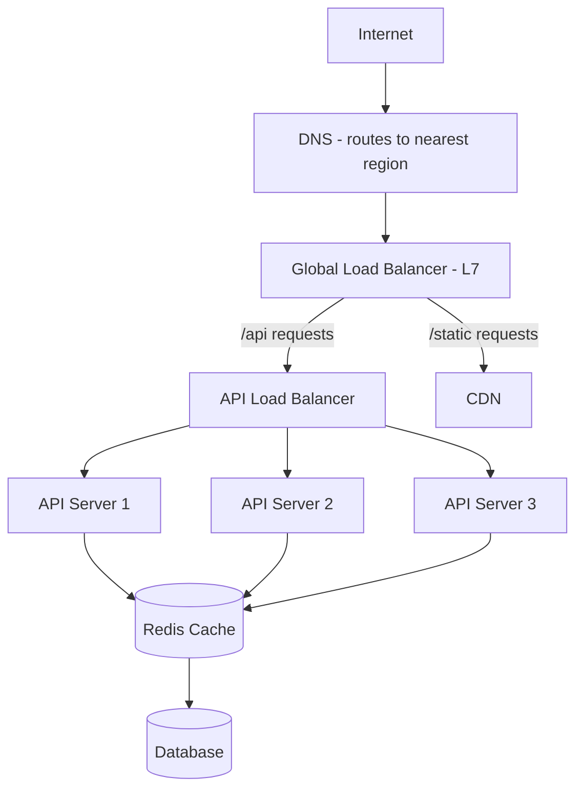

# 11 — Load Balancer: The Traffic Cop

## The Problem It Solves

One server can only handle so much. When too many requests hit the same machine:
- CPU spikes
- Memory runs out
- Response times shoot up
- The server crashes

A **load balancer** sits in front of multiple servers and distributes incoming requests across them.



Benefits:
- No single server gets overwhelmed
- Add or remove servers without clients knowing
- If a server dies, traffic automatically routes around it
- Zero-downtime deployments (take one server down, update it, bring it back)

---

## Load Balancing Algorithms

How does the load balancer decide which server gets the next request?

---

### 1. Round Robin

Requests go to each server in turn, looping around.



**Good when**: All servers are identical in power and requests are roughly equal in complexity.

**Problem**: If request 1 is a huge file upload and request 2 is a tiny health check, Server 1 is overloaded while Server 2 is idle.

---

### 2. Least Connections

Send the next request to whichever server has the **fewest active connections right now**.



**Good when**: Requests vary significantly in how long they take to process.

---

### 3. Weighted Round Robin

Servers get different weights based on their capacity. A powerful server handles more requests.



**Good when**: Servers have different hardware specs.

---

### 4. IP Hash

The client's IP address is hashed. The result determines which server they always go to.



**Good when**: You need **session stickiness** — the same user must always hit the same server (e.g., in-memory sessions without a shared cache).

---

### 5. GEO-Based Routing

Route users to the server closest to them geographically to minimize latency.



Used by Netflix, Google, Cloudflare, and every major global service.

---

## Summary of Algorithms

| Algorithm | How it works | Best for |
|---|---|---|
| **Round Robin** | Take turns, equally | Identical servers, similar requests |
| **Least Connections** | Pick the least busy | Long-running requests |
| **Weighted Round Robin** | Like round robin, but servers have weights | Mixed hardware capacity |
| **IP Hash** | Same client → same server | Session stickiness |
| **GEO-based** | Route to nearest server | Global apps |

---

## Health Checks

A load balancer constantly checks if servers are alive. If a server fails, the load balancer stops sending it traffic.



Types of health checks:
- **Active checks**: Load balancer pings servers on a schedule
- **Passive checks**: Load balancer watches for error responses and marks servers unhealthy after too many failures

---

## Layer 4 vs Layer 7 Load Balancing



**Example L7 routing:**
```
/api/*    → API server pool
/static/* → CDN / static server pool
/ws/*     → WebSocket server pool
```

---

## Load Balancer in a Full Architecture


