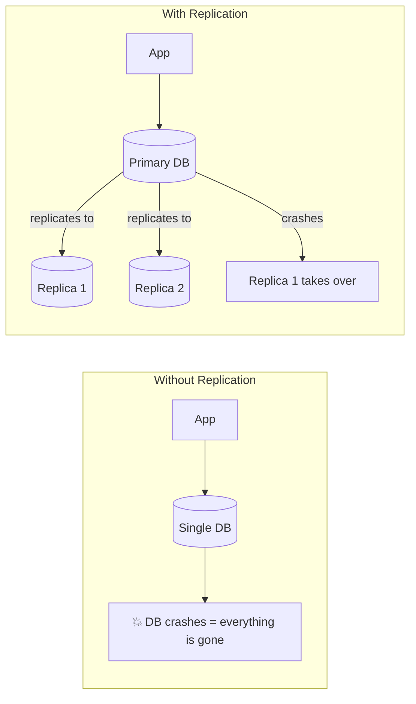
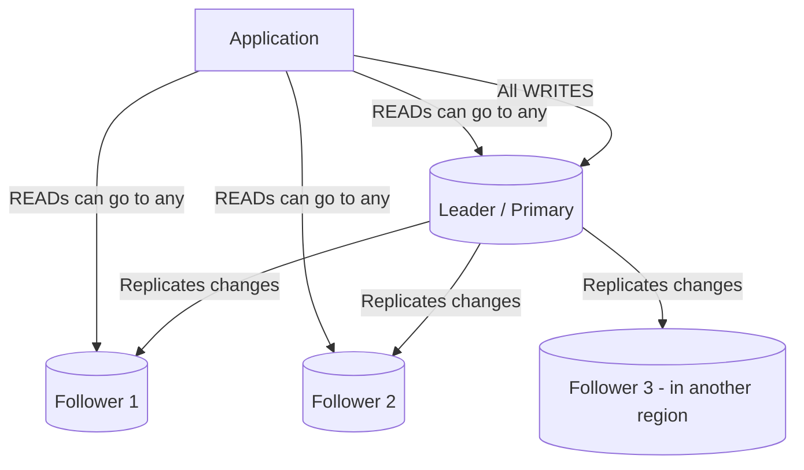
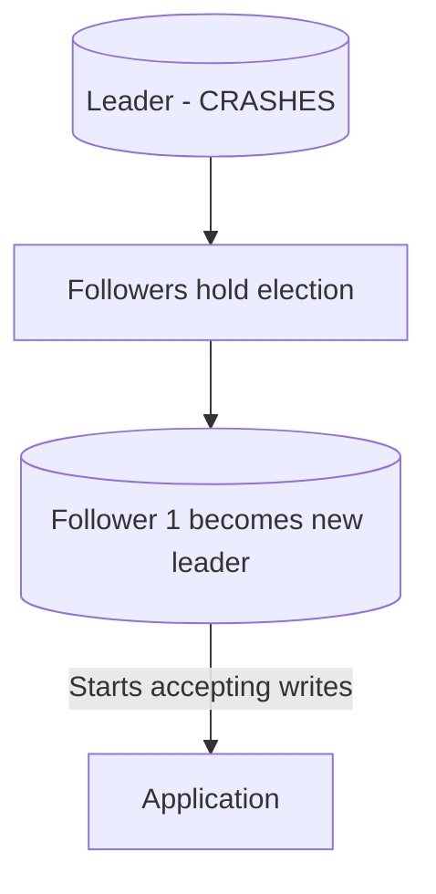
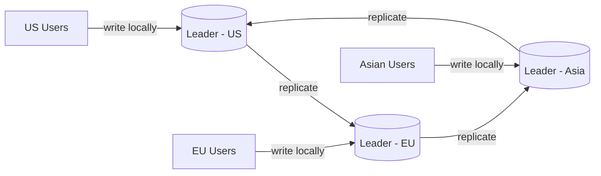
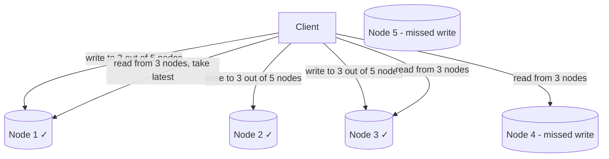
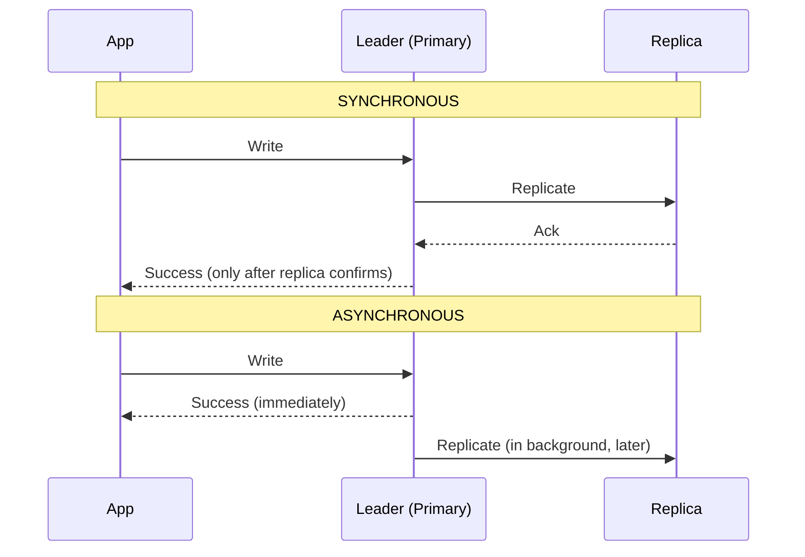
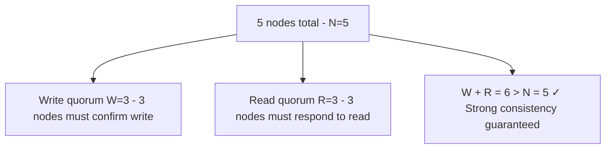

# 12 — Replication: Keeping Your Data Safe and Available

## The Problem

If you have one database and it dies, your entire system dies with it. All your users' data is gone. Your app is down. This is called a **single point of failure**.

**Replication** means keeping **copies of the same data on multiple machines**. If one machine dies, others still have the data.

Replication gives you:
- **High availability** — the system stays up even if some nodes die
- **Read scalability** — multiple replicas can serve read requests
- **Disaster recovery** — data is safe even if a data center burns down

---

## Replication Algorithms

### 1. Single Leader Replication (Primary-Replica)

One node is the **leader** (primary). All writes go to the leader. The leader sends changes to **followers** (replicas). Reads can come from any node.

**Failure scenario:**

**Used by:** MySQL, PostgreSQL, MongoDB

**Pros:** Simple, easy to reason about consistency
**Cons:** Leader is a write bottleneck; failover takes time

---

### 2. Multi-Leader Replication

Multiple nodes can accept **writes**. Each leader replicates to others.

**Pros:** Lower write latency (write to your local region)
**Cons:** **Conflict resolution is hard** — what if two users edit the same document from different regions simultaneously?

**Used by:** Google Docs (offline editing), Notion, distributed databases like CouchDB

---

### 3. Leaderless Replication

No single leader. Any node can accept writes. The client writes to multiple nodes and reads from multiple nodes.

Quorum ensures consistency: if you write to W nodes and read from R nodes, and W + R > total nodes, you're guaranteed to read at least one node that has the latest write.

**Used by:** Amazon DynamoDB, Apache Cassandra

---

## Synchronous vs Asynchronous Replication

| | Synchronous | Asynchronous |
|---|---|---|
| **Write speed** | Slower (waits for replica) | Faster (doesn't wait) |
| **Data safety** | Stronger (confirmed on multiple nodes) | Weaker (could lose recent writes if leader crashes) |
| **Availability** | Lower (if replica is slow, writes slow down) | Higher (leader doesn't wait) |
| **Common use** | Financial transactions | Most web applications |

---

## Quorum

Quorum is the minimum number of nodes that must agree for an operation to succeed.

Given:
- **N** = total number of replicas
- **W** = minimum nodes that must confirm a write
- **R** = minimum nodes that must respond to a read

**Rule for strong consistency:** W + R > N

**Example (N=5, W=3, R=3):**
- A write succeeds when 3 out of 5 nodes confirm it
- A read fetches from 3 nodes and returns the most recent version
- Since W + R > N, the read set and write set overlap by at least 1 node — so the read always sees the latest write

**Tuning quorum for different needs:**

| Configuration | Effect |
|---|---|
| W=1, R=5 | Fast writes, slow reads |
| W=5, R=1 | Slow writes, fast reads |
| W=3, R=3 (N=5) | Balanced |
| W=1, R=1 | Fast everything — but no consistency guarantees |
