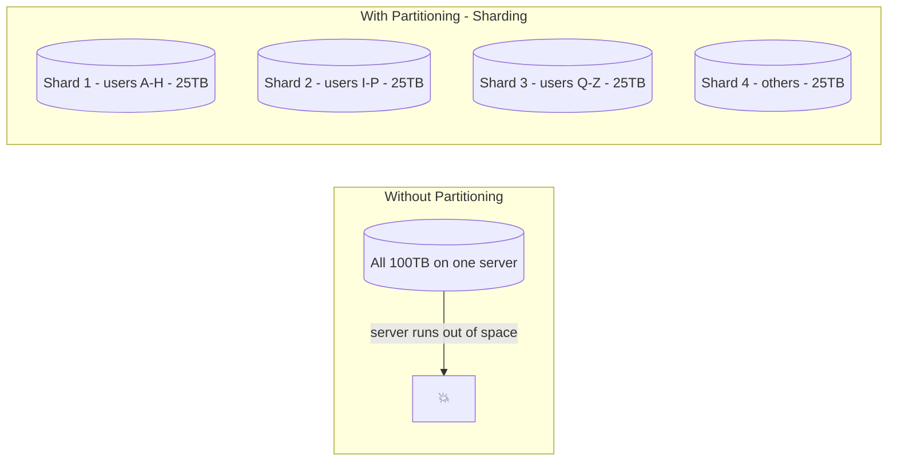
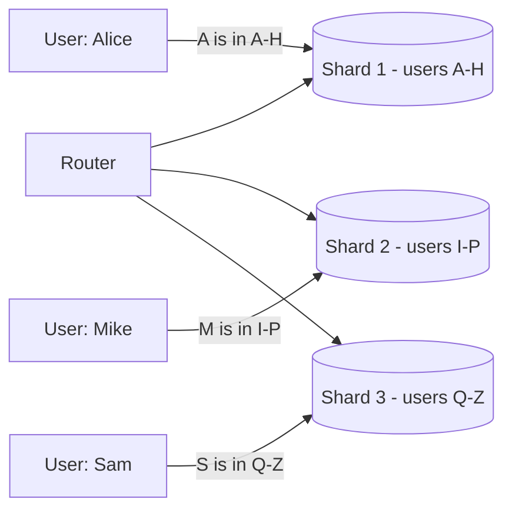
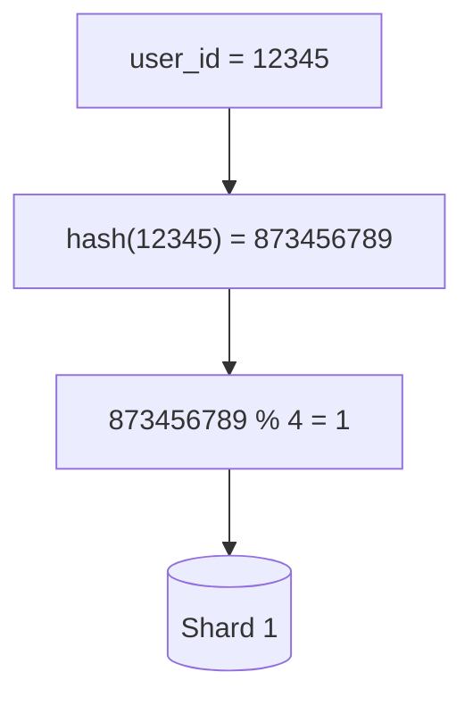
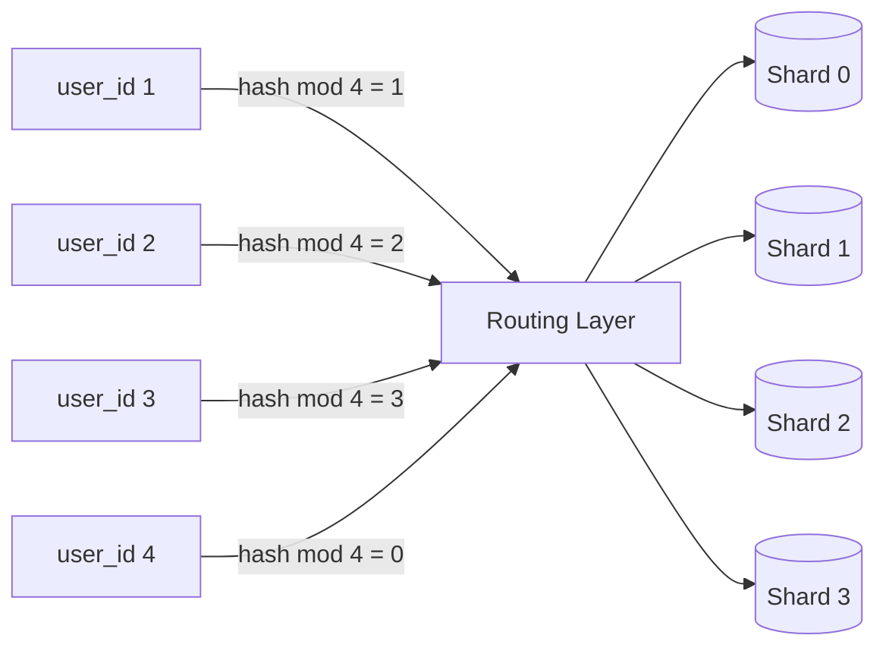
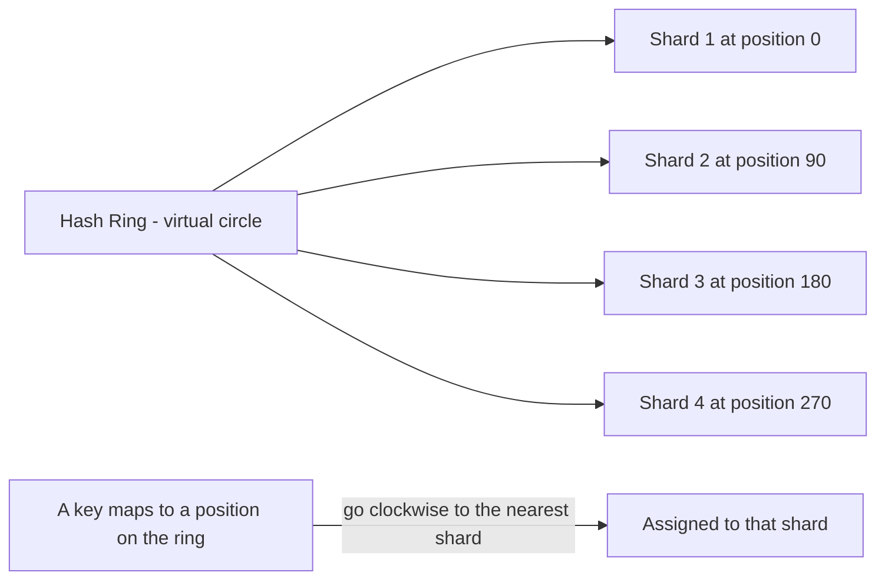
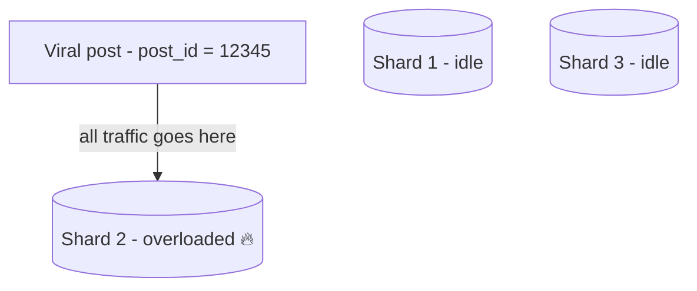
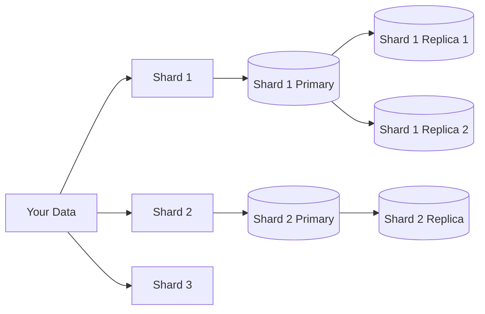

# 13 — Partitioning (Sharding): Splitting the Data Pie

## Why You Need It

Even with replication, you have copies of the **same data** on multiple machines. But what if the data itself is too large for any single machine?

If you have 100 TB of data and each server holds 10 TB, one server can't hold it all. You need to **split the data across multiple servers**.

**Partitioning** (also called **sharding**) means dividing your data so that each server only holds a portion of it.



Sharding also distributes **write load** — instead of one database handling all writes, each shard handles its portion.

---

## Partition Strategy 1: Partition by Key (Range Partitioning)

Split data into ranges based on the value of a key.



**Pros:**
- Range queries are efficient (e.g., "get all users starting with A–D")
- Data is naturally ordered

**Cons:**
- **Hotspots**: if most users have names starting with 'A', Shard 1 is overloaded
- Adding new shards requires redistributing data

---

## Partition Strategy 2: Partition by Hash

Apply a hash function to the key. The result determines which shard gets the data.

```
shard = hash(user_id) % number_of_shards
```





**Pros:**
- Data is spread evenly (no hotspots by design)
- Simple to implement

**Cons:**
- Range queries become expensive (data is scattered, not ordered)
- Adding or removing shards requires rehashing — **most existing data moves**

---

## Consistent Hashing (Solves the Resharding Problem)

When you add a shard with regular hashing, almost every key remaps to a different shard — massive data movement.

Consistent hashing minimizes the data that needs to move when you add or remove a shard.



When a shard is added, only the keys that fall between the old and new shard boundary need to move. Everything else stays.

**Used by:** Amazon DynamoDB, Apache Cassandra, Redis Cluster

---

## Secondary Index Partitioning

What if you need to query by a field that's not the partition key?

Example: Users are partitioned by `user_id`, but you want to search by `city = "Mumbai"`.

```mermaid
flowchart TD
    Query["SELECT * FROM users WHERE city = 'Mumbai'"] --> Problem

    subgraph "Problem"
        Problem[Mumbai users are spread across all shards]
        S1[(Shard 1 - some Mumbai users)]
        S2[(Shard 2 - some Mumbai users)]
        S3[(Shard 3 - some Mumbai users)]
    end

    subgraph "Solution: Global Secondary Index"
        GSI[(Global Secondary Index - city → list of user_ids)]
        GSI -->|lookup Mumbai user IDs| IDs[user_id: 5, 42, 108, ...]
        IDs -->|fetch from correct shards| S1 & S2 & S3
    end
```

There are two approaches:
1. **Local index**: each shard indexes only its own data — fast writes, scatter-gather reads
2. **Global index**: a separate index covers all shards — more complex, but fast reads

---

## Hotspots and How to Avoid Them

A **hotspot** happens when too much traffic hits one shard — defeating the purpose of sharding.

**Common causes:**
- Celebrities: Justin Bieber's user_id always hits Shard 2
- Trending topics: a viral tweet's ID hits one shard with millions of requests
- Time-based sharding: all current data goes to "today's" shard



**Solutions:**
- Add a random suffix to hot keys: `user_42_1`, `user_42_2` ... spread writes across multiple shards
- Application-level caching for hot items
- Dedicated shards for "VIP" keys

---

## Partitioning + Replication Together

In production, each shard is itself replicated:



- Partitioning → splits data so each piece fits on a machine
- Replication → copies each piece for redundancy and read scaling
