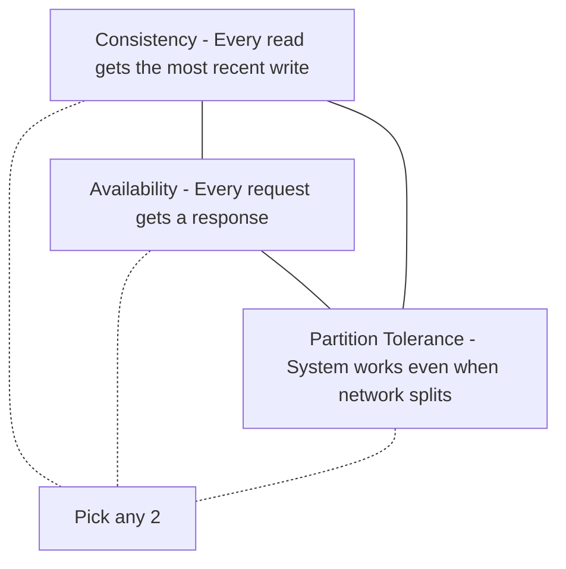
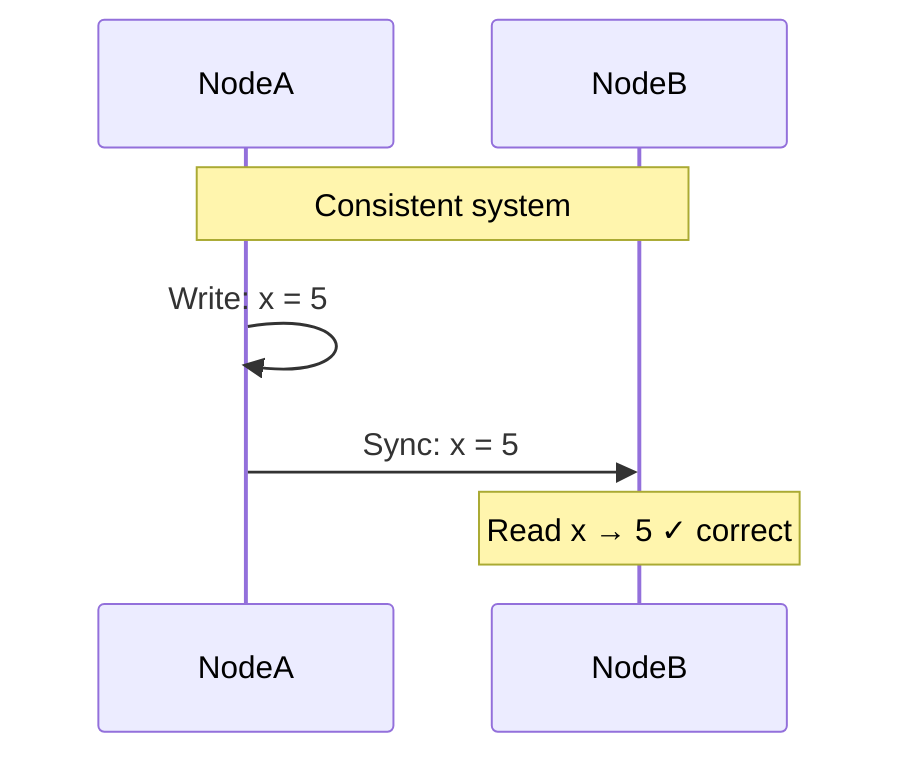
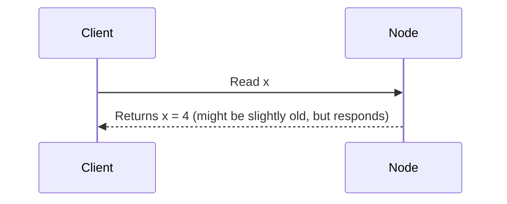
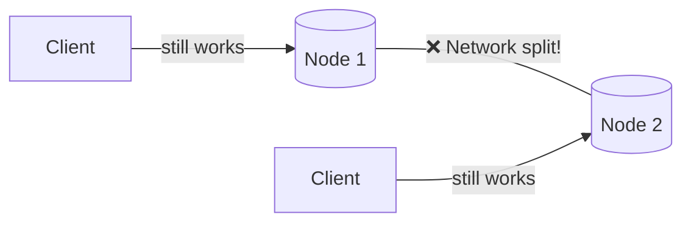
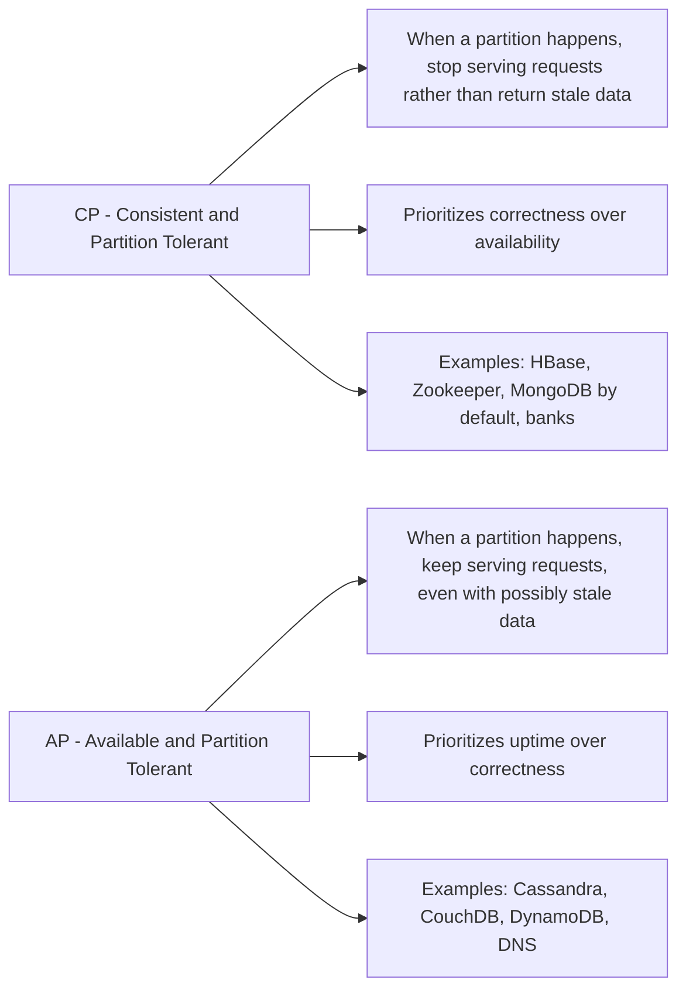
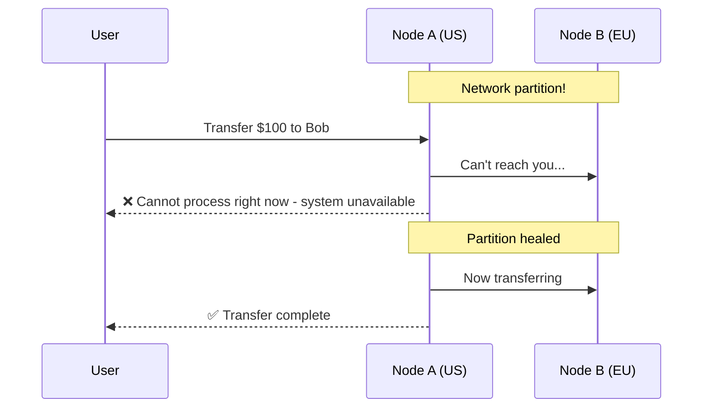
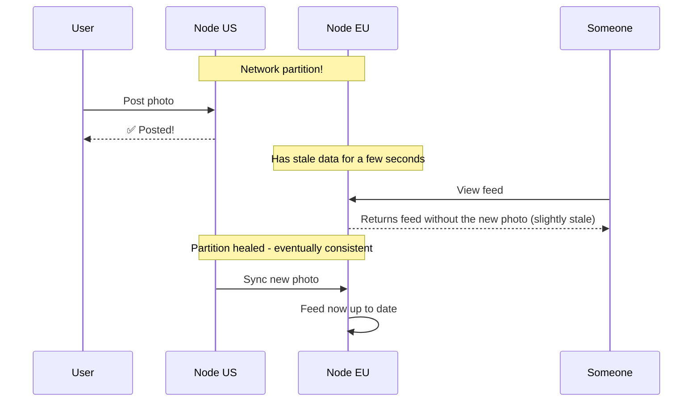
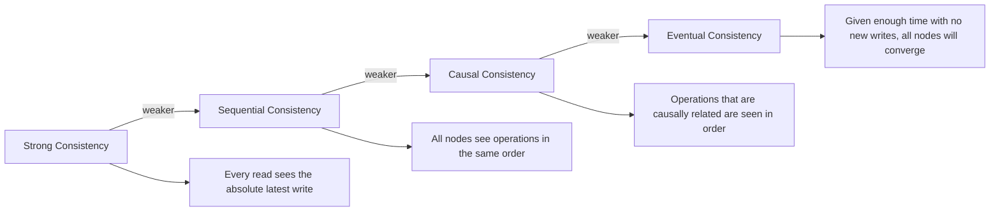
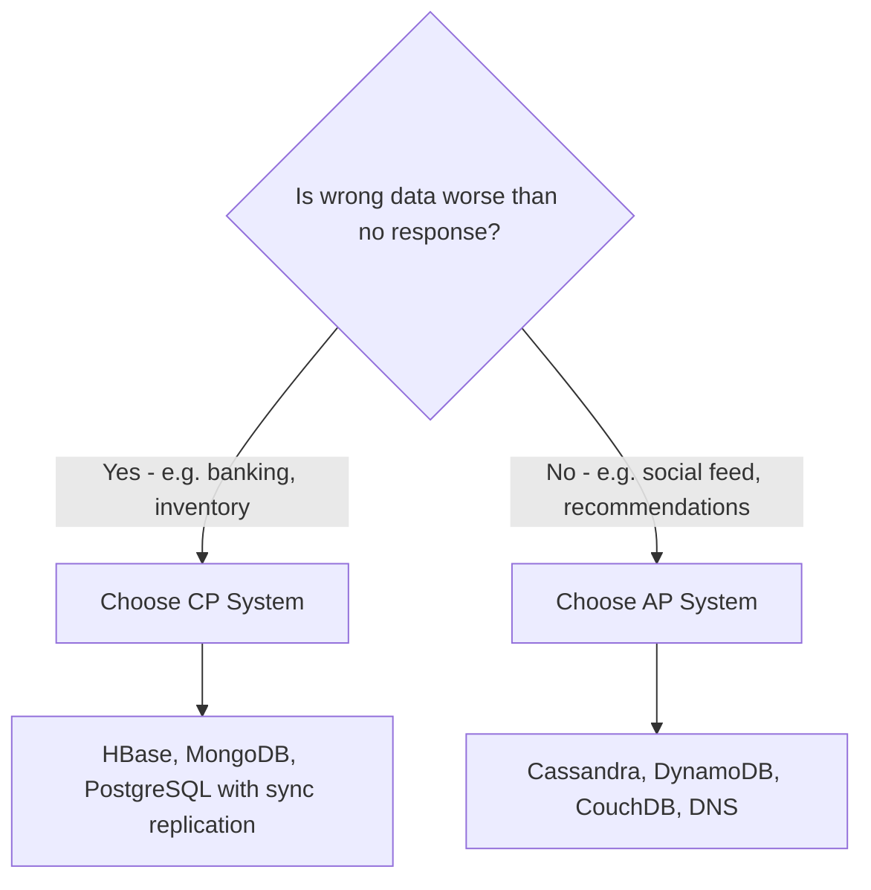

# 14 — CAP Theorem: The Impossible Triangle

## The Big Idea

In any distributed system — any system where data lives on more than one machine — you can only guarantee **two out of these three** properties at the same time:

- **C**onsistency
- **A**vailability
- **P**artition Tolerance

This is the **CAP Theorem**, proven by Eric Brewer in 2000.

---

## What Each Property Means

### Consistency (C)

Every node in the system sees the **same data at the same time**. If you write a value on Node 1, any read from Node 2 immediately sees that new value.

*Not to be confused with ACID consistency — this is about all nodes agreeing on the same value.*

---

### Availability (A)

**Every request receives a response** — it won't just hang or return an error. The response might not have the absolute latest data, but you'll get *some* response.

---

### Partition Tolerance (P)

The system **continues operating** even if the network between nodes breaks and nodes can't talk to each other.

A network partition is when some nodes can't communicate with others. In any real distributed system (especially those spread across data centers), this **will happen**. So partition tolerance is essentially non-negotiable.

---

## The Real Choice: CP vs AP

Since partition tolerance is required, you're really choosing between:

---

## Real-World Examples

### Bank Transfer: CP System

When you transfer money from Account A to Account B:
- Account A must decrease
- Account B must increase
- If there's a network partition, the bank **stops processing transfers** until it's resolved

Better to reject the request than to accidentally create or destroy money.

---

### Social Media Feed: AP System

When you post a photo, it's okay if some users see it 2 seconds later than others. Eventual consistency is fine here.

Nobody is harmed if a photo appears 2 seconds late. The system stays available.

---

## Consistency Models (Beyond Just "Consistent")

Consistency isn't binary. There's a spectrum:

| Model | Example |
|---|---|
| **Strong** | Reading your balance at a bank ATM |
| **Sequential** | Google Docs with real-time sync |
| **Causal** | Replies to a tweet must appear after the original tweet |
| **Eventual** | DNS updates, shopping cart sync |

---

## Summary Decision Guide

| Scenario | Best choice | Why |
|---|---|---|
| Bank transfers | CP | Wrong answer is catastrophic |
| Social media feed | AP | Slightly stale is fine |
| Shopping cart | AP (usually) | Amazon famously chose AP for carts |
| User authentication | CP | Must validate against latest password/token |
| Search suggestions | AP | A stale suggestion is fine |
| Stock trading | CP | Price must be correct |
