# 15 — Message Queues: Don't Do Heavy Work Right Now

## The Core Idea

When a user does something — uploads a photo, places an order, sends an email — you don't have to do *everything* related to that action immediately before responding to them.

A **message queue** is a buffer between producers (things that create work) and consumers (things that process that work).

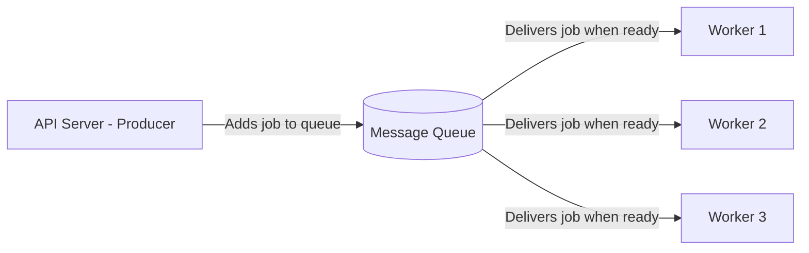

**Without a queue:**
- User uploads photo
- Server resizes it → 2 seconds
- Server generates thumbnails → 1 second
- Server sends notification email → 1 second
- Server updates user's feed → 500ms
- User waits **4.5 seconds** for a response

**With a queue:**
- User uploads photo
- Server saves the raw photo → 100ms
- Server adds jobs to queue → instant
- User gets response: **"Photo uploaded!"** in 100ms
- Workers process resizing, thumbnails, emails in the background

---

## Synchronous vs Asynchronous Processing

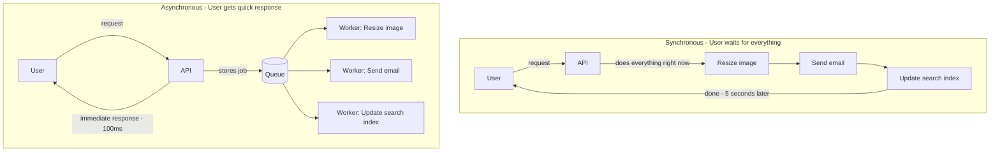

---

## FIFO Queue (First In, First Out)

The simplest kind of queue. Jobs are processed in the order they arrive. First job in → first job processed.

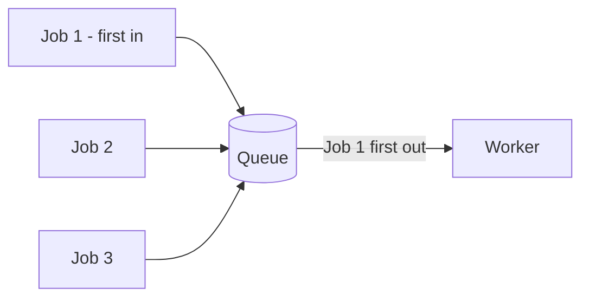

**Used for:** Order processing, basic task queues where order matters

---

## Priority Queue

Some jobs are more urgent than others. A priority queue processes high-priority jobs first, regardless of when they arrived.

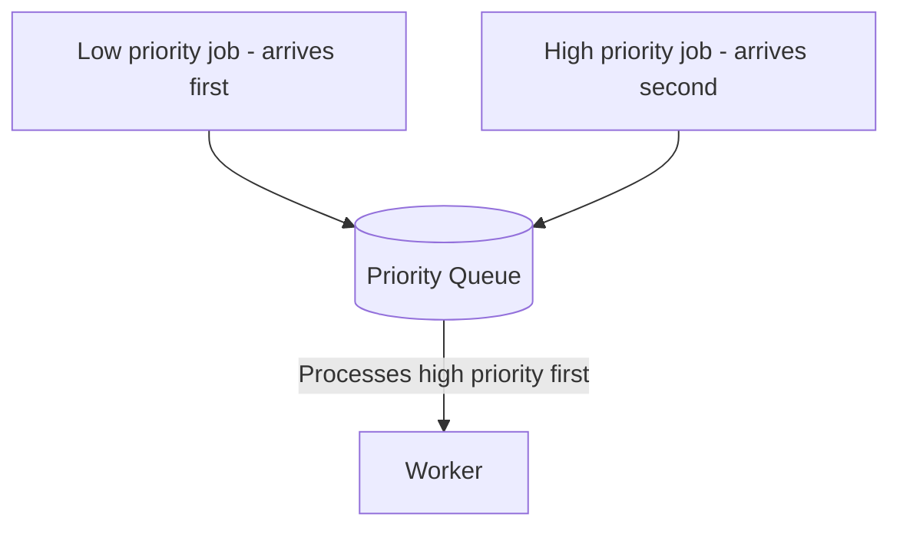

**Real example:**
- **Priority 1 (urgent)**: password reset email — send immediately
- **Priority 2 (normal)**: weekly digest email — can wait
- **Priority 3 (low)**: analytics batch job — send whenever

---

## Pub/Sub (Publish-Subscribe)

In a regular queue, each message goes to **one consumer**. In pub/sub, one message goes to **many consumers** (subscribers).

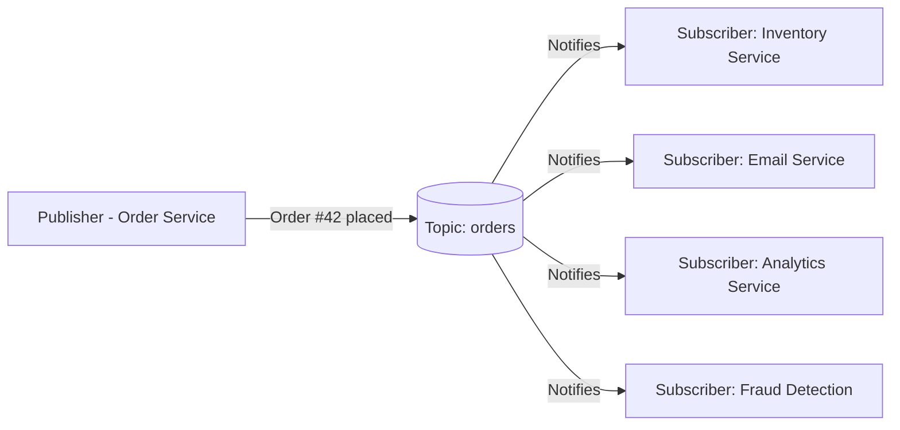

Each subscriber gets the same event and processes it independently.

**Used for:** Event-driven systems, microservices that react to the same event

**Examples:** Apache Kafka, Google Pub/Sub, AWS SNS + SQS

---

## Push vs Pull Model

### Push (Server pushes to consumers)

The queue actively sends messages to consumers.

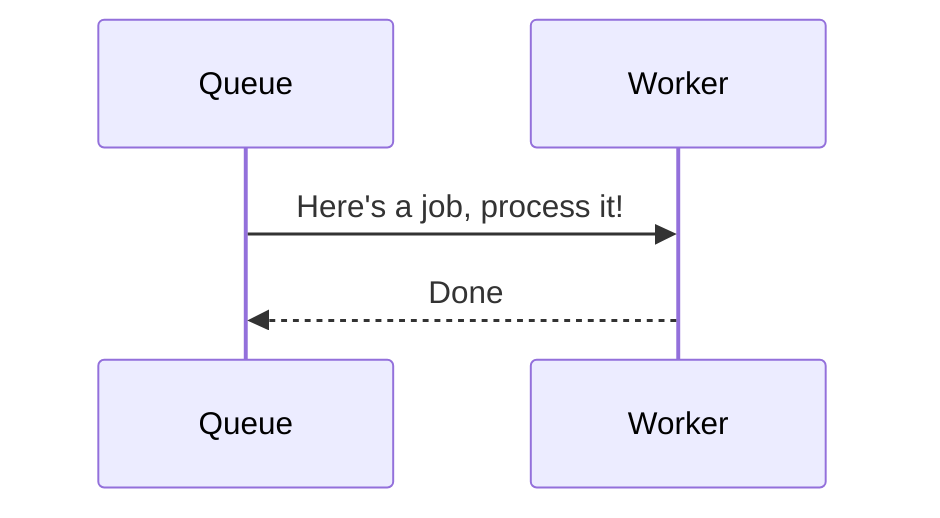

- Workers don't need to poll
- Risk: if the worker is slow, the queue keeps pushing and overwhelms it

---

### Pull (Consumers pull from queue)

Workers ask the queue for work when they're ready.

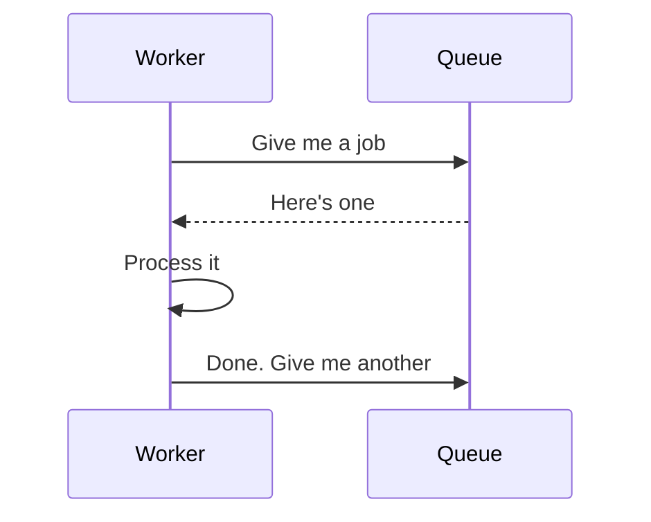

- Worker controls its own rate
- Better for slow or variable-speed workers
- Most modern systems (SQS, Kafka consumers) use pull

---

## Poison Messages

A **poison message** is a message that causes a worker to crash every time it tries to process it. Without protection, the message keeps re-queuing and crashing workers in a loop.

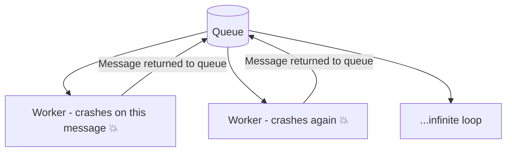

**Solution: Dead Letter Queue (DLQ)**

After a message fails N times (e.g., 3), move it to a **dead letter queue** instead of retrying forever.

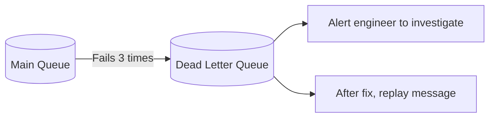

---

## Duplicate Messages

In distributed systems, messages can sometimes be delivered **more than once** (e.g., network hiccup causes the worker to receive the same job twice).

**At-least-once delivery**: guaranteed to be delivered but may deliver twice.

**Solution: Idempotency**

Design your consumers to be **idempotent** — processing the same message twice produces the same result as processing it once.

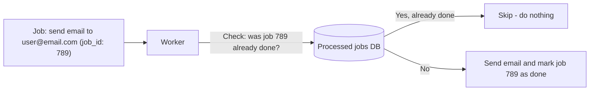

---

## Real Systems at a Glance

| System | Type | Used for |
|---|---|---|
| **Apache Kafka** | Distributed log / pub-sub | High-throughput event streaming |
| **RabbitMQ** | Traditional queue + pub-sub | Microservice messaging |
| **AWS SQS** | Managed FIFO / standard queue | Cloud-native queuing |
| **AWS SNS** | Pub-sub | Fan-out notifications |
| **Redis Streams** | Lightweight stream queue | Small scale, fast |
| **Google Pub/Sub** | Managed pub-sub | GCP event-driven systems |

---

## Full Picture: Order Processing System

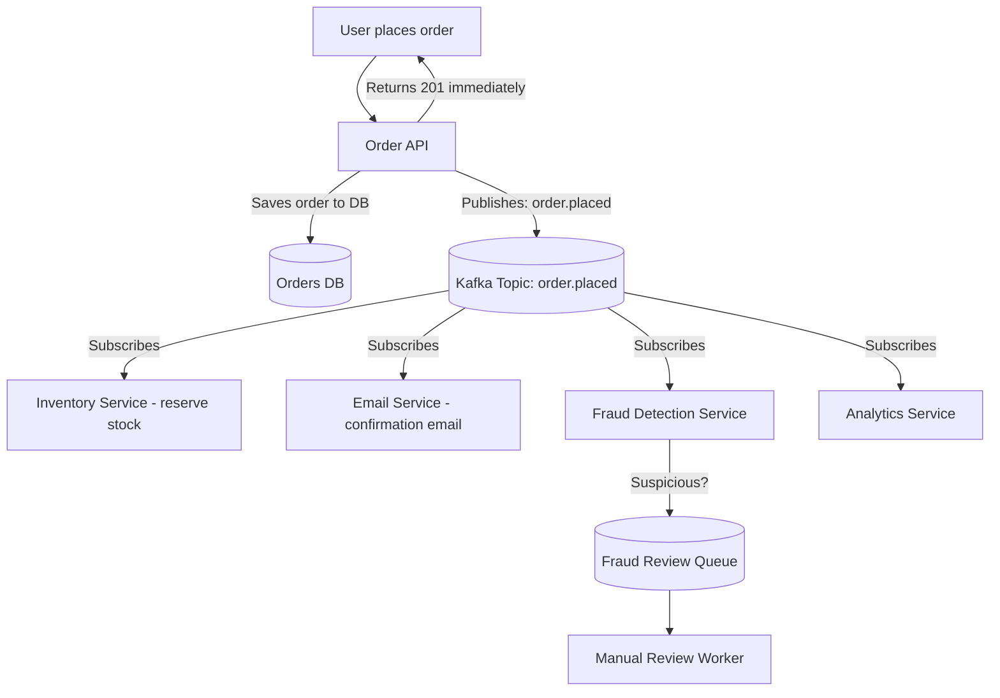
