# 16 — Fault Tolerance: Building Systems That Don't Give Up

## What Is Fault Tolerance?

A **fault** is anything that goes wrong — a hard drive crashing, a server freezing, a developer pushing bad code, a network cable being unplugged.

**Fault tolerance** means the system keeps working (or degrades gracefully) even when faults happen.

The key insight: **you don't prevent failures — you design for them**.

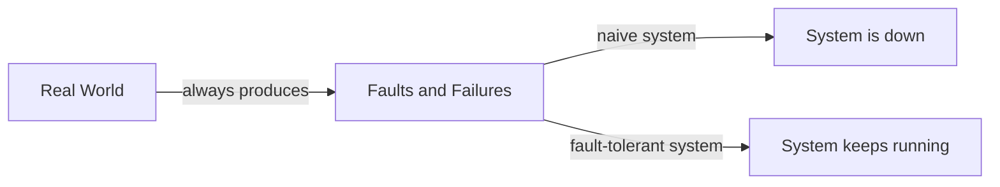

---

## Types of Failures

### 1. Hardware Failures

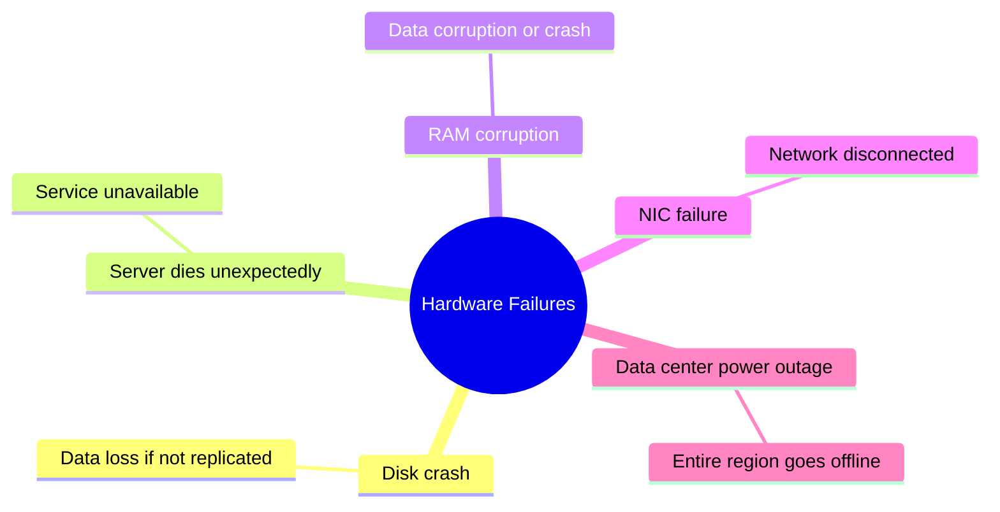

**Solutions:**
- Replicate data across multiple disks (RAID) and servers
- Deploy across multiple availability zones / regions
- Have standby servers ready for immediate failover

---

### 2. Software Failures

Software failures are sneakier than hardware ones because they often affect **all instances** equally.

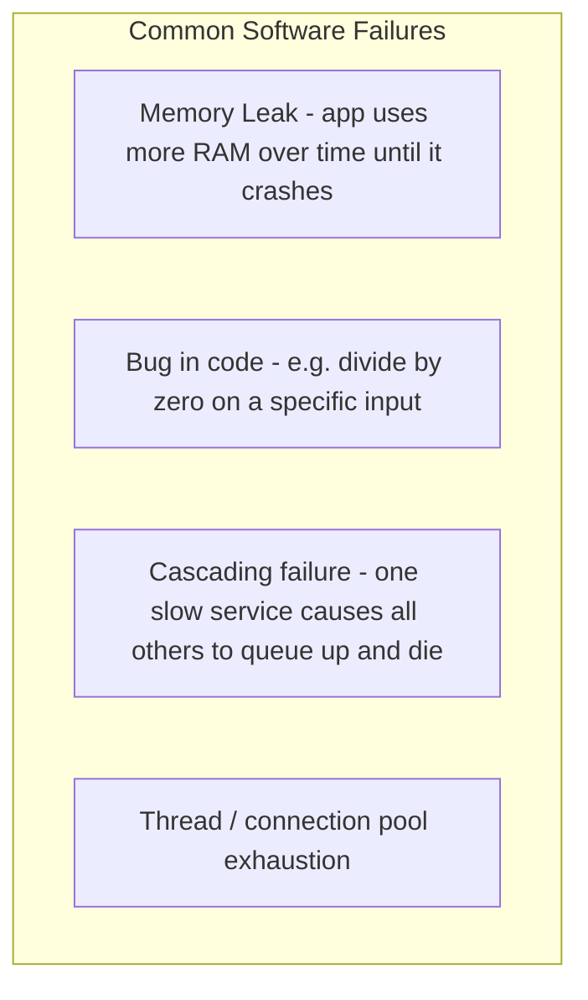

**Cascading failure example:**

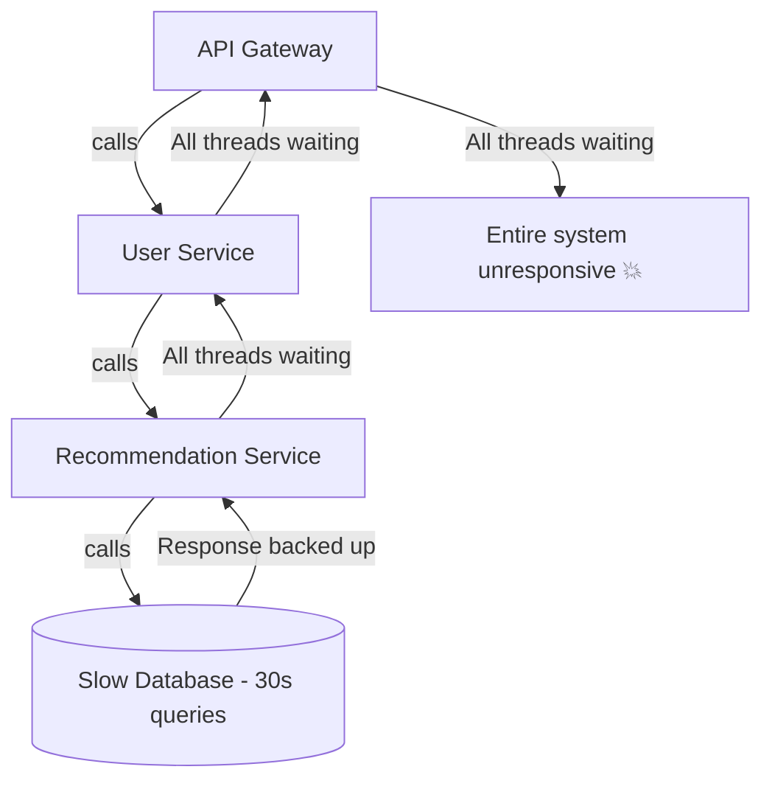

One slow database → entire platform dies.

---

### 3. Human Errors

Studies show **human errors cause more outages than hardware failures**.

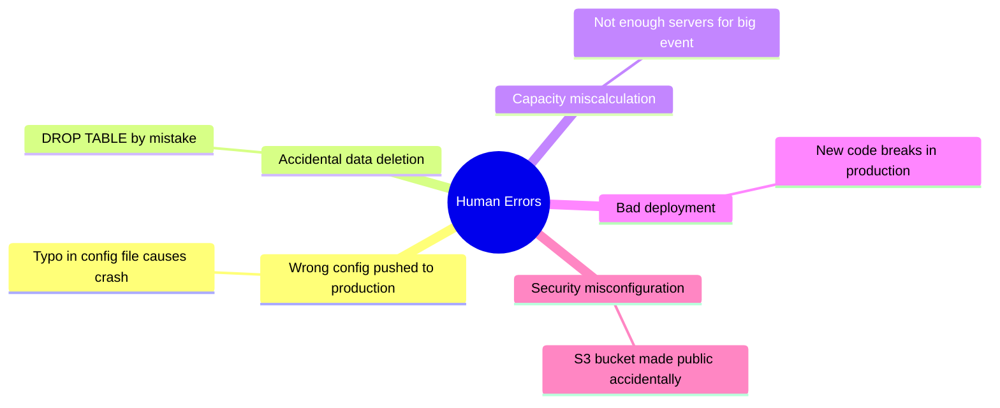

**Solutions:**
- Blue/Green deployments — test in a mirror environment before switching traffic
- Canary releases — roll out to 1% of users first
- Rollback capability — quickly revert to the last known good version
- Change management — require review/approval before config changes
- Backups with tested restore procedures

---

## Recovery Strategies

### Retry with Exponential Backoff

When a call fails, don't retry immediately — you'll hammer an already-struggling service. Wait a bit. Wait longer next time.

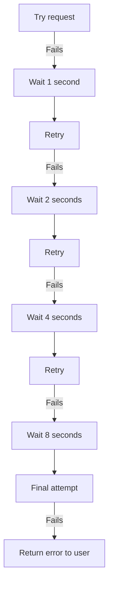

**Jitter**: Add a small random delay so all clients don't retry at the exact same time (which would cause a thundering herd problem).

---

### Circuit Breaker Pattern

Inspired by electrical circuits. If a service is failing, **stop sending it requests** for a while to let it recover.

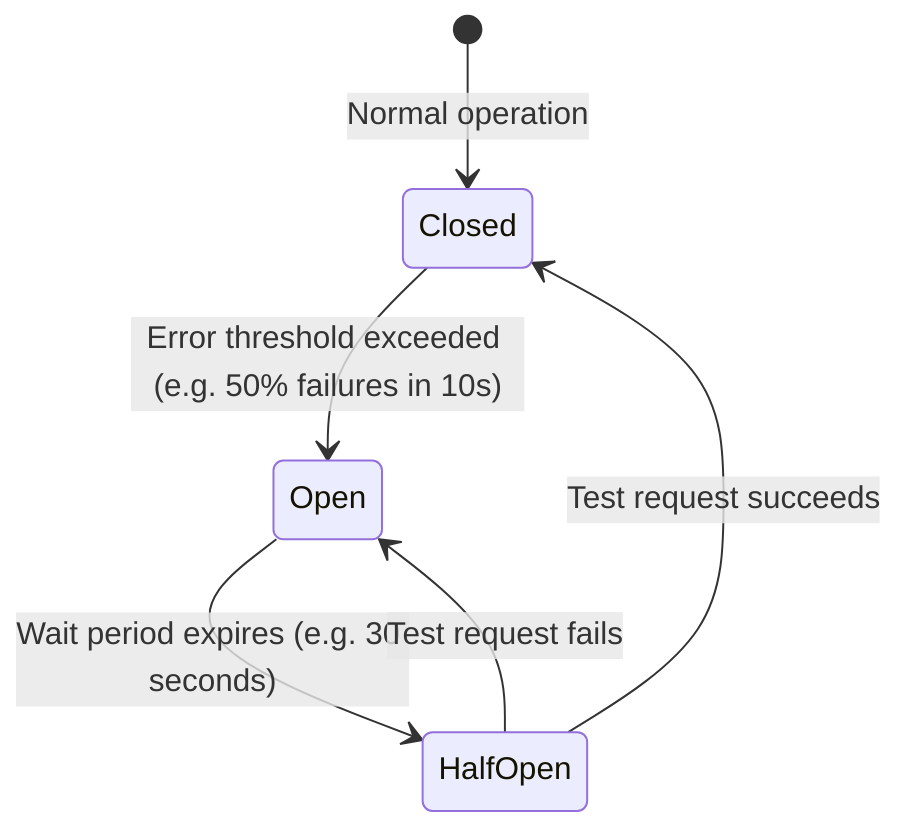

**State meanings:**
- **Closed (green)**: Everything normal, requests flow through
- **Open (red)**: Too many failures — immediately return error without even trying the downstream service
- **Half-Open**: Let one request through as a test — if it succeeds, close the circuit again

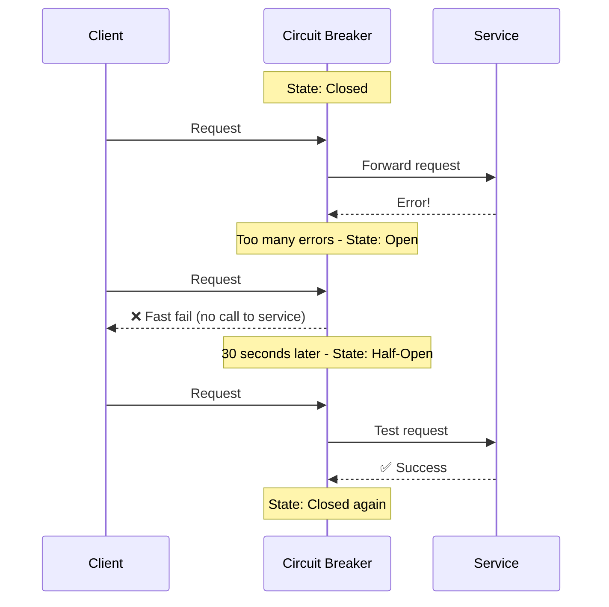

**Benefits:**
- Fails fast instead of making the client wait for a timeout
- Prevents cascading failures
- Gives the failing service breathing room

---

### Redundancy

Have more than you need so that if something fails, a spare is ready.

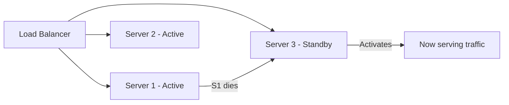

**Types:**

| Type | Description | Example |
|---|---|---|
| **Active-Active** | Multiple instances all serving traffic | Multiple web servers behind a load balancer |
| **Active-Passive** | Backup waits in standby, takes over on failure | Database primary/replica failover |
| **Geographic redundancy** | Copies in multiple regions | AWS us-east-1 and us-west-2 |

---

### Bulkhead Pattern

Isolate different parts of the system so a failure in one doesn't sink everything else.

Named after the compartments on a ship — if one compartment floods, the ship doesn't sink.

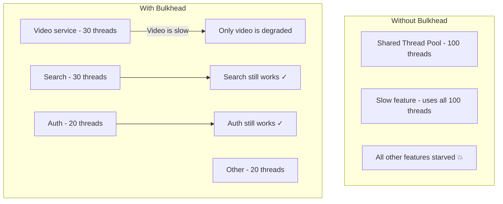

---

## Key Metrics for Fault Tolerance

| Metric | What it measures |
|---|---|
| **MTBF** (Mean Time Between Failures) | Average time between failures — higher is better |
| **MTTR** (Mean Time To Recovery) | Average time to recover from a failure — lower is better |
| **RTO** (Recovery Time Objective) | Maximum acceptable downtime during an outage |
| **RPO** (Recovery Point Objective) | Maximum acceptable amount of data loss |

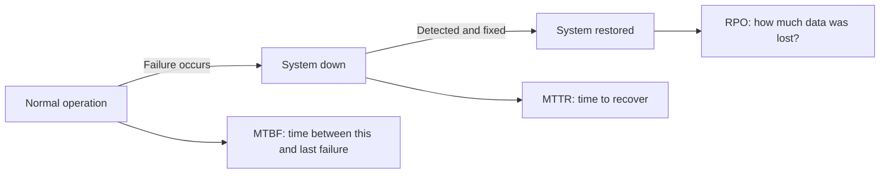

**Example:** "Our RTO is 1 hour and RPO is 10 minutes" means:
- The system must be back up within 1 hour of an outage
- We cannot lose more than 10 minutes of data
