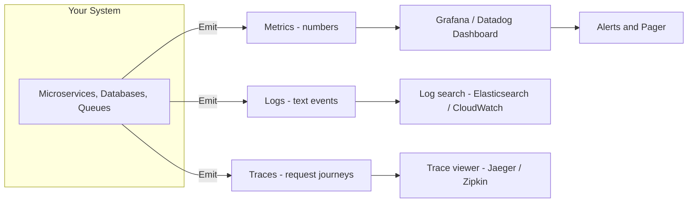
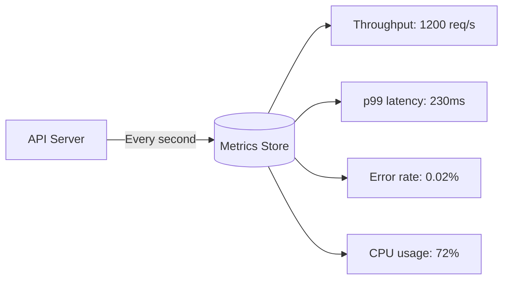
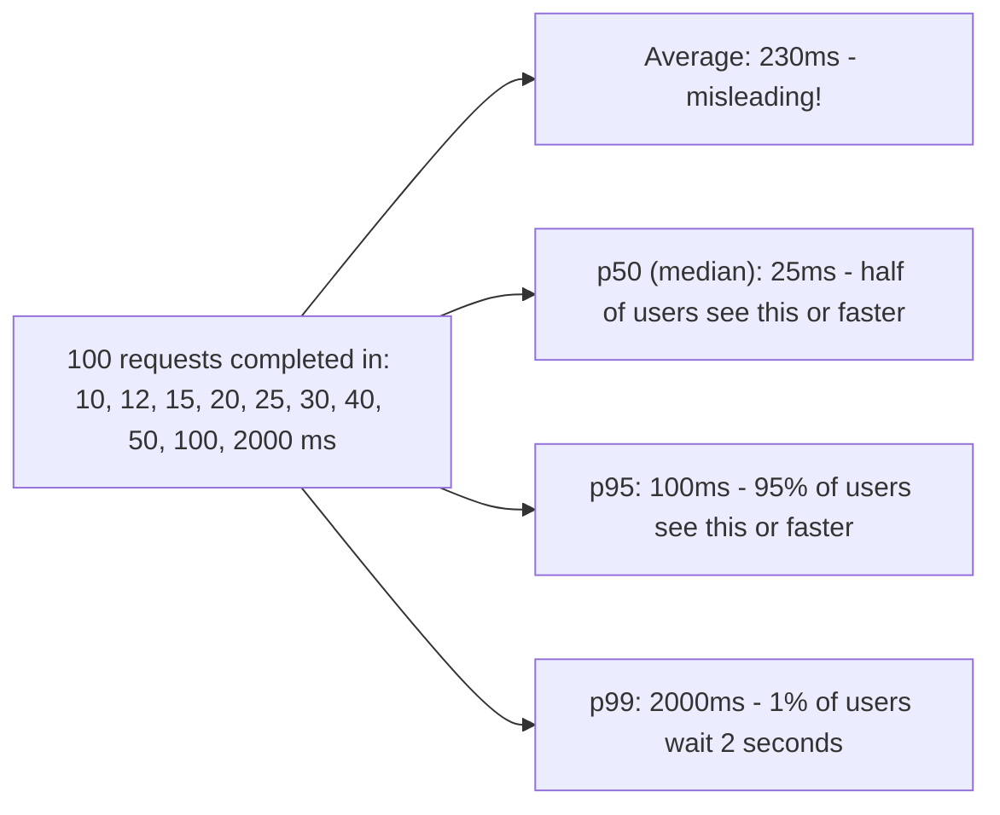
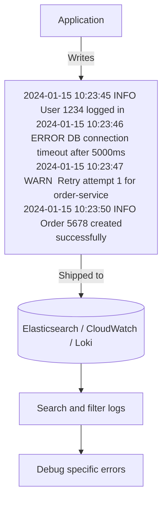
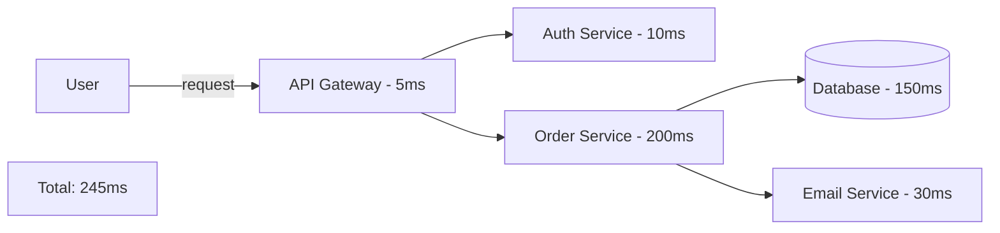
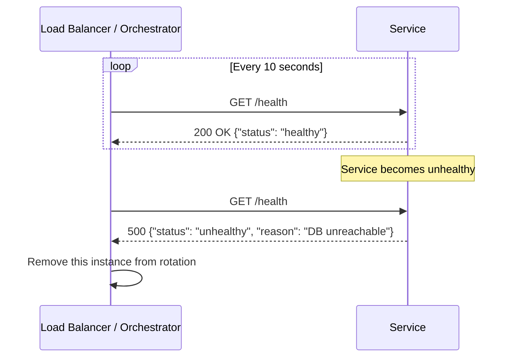
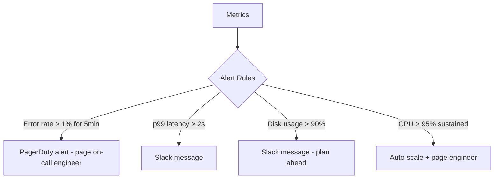
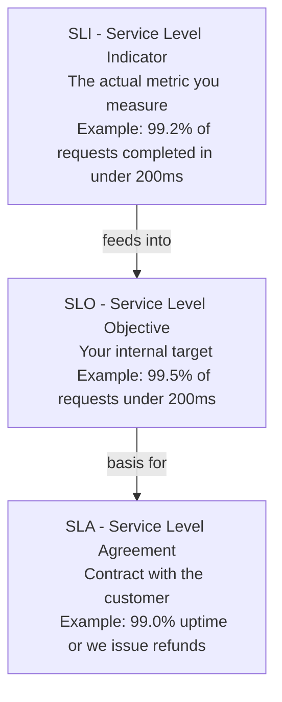

# 17 — Monitoring and Observability: Knowing What's Happening

## The Difference

- **Monitoring**: You know what to watch → you set up dashboards and alerts for known problems
- **Observability**: You can **figure out what's wrong** even for problems you didn't anticipate

A system is observable when you can ask it any question about its internal state just from its external outputs — without modifying the code.



---

## The Three Pillars of Observability

### Pillar 1: Metrics

Metrics are **numbers measured over time**. They tell you what's happening at a high level.



**Common API metrics:**

| Metric | What it tells you |
|---|---|
| **Throughput** (RPS) | How many requests per second |
| **Latency** (p50, p95, p99) | How long requests take |
| **Error rate** | Percentage of requests returning 4xx/5xx |
| **Saturation** | How full is the queue / resource |

**Infrastructure metrics:**

| Metric | What it tells you |
|---|---|
| **CPU usage** | Is the server overloaded? |
| **Memory usage** | Is the app leaking memory? |
| **Disk I/O** | Is the database bottlenecked on disk? |
| **Network I/O** | How much data is flowing in/out? |
| **Disk space** | Will the server fill up soon? |

---

### Latency Percentiles Explained

Don't just measure **average latency** — it hides the pain felt by your slowest users.



If you have 1 million requests per day, p99 means 10,000 users experience the worst latency. That matters.

---

### Pillar 2: Logs

Logs are **timestamped text records** of events that happened inside your system.



**Log levels (most to least severe):**

```
FATAL  → System is crashing, cannot continue
ERROR  → Something failed (but the system might continue)
WARN   → Something unexpected, might cause issues
INFO   → Normal operational events ("user logged in")
DEBUG  → Detailed info for debugging (disabled in production)
```

**Structured logging** (JSON format) makes logs searchable:
```json
{
  "timestamp": "2024-01-15T10:23:46Z",
  "level": "ERROR",
  "message": "DB connection timeout",
  "service": "order-service",
  "user_id": 1234,
  "duration_ms": 5000,
  "trace_id": "abc-123-xyz"
}
```

---

### Pillar 3: Distributed Traces

When a single request flows through multiple services, how do you see the full journey?

A **trace** tracks one request as it travels through your system.



Without tracing, when a request takes 2 seconds, you don't know if it was slow at the gateway, auth, database, or email service.

With tracing:

```mermaid
gantt
    title Request trace (total: 245ms)
    dateFormat X
    axisFormat %Lms

    section API Gateway
    Routing & Auth check :0, 5

    section Auth Service
    Token validation :5, 15

    section Order Service
    Business logic :15, 65

    section Database
    Query execution :65, 215

    section Email Service
    Email send :215, 245
```


The database took 150ms → that's the bottleneck to fix.

---

## Health Checks

Every service should expose an endpoint that says "am I healthy?"



**Types:**
- **Liveness probe**: Is the service alive? (restart if not)
- **Readiness probe**: Is the service ready to serve traffic? (stop sending it traffic if not)

---

## Alerting

Monitoring without alerting is like a smoke detector with no alarm.



**Avoid alert fatigue** — if alerts fire too often for non-critical things, engineers start ignoring them.

**Golden rule:** Only alert on things that require **human action right now**.

---

## SLI, SLO, SLA



| Term | Audience | Consequence if missed |
|---|---|---|
| SLI | Engineering team | Dashboard turns red |
| SLO | Engineering team | Incident review, fix prioritized |
| SLA | Customers | Financial penalty / refund |

---

## Tools Overview

| Tool | Category | What it does |
|---|---|---|
| **Prometheus** | Metrics | Collects and stores metrics |
| **Grafana** | Visualization | Beautiful dashboards from metrics |
| **Datadog** | All-in-one | Metrics, logs, traces, alerts |
| **Elasticsearch + Kibana** | Logs | Search and visualize logs |
| **Jaeger / Zipkin** | Traces | Distributed request tracing |
| **PagerDuty** | Alerting | On-call alerting and escalation |
| **AWS CloudWatch** | All-in-one (AWS) | Managed monitoring on AWS |
| **Google Cloud Monitoring** | All-in-one (GCP) | Managed monitoring on GCP |
