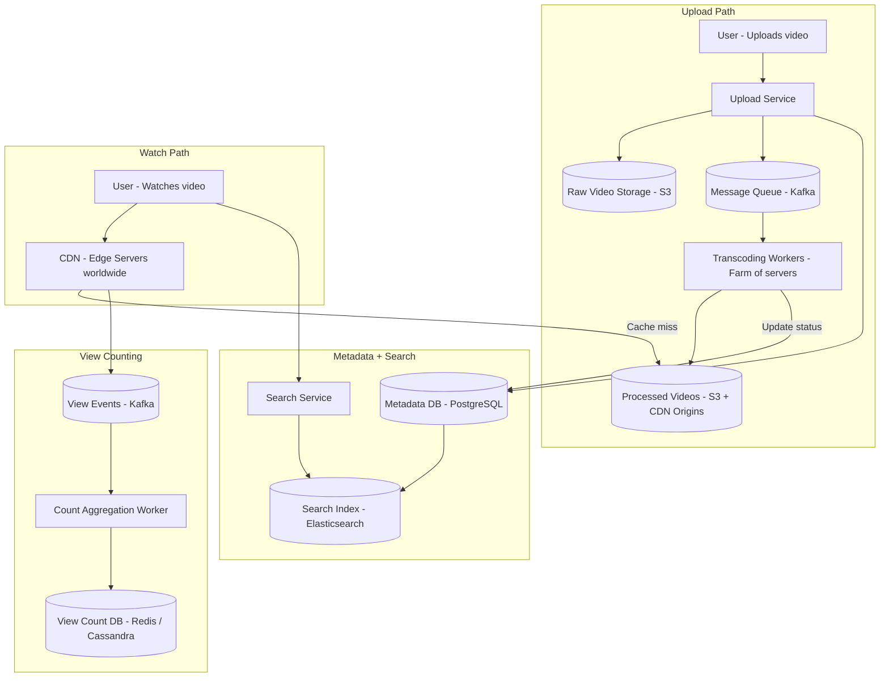
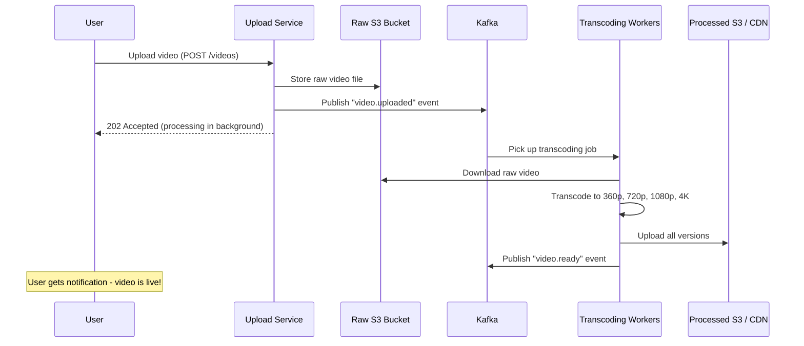
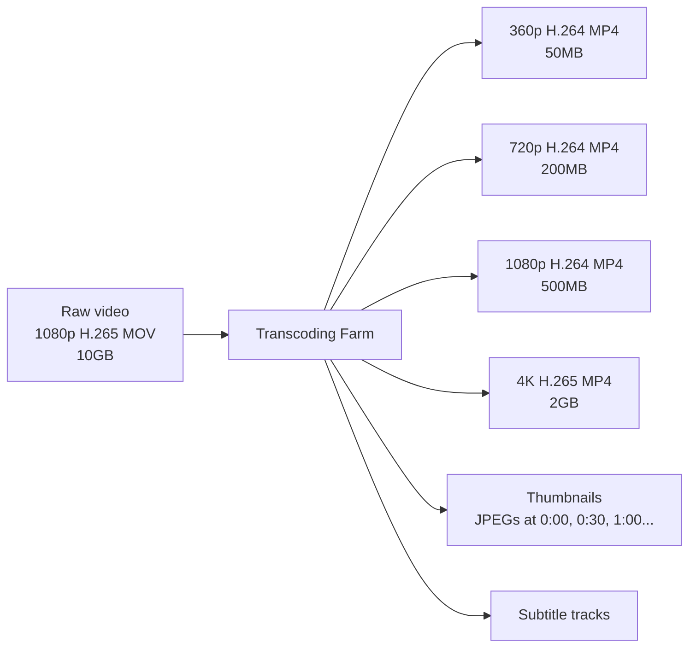
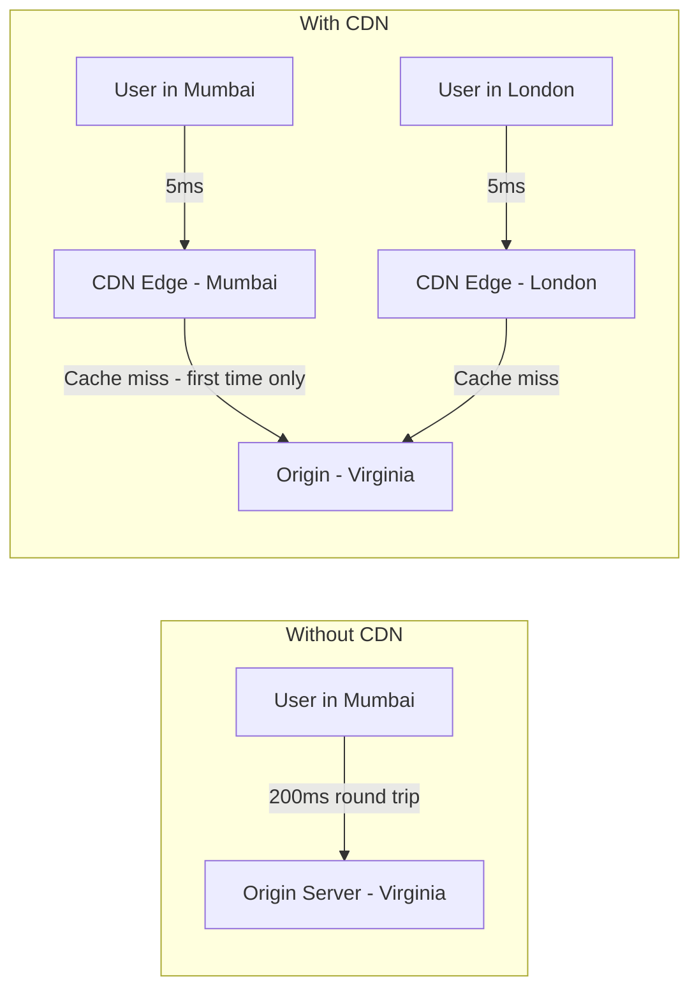
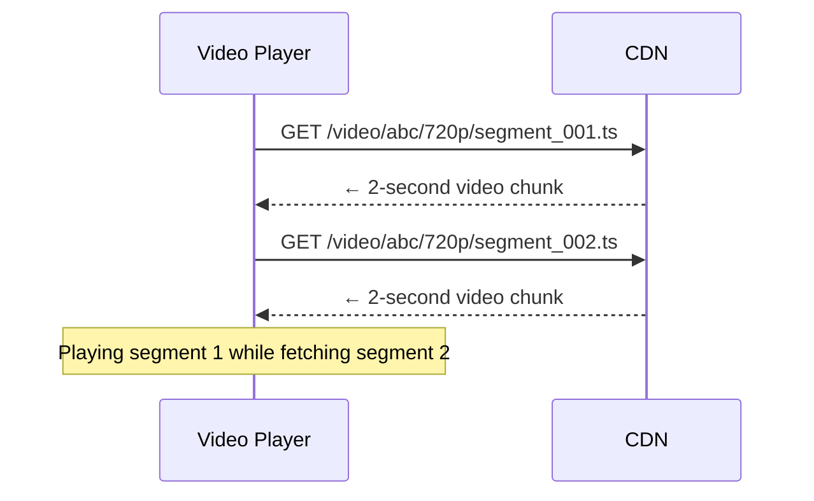
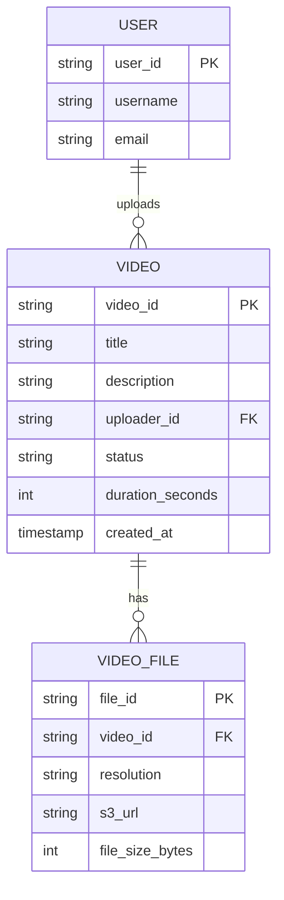
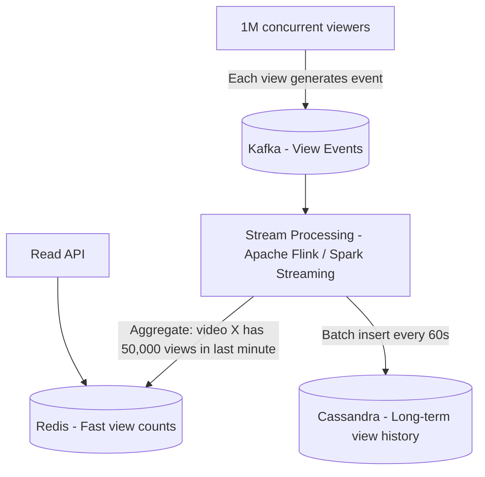
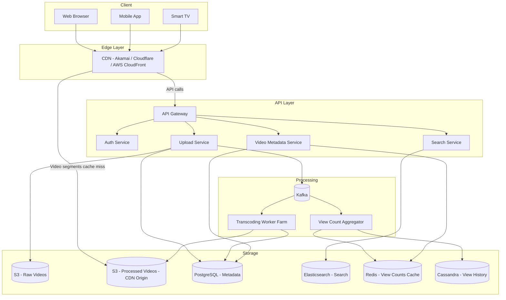

# 18 — Case Study: Design a Video Streaming Platform

## The Problem

Design a system like **YouTube** or **Netflix** where:
- Users can **upload videos**
- Other users can **watch those videos** from anywhere in the world
- The system handles millions of concurrent viewers
- Videos load fast even on slow connections

This is a classic system design interview problem because it touches almost every concept covered in this course.

---

## Step 1: Clarify Requirements

### Functional Requirements
- Users can upload videos
- Users can watch videos
- Videos are available in multiple resolutions (360p, 720p, 1080p, 4K)
- Users can search for videos
- Videos have titles, descriptions, and tags
- Basic view count tracking

### Non-Functional Requirements
- **High availability** — 99.99% uptime (users expect streaming to always work)
- **Low latency** — videos should start playing within 2 seconds
- **Massive scale** — YouTube processes 500 hours of video per minute
- **Eventual consistency** — view counts can be slightly delayed; that's fine

### Scale Estimates
- 1 billion users
- 1 million video uploads per day
- 500 million video views per day
- Average video: 500MB (pre-compression)
- After transcoding, ~1GB per video across all resolutions

---

## Step 2: High-Level Architecture



---

## Step 3: Upload Pipeline (Deep Dive)

This is the most complex part of the system.



### Why asynchronous?
- Transcoding a 1-hour video at 4K can take **30+ minutes**
- You can't make the user wait with an open HTTP connection
- Use a message queue so the user gets an immediate response, and workers process in the background

---

## Step 4: Transcoding (Compute-Intensive Work)

Transcoding = converting a raw video file into multiple formats and resolutions.



This is **compute-intensive** work (heavy CPU/GPU usage). You scale this by having a **fleet of workers** that pick jobs from the queue.

**Why multiple resolutions?**
- Mobile users on slow networks watch 360p
- TV viewers watch 4K
- The video player auto-selects based on network speed (adaptive bitrate streaming)

---

## Step 5: CDN Delivery (How Video Actually Reaches You Fast)

Without a CDN, every video request would travel from your browser to a central server. If that server is in Virginia and you're in Mumbai, that's 200ms of latency minimum — per segment.



**How video streaming with CDN works:**

Videos are broken into **small segments** (2-10 seconds each). The player requests segment by segment.



This is called **HLS (HTTP Live Streaming)** or **DASH (Dynamic Adaptive Streaming)**.

---

## Step 6: Metadata Storage

Every video needs metadata: title, description, uploader, views, likes, tags, status.



- Use **PostgreSQL** for structured metadata (ACID, joins, reliable)
- Use **Elasticsearch** for search (full-text search on titles and descriptions)
- When a video is uploaded, write to PostgreSQL and index into Elasticsearch

---

## Step 7: Search

```mermaid
flowchart LR
    User[User searches: "cooking pasta"] --> SearchAPI[Search API]
    SearchAPI --> ES[(Elasticsearch)]
    ES -->|Ranked results| SearchAPI
    SearchAPI -->|Video IDs + metadata| User
    User -->|Click a video| CDN[Stream from CDN]
```

**Why Elasticsearch?**
- Handles typos ("pastaa" → "pasta")
- Relevance ranking (views, freshness, engagement)
- Fast full-text search across millions of records
- Not good at: transactional writes, complex relationships

---

## Step 8: View Count Tracking at Scale

If 1 million people watch a video simultaneously, you can't write to the database on every view — it would be overwhelmed.



- **Write path**: High volume events → Kafka → aggregated in memory → stored in Redis/Cassandra
- **Read path**: API reads from Redis (fast)
- Eventually consistent: view counts shown to users may be ~60 seconds delayed — that's acceptable

---

## Full Architecture Diagram



---

## Key Trade-Offs Made

| Decision | Choice | Why |
|---|---|---|
| Upload acknowledgement | Async (202) | Can't block user for 30-min transcoding |
| View counts | Eventually consistent | Throughput over accuracy |
| Metadata storage | PostgreSQL | Structured, needs joins, ACID |
| Search | Elasticsearch | Full-text, ranking, fuzzy matching |
| Video delivery | CDN | Latency is king for video |
| High-scale write buffering | Kafka | Decouple producers from storage |
| Transcoding | Worker pool | CPU-intensive, scale horizontally |

---

## What Makes This System Design Hard

1. **Scale of writes** — millions of concurrent events. Can't write directly to SQL.
2. **Compute-intensive jobs** — transcoding needs separate horizontally scalable workers.
3. **Global low latency** — CDN is essential; there's no other way.
4. **Availability requirements** — people rage when Netflix goes down. 99.99% uptime.
5. **Data at rest size** — storing petabytes of video cheaply (S3 with tiered storage).
